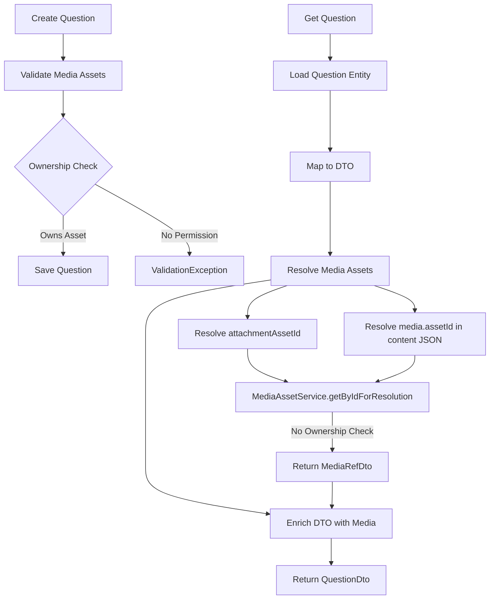

# Implementation Plan: Image Support for Questions and Options (Part 1)

## Overview

Add first-class image support to questions and option/items using the existing MediaAsset feature. Support question-level attachments and option-level media in content JSON while keeping legacy `attachmentUrl` data functional.

**Note**: This plan is based on the implementation guide at `/Users/alekseylazunin/Documents/Programming/Java/QuizMaker/docs/plans/implementation-guide-part1-images.md`. All security fixes and clarifications from code review have been incorporated into this plan.

## Goals

- Allow images on questions and option/items.
- Validate ownership on write, no ownership check on read.
- Keep existing `attachmentUrl` data working.
- Avoid mutating shared JSON during media resolution.

## Non-goals (Part 1)

- Media upload workflows or storage changes.
- Alt/caption persistence.
- Frontend changes.
- Bulk migration of `attachmentUrl` to `attachmentAssetId`.

## Key Decisions

- **Validation vs resolution:** Ownership checks on write only; read uses resolution without ownership checks.
- **Storage:** Store only `assetId` (UUID). Question-level uses `attachment_asset_id` column; option/item uses `media.assetId` in content JSON.
- **DTOs:** Responses include `attachment` (MediaRefDto) and legacy `attachmentUrl`. Requests include `attachmentAssetId` and `clearAttachment`.
- **Clear semantics:** `clearAttachment=true` clears both `attachmentAssetId` and `attachmentUrl`. This removes ambiguity for fallback.
- **Fallback:** If `attachmentAssetId` is set but resolution fails (missing/not READY), fallback to legacy `attachmentUrl` if present. If `clearAttachment` cleared both fields, no fallback occurs.
- **Schema vs prompts:** `/api/v1/questions/schemas` is request-only; prompts explicitly forbid media generation.
- **Service API:** `getByIdForResolution(UUID)` returns `Optional<MediaRefDto>` to avoid leaking JPA entities.

## Implementation Steps

### Phase 1: Foundation (Steps 1-6)

**Step 1: Create MediaRefDto**

- File: `src/main/java/uk/gegc/quizmaker/shared/dto/MediaRefDto.java` (NEW)
- Record fields: `assetId`, `cdnUrl`, `alt`, `caption`, `width`, `height`, `mimeType` (nullable)
- Add `@Schema` annotations with examples

**Step 2: Database Migration**

- File: `src/main/resources/db/migration/V56__add_attachment_asset_id_to_questions.sql` (NEW)
- Add `attachment_asset_id BINARY(16) NULL` column
- Add foreign key constraint to `media_assets(asset_id)` with `ON DELETE SET NULL`
- Add index: `idx_question_attachment_asset_id`

**Step 3: Update Question Entity**

- File: `src/main/java/uk/gegc/quizmaker/features/question/domain/model/Question.java`
- Add `UUID attachmentAssetId` mapped to `attachment_asset_id`
- Verify UUID-to-binary mapping in existing entities. If UUID maps to `CHAR(36)` in your environment, add either:
  - `@Column(name = "attachment_asset_id", columnDefinition = "BINARY(16)")`, or
  - `@JdbcTypeCode(SqlTypes.BINARY)` if consistent with existing mappings
- Keep `attachmentUrl` unchanged for legacy data

**Step 4: Extend MediaAssetService Interface**

- File: `src/main/java/uk/gegc/quizmaker/features/media/application/MediaAssetService.java`
- Add: `MediaAssetResponse getByIdForValidation(UUID assetId, String username)` - with ownership check, returns DTO
- Add: `Optional<MediaRefDto> getByIdForResolution(UUID assetId)` - without ownership check, returns `MediaRefDto` directly
- **Rationale**: Return `MediaRefDto` directly to avoid exposing JPA entities and match resolver needs. This keeps the service API clean and avoids persistence leaks.

**Step 5: Implement MediaAssetService Methods**

- File: `src/main/java/uk/gegc/quizmaker/features/media/application/impl/MediaAssetServiceImpl.java`
- `getByIdForValidation()`: Find asset, validate status=READY, type=IMAGE, check ownership via `assertOwnership()` helper, return `MediaAssetResponse` via `mediaAssetMapper.toResponse(asset)`
- `getByIdForResolution()`: Find asset, return `Optional.empty()` if not found/ready/IMAGE (log warnings), no ownership check, map to `MediaRefDto` via `mediaAssetMapper.toMediaRef(asset)` and return `Optional<MediaRefDto>`
- Both use `@Transactional(readOnly = true)` and `mediaAssetRepository.findByIdAndStatusNot()`
- **Rationale**: Returning `MediaRefDto` directly avoids exposing JPA entities and matches what the resolver needs

**Step 6: Add toMediaRef to MediaAssetMapper**

- File: `src/main/java/uk/gegc/quizmaker/features/media/infra/mapping/MediaAssetMapper.java`
- Method: `MediaRefDto toMediaRef(MediaAsset asset)` - null-safe mapping from entity
- Map `cdnUrl` using `toCdnUrl(asset.getKey())`, map `width`, `height`, `mimeType` directly from asset, leave `alt`/`caption` null (not stored yet)
- Handle null input gracefully (return null)

### Phase 2: DTOs and Resolution (Steps 7-9)

**Step 7: Update Question DTOs**

- Files:
  - `src/main/java/uk/gegc/quizmaker/features/question/api/dto/QuestionDto.java`
  - `src/main/java/uk/gegc/quizmaker/features/question/api/dto/CreateQuestionRequest.java`
  - `src/main/java/uk/gegc/quizmaker/features/question/api/dto/UpdateQuestionRequest.java`
  - `src/main/java/uk/gegc/quizmaker/features/attempt/api/dto/QuestionForAttemptDto.java`
  - `src/main/java/uk/gegc/quizmaker/features/attempt/api/dto/AnswerReviewDto.java`
  - `src/main/java/uk/gegc/quizmaker/features/quiz/api/dto/export/QuestionExportDto.java`
- Add `attachment MediaRefDto` to response DTOs (optional)
- Add `attachmentAssetId UUID` to request DTOs (optional)
- **UpdateQuestionRequest only**: Add `clearAttachment Boolean` field (default false) for explicit clear semantics
- Keep `attachmentUrl` for backward compatibility
- Add `@Schema` annotations

**Step 8: Create QuestionMediaResolver Component**

- File: `src/main/java/uk/gegc/quizmaker/features/question/infra/mapping/QuestionMediaResolver.java` (NEW)
- `@Component` with `@RequiredArgsConstructor` and `@Slf4j`
- Inject `MediaAssetService`
- Method: `MediaRefDto resolveAttachment(UUID assetId)`
  - Returns null if assetId null
  - Call `mediaAssetService.getByIdForResolution(assetId)` which returns `Optional<MediaRefDto>`
  - Return the resolved `MediaRefDto` or null (log warning if missing)
- Method: `JsonNode resolveMediaInContent(JsonNode content)`
  - **CRITICAL**: Perform deep copy of JsonNode before enrichment to avoid mutating shared objects
  - Use `JsonNode.deepCopy()` on container nodes (ObjectNode/ArrayNode) to clone before mutation
  - Alternative: `objectMapper.readTree(objectMapper.writeValueAsBytes(content))` to serialize and deserialize
  - **Do NOT use** `ObjectMapper.treeToValue()` - that's for converting to POJOs, not cloning JsonNode
  - Traverse the deep-copied JSON, find `media.assetId` in options/items/statements
  - For each found, call `getByIdForResolution()` and enrich with `cdnUrl`, `width`, `height`, `mimeType` from resolved `MediaRefDto`

**Step 9: Enrich DTOs in QuestionService**

- File: `src/main/java/uk/gegc/quizmaker/features/question/application/impl/QuestionServiceImpl.java`
- Inject `QuestionMediaResolver`
- Helper: `private QuestionDto enrichQuestionDtoWithMedia(QuestionDto dto, Question question)`
  - Resolve attachment via resolver
  - If resolution is null and `attachmentUrl` is present, set a fallback `MediaRefDto` with only `cdnUrl`
  - Because `clearAttachment` clears `attachmentUrl`, fallback won't resurrect cleared attachments
  - Resolve media in `content` JSON with the resolver (deep copy)
- Call enrichment after `QuestionMapper.toDto()` in:
  - `getQuestion()` method
  - `listQuestions()` - map over page results
  - `updateQuestion()` method (if it returns `QuestionDto`)

### Phase 3: Entity Mapping and Validation (Steps 10-11)

**Step 10: Update QuestionMapper Entity Mapping**

- File: `src/main/java/uk/gegc/quizmaker/features/question/infra/mapping/QuestionMapper.java`
- `toEntity()`: set `attachmentAssetId` from request
- `updateEntity()`:
  - If `clearAttachment == true`, set `attachmentAssetId` and `attachmentUrl` to null and ignore `attachmentAssetId` input
  - Else if `attachmentAssetId != null`, set `attachmentAssetId`
  - Else, leave unchanged

**Step 11: Add Media Validation in QuestionService**

- File: `src/main/java/uk/gegc/quizmaker/features/question/application/impl/QuestionServiceImpl.java`
- Inject `MediaAssetService`
- Add helpers:
  - `validateAttachmentAsset(UUID assetId, String username)`
  - `validateMediaInContent(JsonNode content, String username)`
- On create/update:
  - Validate `attachmentAssetId` unless `clearAttachment` is true
  - Validate all `media.assetId` in content JSON (MCQ options, ORDERING items, MATCHING left/right, COMPLIANCE statements)
- Use `mediaAssetService.getByIdForValidation()`, translate failures to `ValidationException`

### Phase 4: Content JSON and Safe Content (Steps 12-13)

**Step 12: Update SafeQuestionContentBuilder**

- File: `src/main/java/uk/gegc/quizmaker/features/question/application/SafeQuestionContentBuilder.java`
- When copying options/items/statements:
  - If `media` exists and has a valid UUID `assetId`, rebuild `media` with only `assetId`
  - If missing/invalid, skip `media` entirely
  - Never copy user-supplied `cdnUrl` or other fields

**Step 13: Update Question Handler Validation**

- Files:
  - `src/main/java/uk/gegc/quizmaker/features/question/infra/handler/McqSingleHandler.java`
  - `src/main/java/uk/gegc/quizmaker/features/question/infra/handler/McqMultiHandler.java`
  - `src/main/java/uk/gegc/quizmaker/features/question/infra/handler/OrderingHandler.java`
  - `src/main/java/uk/gegc/quizmaker/features/question/infra/handler/MatchingHandler.java`
  - `src/main/java/uk/gegc/quizmaker/features/question/infra/handler/ComplianceHandler.java`
- Require at least one of `text` or `media`
- If `media` present, require `media.assetId` to be valid UUID format
- Do not validate existence here; keep existence checks in service layer

### Phase 5: Schemas and Prompts (Steps 14-15)

**Step 14: Update QuestionSchemaRegistry for Media**

- File: `src/main/java/uk/gegc/quizmaker/features/ai/infra/schema/QuestionSchemaRegistry.java`
- Update `createMcqContentSchema()`, `createOrderingContentSchema()`, `createMatchingContentSchema()`, `createComplianceContentSchema()`
- Add `media` to option/item/statement schemas:
  - `required: ["assetId"]`
  - `additionalProperties: false`
  - `assetId` format `uuid`
- Use `anyOf` to require `text` or `media` (media-only options allowed)
- **Schema purpose:** request-only. Document in API docs that responses may include resolved fields (`cdnUrl`, `width`, `height`, `mimeType`) not present in schema

**Step 15: Update AI Prompt Templates**

- Files:
  - `src/main/resources/prompts/base/system-prompt.txt`
  - `src/main/resources/prompts/structured-quiz/system.txt` (if exists)
  - `src/main/resources/prompts/question-types/*.txt` (type-specific)
- Add explicit prohibition: AI must not emit `media` fields

### Phase 6: Safe Mapper and Export (Steps 16-18)

**Step 16: Update SafeQuestionMapper**

- File: `src/main/java/uk/gegc/quizmaker/features/question/infra/mapping/SafeQuestionMapper.java`
- Inject `QuestionMediaResolver`
- After safe content is built, resolve attachments and option-level media in safe content

**Step 17: Update AnswerReviewDto Mapping**

- File: `src/main/java/uk/gegc/quizmaker/features/attempt/application/impl/AttemptServiceImpl.java`
- If `SafeQuestionMapper` is used, media is already resolved
- If built directly, resolve attachment/media via `QuestionMediaResolver`

**Step 18: Update QuestionExportDto Mapping**

- Find export mapper and include `attachment` (MediaRefDto)
- Resolve `attachmentAssetId` via `QuestionMediaResolver.resolveAttachment()`

### Phase 7: Testing (Steps 19-21)

**Step 19: Write Tests**

### QuestionMediaResolverTest

- Resolve attachment null/missing/valid
- Enrich content with media
- Verify original JSON is not mutated

### QuestionServiceImplTest

- Validate attachment ownership/status/type
- Validate media in content
- Fallback to `attachmentUrl` when resolution fails
- No fallback when `clearAttachment` clears both fields
- Clear vs update semantics

### SafeQuestionContentBuilderTest

- Media with valid UUID preserved (assetId only)
- Media with missing/invalid UUID skipped

### Handlers Tests

- Media-only options valid
- No text and no media invalid
- Invalid UUID rejected

### Schema Tests

- Media field present and required `assetId`
- `anyOf` allows media-only options
- Schema is valid JSON Schema

**Step 20: Update API Documentation**

- Review and update API documentation with examples of new attachment field usage

**Step 21: Schema Drift Tests**

- Add schema drift tests to verify media fields are included and anyOf pattern works correctly

## Key Files Summary

### New Files

1. `src/main/java/uk/gegc/quizmaker/shared/dto/MediaRefDto.java`
2. `src/main/resources/db/migration/V56__add_attachment_asset_id_to_questions.sql`
3. `src/main/java/uk/gegc/quizmaker/features/question/infra/mapping/QuestionMediaResolver.java`
4. `src/test/java/uk/gegc/quizmaker/features/question/infra/mapping/QuestionMediaResolverTest.java`

### Modified Files (15+)

- Domain: `Question.java`
- Services: `MediaAssetService.java`, `MediaAssetServiceImpl.java`, `QuestionServiceImpl.java`
- Mappers: `MediaAssetMapper.java`, `QuestionMapper.java`, `SafeQuestionMapper.java`
- DTOs: 6 files (QuestionDto, CreateQuestionRequest, UpdateQuestionRequest, QuestionForAttemptDto, AnswerReviewDto, QuestionExportDto)
- Handlers: 5 files (McqSingleHandler, McqMultiHandler, OrderingHandler, MatchingHandler, ComplianceHandler)
- Content Builder: `SafeQuestionContentBuilder.java`
- Schema: `QuestionSchemaRegistry.java`
- Prompt templates: multiple files
- Attempt service: `AttemptServiceImpl.java`
- Export mappers
- Test files

## Backward Compatibility

- Existing `attachmentUrl` data remains usable
- New `attachmentAssetId` does not overwrite `attachmentUrl`
- `clearAttachment` clears both fields to prevent legacy fallback from resurfacing a cleared attachment

## Risks and Mitigations

- **N+1 resolution:** Consider caching or batch resolution for list endpoints
- **Schema confusion:** Clearly document that schemas are request-only
- **Asset deletion:** Missing assets return null and log warnings; responses still succeed

## Open Questions - Resolved

### Q1: Is UpdateQuestionRequest intended as patch (partial) or replace (full)?

**A: Patch (partial) pattern.** Current implementation uses null checks - null means "don't change", non-null means "update". To clear `attachmentAssetId`, add boolean flag `clearAttachment` to `UpdateQuestionRequest`:

- `clearAttachment = true` → clears attachment (sets `attachmentAssetId` and `attachmentUrl` to null), ignores `attachmentAssetId` if provided
- `clearAttachment = false` and `attachmentAssetId != null` → updates attachment
- `clearAttachment = false` and `attachmentAssetId == null` → leaves unchanged
- **Precedence**: If both `clearAttachment = true` and `attachmentAssetId` are provided, `clearAttachment` takes precedence (attachment is cleared, `attachmentAssetId` is ignored and not validated)
- **Clear legacy URL**: When `clearAttachment = true`, also clear `attachmentUrl` to prevent stale legacy URLs from resurfacing via fallback logic. This ensures we can distinguish "cleared" from "legacy/not-set" for fallback purposes.
- **Rationale**: `Optional<UUID>` cannot represent explicit null (`Optional.of(null)` throws NPE). Boolean flag is simpler and more explicit than JsonNullable.

### Q2: Should read-time resolution fall back to attachmentUrl when attachmentAssetId is missing or not READY?

**A: Conditional fallback to attachmentUrl with clear semantics.**

- If `attachmentAssetId` resolution fails (asset not found, not READY), check `question.getAttachmentUrl()` and create fallback `MediaRefDto` with only `cdnUrl` set. This ensures legacy questions don't lose their images.
- **Distinguishing cleared vs legacy**: Since `attachmentAssetId == null` conflates "cleared" and "legacy/not-set", we cannot distinguish them at read time. Solution: When `clearAttachment = true`, also clear `attachmentUrl`. This ensures:
  - Legacy questions: `attachmentAssetId == null` and `attachmentUrl != null` → fallback to `attachmentUrl`
  - Cleared questions: `attachmentAssetId == null` and `attachmentUrl == null` → no fallback (both cleared)
- This provides graceful degradation for legacy questions while preventing cleared attachments from resurfacing.

### Q3: Are there additional question types beyond MCQ/ORDERING/MATCHING/COMPLIANCE that need media traversal and validation?

**A: No additional types.** Question types are: MCQ_SINGLE, MCQ_MULTI, TRUE_FALSE, OPEN, FILL_GAP, ORDERING, MATCHING, HOTSPOT, COMPLIANCE. Only MCQ (options), ORDERING (items), MATCHING (left/right), and COMPLIANCE (statements) have option-like structures that support media. HOTSPOT already has `imageUrl` at question level, and FILL_GAP/OPEN/TRUE_FALSE don't have options/items that would need media.

### Q4: Is /api/v1/questions/schemas meant to describe response shapes as well as request shapes?

**A: Request shapes only.** The schema endpoint describes the structure for **creating questions** (request validation), not response shapes. Responses can include server-enriched fields (`cdnUrl`, `width`, `height`, `mimeType`) added during resolution without violating the schema. This is documented in the schema description.

**Decision**: Keep single schema (request-only) rather than splitting into request/response schemas. Benefits:

- Simpler implementation and maintenance
- Clear separation: schema = what clients send, responses = what server returns
- Document in API docs that responses may include additional resolved fields
- Clients should not validate responses against request schemas

**Export/Import Round-trip**: Exports will include resolved media fields (`cdnUrl`, `width`, `height`, `mimeType`) in content JSON. When importing exported questions:

- Strip server-enriched fields from media objects before validation (keep only `assetId`)
- This ensures imports pass validation and can be re-imported successfully
- Document this behavior in import/export documentation

**Export/Import Round-trip**: Exports will include resolved media fields (`cdnUrl`, `width`, `height`, `mimeType`) in content JSON. When importing exported questions:

- Strip server-enriched fields from media objects before validation (keep only `assetId`)
- This ensures imports pass validation and can be re-imported successfully
- Document this behavior in import/export documentation

## Data Flow Diagram

## Security Fixes Applied

1. **Safe Content Builder Sanitization**: Rebuild media objects with only `assetId` field to prevent user-supplied fields from leaking. Add null guards to skip media if `assetId` is missing/invalid.
2. **Update Semantics**: Use `clearAttachment` boolean flag in `UpdateQuestionRequest` to provide explicit clear semantics (avoids Optional<UUID> limitation where `Optional.of(null)` throws NPE).
3. **Fallback to attachmentUrl**: When `attachmentAssetId` resolution fails, fall back to `attachmentUrl` if present to preserve legacy images.
4. **Non-Mutating Resolution**: `resolveMediaInContent()` performs deep copy using `JsonNode.deepCopy()` or `readTree(writeValueAsBytes())` to avoid mutating shared objects (not `treeToValue()` which is for POJO conversion).
5. **Persistence Layer Separation**: `getByIdForResolution()` returns `MediaRefDto` directly (not entity) to avoid exposing JPA entities and match resolver needs.
6. **Clear Semantics**: When `clearAttachment = true`, also clear `attachmentUrl` to prevent stale legacy URLs from resurfacing and to distinguish "cleared" from "legacy/not-set".
7. **Export/Import Round-trip**: Strip server-enriched fields (`cdnUrl`, `width`, `height`, `mimeType`) from media objects during import to ensure validation passes and round-trip compatibility.
8. **Schema Validation**: Media schema requires `assetId` field and uses `additionalProperties: false` for request validation. Schema describes request shapes only - responses may include server-enriched fields.
9. **JPA Mapping**: Verify UUID mapping behavior - may need explicit `columnDefinition = "BINARY(16)"` or `@JdbcTypeCode(SqlTypes.BINARY)` depending on configuration.

## Document Status and Review Notes

**Working Document**: This plan file (`image_support_for_questions_part_1_735cb48b.plan.md`) is the active implementation plan. The implementation guide (`implementation-guide-part1-images.md`) is a separate reference document.

**All Review Findings Addressed**:

- ✅ Type decision: `getByIdForResolution()` returns `Optional<MediaRefDto>` directly to avoid exposing JPA entities and match resolver needs.
- ✅ Clear semantics: `clearAttachment` boolean flag added with precedence rules
- ✅ Deep copy: Explicitly documented with correct APIs (`deepCopy()` or `readTree(writeValueAsBytes())`)
- ✅ Safe content builder: Rebuilds with only `assetId`, includes UUID validation
- ✅ Schema: `assetId` required, `additionalProperties: false` for request validation
- ✅ Fallback: Conditional fallback to `attachmentUrl`. When `clearAttachment = true`, also clear `attachmentUrl` to distinguish "cleared" from "legacy/not-set" and prevent stale URLs from resurfacing.
- ✅ Schema approach: Request-only schema (no split needed - documented that responses include server-enriched fields). Export/import: Strip enriched fields during import to ensure round-trip compatibility.

## Estimated Effort

- Database migration: 30 minutes
- Domain/DTO changes: 2 hours (including clearAttachment boolean flag for clear semantics)
- Service layer (validation + resolution + fallback): 3.5 hours
- Mapper updates: 2 hours
- Handler updates: 2 hours
- Schema updates: 1 hour
- Prompt updates: 30 minutes
- Testing: 4.5 hours (including security test cases)
- **Total: ~16 hours (2 days)**