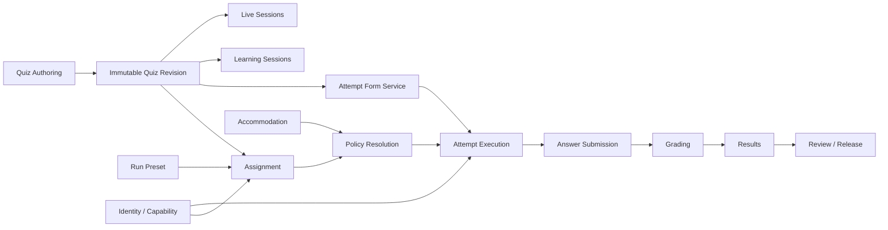
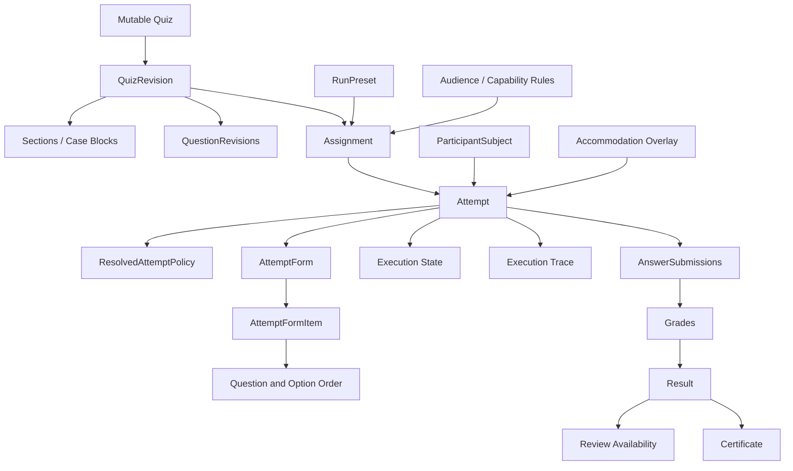

# Policy-Driven Quiz Execution Architecture

## Status, Purpose, and Authority

This document is the architectural reference for evolving QuizMaker from its current practice and assessment implementation into a general-purpose learning and assessment platform.

It defines:

- the target product capabilities;
- the core domain concepts;
- architectural and security invariants;
- policy composition and resolution;
- ownership boundaries between features;
- compatibility and migration principles;
- extension points for future execution modes;
- the intended delivery sequence behind the [Quiz Execution tracker](https://github.com/Gegcuk/QuizMaker/issues/472).

This document is broader than any individual implementation issue. It explains how the individual issues fit together and what architectural assumptions future work must preserve.

It is not a commitment to implement every capability immediately. Each capability remains subject to product prioritisation, security review, data-retention decisions, operational constraints, and the acceptance criteria of its owning issue.

Where a linked implementation issue contains a more specific approved decision, that issue takes precedence. When an issue conflicts with an invariant in this document, the conflict must be resolved explicitly before implementation rather than silently interpreted by the contributor.

---

## Product Vision

QuizMaker should support two equally important product families without maintaining two separate execution engines.

### Learning and self-improvement

A learner should be able to:

- practise an entire quiz;
- receive immediate feedback after each submitted answer;
- repeat only incorrectly answered questions;
- practise questions not seen before;
- keep a stable question order between sessions;
- receive a different random selection on every session;
- use hints and explanations;
- retry until correct where the policy allows it;
- rate confidence in an answer;
- review due material through spaced repetition;
- work towards topic mastery;
- resume an unfinished session;
- use flashcard or self-assessment workflows;
- complete ungraded reflective activities.

### Teaching and assessment

An author, teacher, or assignment manager should be able to:

- maintain a large reusable question bank;
- publish an immutable version of a quiz;
- create an assignment for a particular audience;
- distribute an authenticated or anonymous participant link;
- choose a fixed or random number of questions from a larger bank;
- require balanced selection across topics and difficulty levels;
- give every participant the same form or equivalent individual forms;
- set opening time, deadline, and attempt duration;
- configure total, section, or question-level timers;
- prevent backtracking or allow free navigation;
- limit the number of attempts;
- delay scores, correct answers, or explanations until a specified release point;
- manually grade free-text or file-based answers;
- view participant and cohort results;
- issue certificates where appropriate;
- provide participant-specific accommodations;
- investigate disputed attempts using reproducible evidence.

These workflows must reuse the same immutable content, policy-resolution, form, answer, grading, and review foundations.

---

## Representative Product Scenarios

The architecture must be capable of expressing the following scenarios without controller-specific mode branches.

### Scenario A: learner practice

A learner opens their own quiz and chooses practice.

The system:

1. uses the current published revision;
2. selects all questions;
3. shuffles them for this attempt;
4. allows free navigation;
5. saves drafts;
6. allows answers to be changed until final submission;
7. shows correctness immediately after each submitted answer;
8. shows explanations after submission;
9. records mistakes for later practice;
10. allows unlimited future attempts.

### Scenario B: consistent learner practice

A learner wants to compare progress across repeated attempts.

The system:

- selects the same question set for that learner;
- uses a stable order derived from a versioned deterministic key;
- preserves the option order where configured;
- records each attempt separately;
- calculates progress without changing historical results.

### Scenario C: timed randomized student assignment

A teacher has a bank of 120 questions and creates an assignment that:

- opens at 09:00 on 10 October;
- closes at 18:00 on 17 October;
- gives every student 45 minutes after first start;
- selects 30 questions;
- includes 10 questions from each of three topics;
- includes a defined balance of easy, medium, and difficult questions;
- gives every participant an individually randomized but equivalent form;
- allows one attempt;
- prevents returning to submitted questions;
- reveals no correctness or score during the attempt;
- automatically submits when time expires;
- releases the total score after the deadline;
- releases correct answers and explanations only after the teacher manually approves review.

The student accesses the assignment through an authenticated invitation or a capability-backed link. The participant cannot change any of these rules.

### Scenario D: mixed automatic and manual grading

An assignment contains:

- multiple-choice questions;
- fill-gap questions;
- short free-text questions;
- one essay graded using a rubric.

The participant can submit before manual grading is complete.

The system represents:

```text
Execution: SUBMITTED
Answer submission: COMPLETE
Automatic grading: COMPLETE
Manual grading: PENDING
Result release: WAITING_FOR_GRADING
Review availability: HIDDEN
```

Submission, grading, result release, and review are therefore separate concepts.

### Scenario E: branching scenario

A participant receives the next scenario node based on their previous decision. Future nodes are not preselected or visible.

Each selected edge and newly delivered node is persisted before delivery so that the participant path remains reproducible.

### Scenario F: live competition

A host opens a synchronized session. Participants receive rounds at the same server-controlled time.

Live coordination manages:

- lobby membership;
- teams;
- current round;
- answer windows;
- synchronized delivery;
- provisional scores;
- leaderboard publication.

The live feature reuses immutable content and scoring contracts but is not implemented as another `AttemptMode`.

---

## Architectural Objective

Support practice, assessments, assignments, review, manual grading, adaptive learning, branching scenarios, spaced repetition, surveys, and live sessions without creating a separate copy of the execution engine for each mode.

An execution mode is a reusable server-owned preset.

At attempt creation, the preset, published content, assignment configuration, participant context, accommodations, and only explicitly permitted overrides are resolved into one immutable versioned policy snapshot.

```text
Platform defaults
    + run preset
    + published quiz revision constraints
    + assignment or legacy share-link configuration
    + participant eligibility
    + authorized accommodation overlay
    + explicitly permitted start-time override
    = immutable ResolvedAttemptPolicy
```

The attempt executes its saved policy and saved form.

It must not reinterpret mutable quiz, link, template, accommodation, question-bank, or algorithm data after it starts.

---

## Fundamental Architectural Principles

### 1. Modes are presets, not runtime branches

`PRACTICE`, `ASSESSMENT`, `FLASHCARDS`, and similar names may be exposed as convenient product presets, but they must not become the primary runtime architecture.

Avoid:

```java
if (mode == PRACTICE) {
    ...
} else if (mode == ASSESSMENT) {
    ...
} else if (mode == LIVE) {
    ...
}
```

Prefer:

```text
Practice preset
    -> SelectionPolicy
    -> OrderingPolicy
    -> DeliveryPolicy
    -> NavigationPolicy
    -> SubmissionPolicy
    -> DisclosurePolicy
    -> TimingPolicy
    -> GradingPolicy
    -> ReviewPolicy
```

A new conventional mode should usually be expressible as another combination of existing policies.

### 2. Attempts execute immutable snapshots

After creation, an attempt never continuously reads mutable execution settings.

It executes:

- a specific immutable quiz revision;
- a versioned resolved policy;
- a persisted fixed or progressive form;
- stored answer and lifecycle state;
- versioned grading contracts.

### 3. The server owns every consequential decision

The server decides:

- who the participant is;
- whether they may start;
- which questions are selected;
- which question is currently available;
- which actions are allowed;
- whether time remains;
- whether an answer may change;
- how the answer is graded;
- which protected information may be released;
- whether review is available.

The client renders server state and requests actions. It does not authorize them.

### 4. Participant experience is persisted as evidence

A seed is useful but insufficient.

The system persists what the participant actually received:

- selected questions;
- section and case membership;
- question order;
- option order;
- progressive selections;
- branch transitions;
- applied accommodations;
- algorithm versions.

### 5. Submission, grading, release, and review are independent

Completing the participant interaction does not necessarily mean:

- every answer has been graded;
- the total score is final;
- results have been released;
- correct answers may be reviewed.

### 6. Fundamentally different runtimes use separate bounded contexts

Learning schedules, live orchestration, and potentially advanced analytics have different lifecycles from assessment attempts.

They may reuse shared immutable content and strategy interfaces, but they must not overload the ordinary attempt lifecycle.

---

## Starting Constraints

The current application contains production behaviour and live client contracts that must remain compatible while the new architecture is introduced.

Current constraints include:

- `Attempt` has a direct relationship to a mutable `Quiz`;
- `Answer` has a direct relationship to a mutable `Question`;
- execution uses a compact `AttemptMode` enum;
- current routes contain mode-specific or route-specific behaviour;
- existing request and response shapes are used by the frontend;
- existing historical attempts do not contain complete policy or form evidence;
- legacy anonymous access uses a sentinel user;
- share links currently act as capabilities but not immutable assignments;
- some request shapes contain disclosure-related flags;
- existing practice and assessment behaviour must continue during migration.

The target architecture is additive.

It introduces new policy-aware application services and persistence alongside the current implementation, then adapts existing routes through explicit compatibility adapters.

The migration must not:

- rewrite all controllers in one change;
- destructively reinterpret historical attempts;
- alter active attempts in place;
- silently infer historical policies that were never stored;
- remove legacy routes before their migration lifecycle is complete.

---

## Core Terms

| Term | Meaning | Primary owner |
| --- | --- | --- |
| Mutable Quiz | Authoring aggregate that authors may edit. | Quiz |
| Quiz Draft | Mutable unpublished authoring state. | Quiz |
| Quiz Revision | Immutable published content and response contracts. | Quiz Revision |
| Question Revision | Immutable version of one question and its grading contract. | Quiz Revision |
| Section | Ordered grouping with optional policy overrides and completion rules. | Quiz Revision |
| Case Block | Atomic collection of related questions sharing context. | Quiz Revision |
| Question Bank | Eligible immutable questions used by selection strategies. | Quiz Revision |
| Run Preset | Reusable author-managed policy defaults. | Quiz/Assignment |
| Assignment | Published delivery configuration bound to one quiz revision and policy configuration. | Assignment |
| Legacy Share Link | Existing capability-backed access path preserved through an adapter. | Sharing |
| Resolved Attempt Policy | Versioned rules applied to one attempt. | Attempt |
| Participant Subject | Server-resolved participant identity abstraction. | Attempt/Identity |
| Attempt | One participant execution governed by one policy and form. | Attempt |
| Attempt Form | Exact fixed or progressively constructed participant-visible content. | Attempt |
| Form Item | Immutable question occurrence within an attempt form. | Attempt |
| Answer Draft | Mutable, unsubmitted participant work where policy permits it. | Answer Submission |
| Answer Submission | Accepted answer aligned to a form item and response contract. | Answer Submission |
| Grade | Automatic or manual evaluation of a submitted answer. | Grading |
| Result | Aggregated assessment outcome derived from eligible grades. | Results |
| Review | Participant-visible post-submission content controlled by release policy. | Review |
| Execution Trace | Append-only protected evidence of decisions and accepted commands. | Attempt |
| Learning Session | Non-assessment practice and scheduling lifecycle. | Learning |
| Live Session | Multi-participant synchronized orchestration. | Live |

---

## Bounded Contexts and Ownership



### Quiz and Quiz Revision

Own:

- mutable authoring;
- publication;
- immutable question content;
- immutable response and grading contracts;
- sections;
- case blocks;
- authored order;
- question metadata;
- shuffle constraints;
- rubric definitions.

Do not own:

- participant progress;
- attempt policy snapshots;
- answers;
- assignment eligibility;
- result release.

### Assignment

Own:

- revision binding;
- policy or preset binding;
- audience and eligibility;
- availability window;
- participant limits;
- assignment publication and revocation;
- assignment-level reporting configuration.

Do not own:

- active attempt state;
- answer submissions;
- grades;
- participant review representation.

### Attempt Execution

Own:

- resolved policy snapshot;
- participant subject;
- attempt form;
- current execution state;
- allowed-action calculation;
- navigation;
- timing checkpoints;
- command idempotency;
- execution trace references.

### Answer Submission

Own:

- drafts;
- submitted response values;
- answer state;
- answer locking;
- response-contract validation;
- answer command concurrency.

### Grading

Own:

- automatic grade decisions;
- manual grading queue;
- rubric decisions;
- grading state;
- grading algorithm version;
- score correction or supersession records where supported.

### Results and Review

Own:

- result aggregation;
- pass/fail evaluation;
- result selection across attempts;
- release decisions;
- review windows;
- participant-visible review content;
- certificates;
- leaderboard projections where applicable.

### Learning

Own:

- due state;
- mistake-review selection;
- mastery state;
- scheduling strategy;
- learning-session outcomes.

Learning progress must not be stored as assessment result data.

### Live

Own:

- lobby;
- participants;
- teams;
- rounds;
- synchronized question windows;
- connection and reconnection state;
- provisional scoring;
- leaderboard timing.

---

## Domain Model



---

## Policy Resolution and Precedence

Policy composition must use deterministic precedence.

A recommended order is:

1. platform safety defaults;
2. preset defaults;
3. quiz-revision structural constraints;
4. assignment configuration;
5. audience or cohort restrictions;
6. participant accommodation overlay;
7. explicitly permitted start-time overrides;
8. server-computed derived fields.

Later inputs may override earlier inputs only where the schema explicitly allows them.

For example:

- an assignment may disable pause even if the preset allows it;
- an accommodation may add time where its approval allows it;
- a participant may choose a permitted question count for personal practice;
- a participant may not disable an assignment deadline;
- an option ordering policy may not override a question-level `shuffleAllowed = false`.

Policy resolution must return both:

- the final immutable `ResolvedAttemptPolicy`;
- provenance explaining which source contributed each material override.

Example:

```text
timing.totalDuration = PT45M
    source: Assignment version 3

timing.extraDuration = PT15M
    source: Accommodation code EXTRA_TIME_33

timing.effectiveDuration = PT60M
    source: Derived policy value
```

Detailed accommodation rationale remains outside the attempt snapshot. Only the minimum approved code, version, and effective changes belong in the snapshot.

---

## Resolved Attempt Policy

The complete target model is composed from typed, versioned sub-policies.

```text
ResolvedAttemptPolicy
├── content
├── questionSelection
├── questionOrdering
├── answerOrdering
├── delivery
├── navigation
├── submission
├── answerChange
├── disclosure
├── hints
├── timing
├── pause
├── attempts
├── access
├── grading
├── review
├── results
├── accessibility
└── integrity
```

The initial implementation may introduce only a subset, but the schema and boundaries must not assume that the omitted dimensions do not exist.

### Content policy

Defines:

- quiz revision;
- eligible sections;
- eligible question bank;
- case-block treatment;
- whether the form is fixed or progressive;
- response-contract versions.

### Question selection policy

Candidate strategies:

```text
ALL
MANUAL_SET
RANDOM_COUNT
RANDOM_PERCENTAGE
STRATIFIED
WEIGHTED_RANDOM
UNSEEN_ONLY
INCORRECT_ONLY
LOW_CONFIDENCE_ONLY
DUE_FOR_REVIEW
ADAPTIVE
```

### Question ordering policy

Candidate strategies:

```text
AUTHORED
SHUFFLED_PER_ATTEMPT
STABLE_PER_USER
STABLE_PER_ASSIGNMENT
STABLE_PER_SHARE_LINK
STABLE_PER_COHORT
SEEDED
DIFFICULTY_ASC
DIFFICULTY_DESC
TOPIC_GROUPED
TOPIC_INTERLEAVED
ADAPTIVE
```

### Answer ordering policy

Candidate strategies:

```text
AUTHORED
SHUFFLED_PER_ATTEMPT
STABLE_PER_USER
STABLE_PER_ASSIGNMENT
STABLE_PER_COHORT
SEEDED
```

Question-level constraints override general shuffling where necessary.

### Delivery policy

Candidate modes:

```text
ALL_AT_ONCE
SECTION_AT_ONCE
ONE_AT_A_TIME
PREFETCH_NEXT
PROGRESSIVE
```

### Navigation policy

Candidate modes:

```text
FREE
SEQUENTIAL
SEQUENTIAL_WITH_BACKTRACK
SECTION_LOCKED
BRANCHING
```

### Submission policy

Defines:

- draft availability;
- autosave support;
- answer requirement;
- skip behaviour;
- single or batch submission;
- answer locking;
- idempotency;
- completion confirmation;
- automatic submission.

### Disclosure policy

Defines independent rules for:

- correctness;
- per-question score;
- total score;
- correct answer;
- explanation;
- hints;
- rubric;
- grader comments;
- participant answers;
- cohort statistics.

### Timing policy

Defines:

```text
NONE
TOTAL_ATTEMPT
PER_SECTION
PER_QUESTION
COMBINED
```

It also defines availability, deadline, grace periods, and expiry behaviour.

### Pause policy

Candidate values:

```text
DISABLED
IMMEDIATE
AFTER_CURRENT_SUBMISSION
BETWEEN_SECTIONS
LIMITED_COUNT
LIMITED_DURATION
MODERATOR_ONLY
```

### Attempt policy

Defines:

```text
UNLIMITED
FIXED_COUNT
ONE_PER_PERIOD
ONE_PER_REVISION
MANUAL_RESET
```

It also defines cooldown, retake selection, and result-selection rules.

### Grading policy

Candidate strategies:

```text
BINARY
PARTIAL_CREDIT
NEGATIVE_MARKING
WEIGHTED
MANUAL
RUBRIC
CONFIDENCE_WEIGHTED
MASTERY
UNGRADED
```

### Review policy

Defines:

- review eligibility;
- release timing;
- review duration;
- content visible in review;
- revocation behaviour;
- whether only incorrect answers are shown.

### Result policy

Defines:

- participant visibility;
- author visibility;
- assignment reporting;
- pass thresholds;
- section thresholds;
- best/latest result selection;
- leaderboard behaviour;
- certificate eligibility.

---

## Typed Policies, Not a Generic Rules Engine

Policies are typed Java records or value objects.

For example:

```java
public record TimingPolicy(
        TimingMode mode,
        Duration totalDuration,
        Map<SectionId, Duration> sectionDurations,
        Duration defaultQuestionDuration,
        Instant opensAt,
        Instant deadline,
        Duration gracePeriod,
        ExpiryAction expiryAction
) {}
```

Canonical JSON acts as:

- a persistence boundary;
- a hashing boundary;
- a compatibility boundary;
- an operational inspection format.

It must not become an arbitrary expression language or generic runtime workflow engine.

Algorithmic behaviour belongs behind narrow interfaces:

```java
interface QuestionSelectionStrategy {
    SelectionResult select(SelectionContext context);
}

interface QuestionOrderingStrategy {
    OrderedQuestions order(OrderingContext context);
}

interface AnswerOrderingStrategy {
    OrderedOptions order(AnswerOrderingContext context);
}

interface GradingStrategy {
    GradeDecision grade(GradingContext context);
}

interface ReviewReleaseStrategy {
    ReviewDecision evaluate(ReviewContext context);
}
```

Each implementation must have a stable version identifier.

---

## Policy Validation

A central validator must reject unsupported or dangerous combinations before an attempt exists.

Examples:

```text
ALL_AT_ONCE
+ future questions hidden
= invalid
```

```text
ADAPTIVE selection
+ fully precomputed fixed form
= invalid unless the adaptive policy explicitly precomputes
```

```text
MANUAL grading
+ immediate final score release
= invalid
```

```text
correct answer released after submission
+ scored answer editable after submission
= invalid answer oracle
```

```text
timed protected assessment
+ unlimited participant-controlled pause
= invalid or explicit high-risk override
```

```text
branching navigation
+ client-selected next question
= invalid
```

The validator should distinguish:

- structurally invalid policy;
- unsupported combination;
- unauthorized override;
- insufficient content;
- incompatible revision structure;
- unavailable algorithm version.

Failures return stable RFC 7807 responses and create no partial attempt.

---

## Example Policy: Learner Practice

```yaml
schemaVersion: 1

content:
  revisionId: quiz-revision-42
  formMode: PRECOMPUTED

questionSelection:
  strategy: ALL

questionOrdering:
  strategy: SHUFFLED_PER_ATTEMPT

answerOrdering:
  strategy: SHUFFLED_PER_ATTEMPT

delivery:
  mode: ALL_AT_ONCE

navigation:
  mode: FREE
  allowSkip: true
  allowBookmark: true

submission:
  draftsEnabled: true
  answerRequiredBeforeNext: false
  completionConfirmationRequired: true

answerChange:
  allowedUntil: ATTEMPT_COMPLETION

disclosure:
  correctness: AFTER_EACH_SUBMISSION
  questionScore: AFTER_EACH_SUBMISSION
  correctAnswer: AFTER_EACH_SUBMISSION
  explanation: AFTER_EACH_SUBMISSION
  totalScore: AFTER_ATTEMPT

timing:
  mode: NONE

pause:
  mode: IMMEDIATE

attempts:
  limit: UNLIMITED
  retakeSelection: NEW_FORM

grading:
  strategy: BINARY

review:
  availability: AFTER_ATTEMPT
  content:
    - SUBMITTED_ANSWERS
    - CORRECTNESS
    - CORRECT_ANSWERS
    - EXPLANATIONS

results:
  visibility: PARTICIPANT_AND_AUTHOR

access:
  audience: OWNER
```

Because correct answers are released after each submission, submitted answers must either become locked or the activity must be explicitly unscored.

---

## Example Policy: Timed Randomized Assignment

```yaml
schemaVersion: 1

content:
  revisionId: quiz-revision-75
  formMode: PRECOMPUTED

questionSelection:
  strategy: STRATIFIED
  totalCount: 30
  strata:
    - topic: JAVA
      count: 10
      difficulty:
        EASY: 3
        MEDIUM: 5
        HARD: 2
    - topic: SQL
      count: 10
      difficulty:
        EASY: 3
        MEDIUM: 5
        HARD: 2
    - topic: SECURITY
      count: 10
      difficulty:
        EASY: 3
        MEDIUM: 5
        HARD: 2

questionOrdering:
  strategy: SHUFFLED_PER_ATTEMPT

answerOrdering:
  strategy: SHUFFLED_PER_ATTEMPT

delivery:
  mode: ONE_AT_A_TIME
  prefetchCount: 0
  exposeFutureQuestionIds: false

navigation:
  mode: SEQUENTIAL
  allowSkip: false
  allowBacktrack: false
  requireAnswerBeforeNext: true

submission:
  draftsEnabled: true
  answerRequiredBeforeNext: true
  autoSubmitOnExpiry: true

answerChange:
  allowedUntil: NEXT_QUESTION

disclosure:
  correctness: AFTER_DEADLINE
  questionScore: AFTER_DEADLINE
  correctAnswer: MANUAL_RELEASE
  explanation: MANUAL_RELEASE
  totalScore: AFTER_DEADLINE

timing:
  mode: TOTAL_ATTEMPT
  duration: PT45M
  opensAt: 2026-10-10T09:00:00Z
  deadline: 2026-10-17T17:00:00Z
  gracePeriod: PT30S
  expiryAction: SUBMIT_ACCEPTED_RESPONSES

pause:
  mode: DISABLED

attempts:
  limit: FIXED_COUNT
  count: 1
  resultSelection: LATEST_VALID

grading:
  strategy: WEIGHTED
  passThresholdPercent: 60

review:
  availability: MANUAL_RELEASE
  content:
    - SUBMITTED_ANSWERS
    - CORRECTNESS
    - CORRECT_ANSWERS
    - EXPLANATIONS

results:
  visibility: PARTICIPANT_AND_AUTHOR

access:
  audience: INVITED_PARTICIPANTS
```

---

## Attempt Creation

Starting an attempt is a single server-owned operation.

A recommended transaction flow is:

1. resolve the entry resource;
2. resolve participant identity or exact capability;
3. check assignment visibility and eligibility;
4. verify opening time, deadline, revocation, capacity, and attempt limits;
5. load the immutable quiz revision;
6. capture the exact preset and assignment versions;
7. apply permitted accommodation overlays;
8. apply only authorized overrides;
9. validate the complete configuration;
10. persist the resolved policy snapshot;
11. create the participant subject binding;
12. create the attempt;
13. construct and persist the fixed form, or initialise a progressive form;
14. persist initial execution and lifecycle state;
15. append `AttemptStarted` evidence;
16. commit;
17. return the participant-safe representation.

If any required stage fails:

- no participant-visible attempt exists;
- no partial form is published;
- no attempt limit is consumed;
- no orphan snapshot remains;
- the failure is observable without exposing sensitive data.

Attempt creation must support canonical idempotency.

Concurrent start requests with the same semantic operation must not create duplicate attempts or consume multiple allowed attempts.

---

## Immutable Quiz Revisions

A mutable quiz is an authoring workspace.

A quiz revision is immutable delivery content.

A revision contains or references immutable versions of:

- question text;
- stimulus material;
- options;
- stable option IDs;
- response schema;
- correct-answer interpretation;
- explanation;
- hints;
- scoring contract;
- topic and difficulty metadata;
- authored order;
- section membership;
- case-block membership;
- shuffle restrictions;
- rubric;
- branching graph where applicable.

Editing a quiz after publication creates another revision.

It must not modify:

- existing assignments;
- active attempts;
- completed attempts;
- historical scoring;
- review content;
- learning sessions already started from the previous revision.

A physical deep clone and a strictly immutable versioned representation may be implementation alternatives, but their external semantics must be identical.

---

## Question and Response Contract Versioning

Every form item references an immutable question revision and response contract.

Response validation and grading must not depend on the current Java implementation alone.

Examples of response contracts include:

- single option ID;
- multiple option IDs;
- ordered option IDs;
- free text;
- normalized fill-gap values;
- matrix responses;
- matching pairs;
- hotspot coordinates;
- confidence value;
- uploaded artefact reference.

A contract must carry a stable type and version.

Example:

```text
questionType: MULTIPLE_CHOICE_SINGLE
responseContractVersion: 2
gradingAlgorithmVersion: binary-option-id/v1
```

Display order must never affect scoring.

Correct answers use stable domain IDs rather than:

- array indexes;
- letters such as A, B, or C;
- text equality against the displayed option.

---

## Assignments and Legacy Share Links

### Assignment

An assignment is a published immutable delivery binding.

It should contain:

- immutable quiz revision reference;
- preset or explicit policy configuration;
- audience definition;
- availability window;
- participant limits;
- attempt limits;
- same-form or individualized-form policy;
- result visibility;
- review release configuration;
- reporting ownership;
- status and publication version.

Changing material assignment behaviour creates a new version or assignment. It does not rewrite active participant attempts.

### Legacy share links

Existing share links remain supported through an adapter.

They are not silently renamed or rewritten into assignments.

The adapter may resolve a legacy link into:

- the current legacy access behaviour;
- an equivalent default preset;
- a legacy participant subject;
- a compatibility form and result representation.

The adapter must preserve documented success behaviour without preserving security vulnerabilities.

### Capability separation

These concepts must remain distinct:

```text
Quiz share capability
Assignment access capability
Attempt execution capability
Attempt review capability
Public certificate verification capability
```

Possession of a quiz or assignment link must not automatically authorize access to another participant’s attempt review.

---

## Participant Subjects

An attempt must not assume that every participant is a registered `User`.

Candidate subject types include:

```text
AUTHENTICATED_USER
CAPABILITY_GUEST
EXTERNAL_PARTICIPANT
COHORT_MEMBER
TEAM
```

The initial implementation may support only authenticated users and capability-bound guests, but the model should not use a common anonymous sentinel as the authorization identity.

Participant identity and access capability are related but separate concepts.

For example:

```text
Participant subject:
    CAPABILITY_GUEST / pseudonymous subject 9271

Current authorization:
    exact attempt capability X

Display identity:
    "Student 14"
```

The server resolves the subject. A client-supplied `userId`, `participantId`, team ID, or subject type cannot establish ownership.

---

## Question Bank Selection

Question selection is separate from ordering.

Selection answers:

> Which questions belong in this attempt?

Ordering answers:

> In what order are those selected questions shown?

### Candidate selection strategies

```text
ALL
MANUAL_SET
RANDOM_COUNT
RANDOM_PERCENTAGE
STRATIFIED
WEIGHTED_RANDOM
UNSEEN_ONLY
INCORRECT_ONLY
LOW_CONFIDENCE_ONLY
DUE_FOR_REVIEW
ADAPTIVE
```

### Stratified selection

Example:

```text
Total: 20 questions

Topic quotas:
- Java: 5
- Spring: 5
- SQL: 5
- Security: 5

Within each topic:
- Easy: 2
- Medium: 2
- Hard: 1
```

This permits different participants to receive different questions while preserving comparable form composition.

### Candidate constraints

Selection should eventually support:

- minimum questions by tag;
- maximum questions by tag;
- required questions;
- recently seen exclusions;
- mutually exclusive questions;
- one question from a group of equivalent alternatives;
- prerequisite constraints;
- complete case-block inclusion;
- question-type quotas;
- difficulty quotas;
- content-exposure constraints;
- exclusion of retired or invalid items.

### Impossible selections

A selection configuration must fail before attempt creation when it cannot be satisfied.

The system must not silently:

- reduce the requested count;
- ignore a topic quota;
- split an atomic case block;
- replace stratified selection with random selection;
- downgrade an unknown strategy to `ALL`.

### Equivalent forms

The architecture must distinguish:

```text
sameContent
sameOrder
equivalentComposition
equivalentDifficulty
individualRandomization
```

Two students may receive different questions while still receiving forms designed to be equivalent.

This equivalence should be auditable through composition metadata without exposing hidden questions or answers.

Advanced statistical equating is a future product capability, not implied by simple topic and difficulty quotas.

---

## Question Ordering

Candidate strategies include:

```text
AUTHORED
SHUFFLED_PER_ATTEMPT
STABLE_PER_USER
STABLE_PER_ASSIGNMENT
STABLE_PER_SHARE_LINK
STABLE_PER_COHORT
SEEDED
DIFFICULTY_ASC
DIFFICULTY_DESC
TOPIC_GROUPED
TOPIC_INTERLEAVED
ADAPTIVE
```

A fixed authored order is necessary when:

- later questions depend on earlier ones;
- the quiz follows a teaching sequence;
- all students discuss question numbers together;
- the content represents one story or case;
- stable comparison is more important than randomization;
- accessibility requires predictable navigation.

### Shuffle scope

Randomization may operate on different units:

```text
QUESTIONS
SECTIONS
QUESTIONS_WITHIN_SECTION
CASE_BLOCKS
QUESTIONS_WITHIN_CASE
```

For example, section order may remain fixed while questions within each section are randomized.

---

## Answer Option Ordering

Option ordering is independent from question ordering.

Candidate strategies:

```text
AUTHORED
SHUFFLED_PER_ATTEMPT
STABLE_PER_USER
STABLE_PER_ASSIGNMENT
STABLE_PER_COHORT
SEEDED
```

Question- and option-level constraints include:

```text
shuffleAllowed
shuffleGroup
pinnedPosition: FIRST | LAST | NONE
preserveRelativeOrder
semanticOrder
```

These constraints support:

- “All of the above”;
- “None of the above”;
- Likert scales;
- Strongly disagree to strongly agree;
- chronological choices;
- grouped dependent options;
- matching questions;
- matrix questions.

The exact option order is persisted in the form and never regenerated during resume or review.

---

## Attempt Forms

An attempt form represents exactly what may be delivered to a participant.

### Precomputed form

All selected questions and option orders are resolved at start.

Suitable for:

- ordinary practice;
- randomized tests;
- section-based assessments;
- offline-eligible full forms.

### Progressive form

The form grows during execution.

Suitable for:

- adaptive selection;
- branching scenarios;
- some mastery workflows.

```text
AttemptForm
├── mode: PRECOMPUTED | PROGRESSIVE
├── formVersion
├── formHash
├── itemSequence
├── sectionMembership
├── caseMembership
├── optionOrder
├── selectionEvidence
└── algorithmVersions
```

Every progressive extension is persisted before the item is delivered.

A progressive decision may record:

```text
selectedItem: question-revision-219
strategyVersion: adaptive-rules/v2
reasonCode: TOPIC_MASTERY_BELOW_THRESHOLD
candidateSetFingerprint: ...
precedingSubmission: answer-submission-18
```

The reason code should explain the category of decision without exposing protected internal data to participants.

---

## Sections and Case Blocks

Sections deserve explicit revision and form models.

```text
Section
├── title and instructions
├── ordered items or blocks
├── selection override
├── ordering override
├── timing override
├── navigation override
├── grading threshold
├── disclosure override
└── completion rule
```

Examples:

- untimed theory followed by timed practice;
- fixed first section and randomized second section;
- next section opens only after passing the previous section;
- first-section feedback is released before the next section;
- mandatory and optional sections;
- separate pause rules by section.

A case block contains shared stimulus material and multiple related questions.

Atomic case blocks must never be partially selected unless the authored block explicitly allows it.

Section policy precedence must be explicit:

```text
Global resolved policy
    overridden by permitted section policy
        constrained by immutable question/case rules
```

---

## Delivery

Candidate delivery modes:

```text
ALL_AT_ONCE
SECTION_AT_ONCE
ONE_AT_A_TIME
PREFETCH_NEXT
PROGRESSIVE
```

The delivery policy defines:

- whether future questions may be fetched;
- whether future question IDs are visible;
- how many questions may be prefetched;
- whether the full participant-safe form is downloadable;
- when an item becomes “delivered”;
- whether repeated retrieval changes delivery state;
- what happens after reconnect.

The server should distinguish:

```text
selectedFormItemIds
deliveredFormItemIds
currentFormItemId
submittedFormItemIds
lockedFormItemIds
```

Selection does not automatically mean delivery.

Delivery may have security, timing, or exposure consequences.

---

## Navigation

Candidate modes:

```text
FREE
SEQUENTIAL
SEQUENTIAL_WITH_BACKTRACK
SECTION_LOCKED
BRANCHING
```

Parameters may include:

- skip allowed;
- return to skipped item allowed;
- answer required before next;
- submitted answer editable;
- previous section locked;
- bookmark allowed;
- complete with unanswered items allowed;
- completion confirmation required;
- current item fixed until submission;
- direct item retrieval permitted.

The frontend must not determine navigation validity from its local array alone.

Every request is checked against authoritative server state.

---

## Server-Reported Allowed Actions

The participant representation should include actions computed from:

- resolved policy;
- attempt state;
- answer state;
- form state;
- timing state;
- participant subject;
- assignment and capability state.

Example:

```json
{
  "attemptState": "PAUSE_PENDING",
  "allowedActions": {
    "canViewCurrent": true,
    "canSaveDraft": true,
    "canSubmitCurrent": true,
    "canRequestNext": false,
    "canGoBack": false,
    "canSkip": false,
    "canPause": false,
    "canResume": false,
    "canComplete": false,
    "canReview": false
  }
}
```

This reduces client duplication of policy logic.

The server still validates every requested action. `allowedActions` is not an authorization token.

---

## Answer Lifecycle

Candidate answer states:

```text
EMPTY
DRAFT
SUBMITTED
LOCKED
GRADED
REVIEWED
```

Not every question needs every state, but the architecture must preserve the distinction between mutable work and accepted submission.

### Draft

A draft:

- may be overwritten where allowed;
- is not graded;
- does not trigger feedback;
- does not count as a submitted answer;
- may be returned only to the same authorized subject.

### Submitted answer

A submitted answer:

- has passed response-contract validation;
- has an accepted server timestamp;
- is aligned to one immutable form item;
- may trigger grading;
- may trigger disclosure;
- follows explicit edit and retry rules.

### Answer change policy

Candidate rules:

```text
UNTIL_SUBMISSION
UNTIL_NEXT_QUESTION
UNTIL_SECTION_SUBMISSION
UNTIL_ATTEMPT_SUBMISSION
NEVER_AFTER_SUBMISSION
```

### Retry policy

Candidate rules:

```text
NONE
FIXED_COUNT
UNTIL_CORRECT
UNTIL_SECTION_END
```

Retry attempts must remain distinguishable from attempt-level retakes.

### Locking after feedback

When protected feedback has been disclosed, a scored answer must normally become locked.

Otherwise a participant could:

1. submit an answer;
2. observe correctness or the correct answer;
3. change the answer;
4. receive a score based on disclosed information.

An explicitly unscored learning activity may permit different behaviour.

---

## Answer Submission, Idempotency, and Concurrency

All mutating commands require defined idempotency behaviour.

Canonical rule:

- same idempotency key and same semantic payload returns the previous result;
- same key and different semantic payload returns conflict;
- a retry never grants more disclosure than the original successful operation.

Submission must support:

- single answer submission;
- batch submission where approved;
- atomic answer submission plus transition request;
- optimistic version checking;
- duplicate request handling;
- two-device conflict handling;
- deterministic partial-batch semantics.

A batch must not apply looser policy than individual commands.

Possible batch policies include:

```text
ATOMIC_ALL_OR_NOTHING
VALID_ITEMS_ONLY_WITH_ITEM_ERRORS
```

The chosen behaviour must be explicit in the API contract.

---

## Execution, Grading, and Review Lifecycles

One attempt status is insufficient.

### Execution lifecycle

A possible target model:

```text
CREATED
READY
IN_PROGRESS
PAUSE_PENDING
PAUSED
SUBMITTED
EXPIRED
ABANDONED
CANCELLED
```

`SUBMITTED` is a terminal participant execution state, but not necessarily a terminal grading or review state.

### Answer-submission lifecycle

```text
NOT_STARTED
IN_PROGRESS
COMPLETE
```

Per-answer state remains separately represented.

### Grading lifecycle

```text
NOT_REQUIRED
PENDING_AUTOMATIC
PENDING_MANUAL
PARTIALLY_GRADED
GRADED
FAILED_RETRYABLE
```

### Result lifecycle

```text
NOT_AVAILABLE
CALCULATING
FINAL
INVALIDATED
```

### Release lifecycle

```text
HIDDEN
WAITING_FOR_GRADING
WAITING_FOR_DEADLINE
WAITING_FOR_MANUAL_RELEASE
AVAILABLE
REVOKED
```

### Review lifecycle

```text
NOT_AVAILABLE
AVAILABLE
EXPIRED
REVOKED
```

The final state names may differ, but these concepts must remain separate.

---

## Disclosure and Feedback

Correctness, score, correct answers, and explanations are different information categories.

Each requires its own release rule.

### Protected categories

```text
correctnessRelease
questionScoreRelease
totalScoreRelease
correctAnswerRelease
explanationRelease
hintRelease
rubricRelease
graderCommentRelease
participantAnswerRelease
statisticsRelease
```

### Candidate release conditions

```text
NEVER
ON_REQUEST
AFTER_HINT_REQUEST
AFTER_EACH_SUBMISSION
AFTER_N_FAILED_ATTEMPTS
AFTER_QUESTION_LOCK
AFTER_SECTION
AFTER_ATTEMPT
AFTER_PASSING
AFTER_DEADLINE
AFTER_ALL_PARTICIPANTS_FINISH
MANUAL_RELEASE
```

Examples:

- show only correct/incorrect immediately;
- show a hint after the second failed attempt;
- show explanation after the third failed attempt;
- show total score immediately but delay correct answers;
- release full review after the deadline;
- never release the answer key;
- release grader comments but not the complete rubric.

Disclosure is evaluated by a central server-owned service.

Request flags such as:

```text
includeCorrectness
includeCorrectAnswer
includeExplanation
```

must not override the stored policy.

Legacy flags may temporarily be accepted and ignored for request compatibility.

---

## Timing and Deadlines

The server clock is authoritative.

The client clock is display-only.

### Timing modes

```text
NONE
TOTAL_ATTEMPT
PER_SECTION
PER_QUESTION
COMBINED
```

Timing policy may include:

- assignment opening time;
- assignment deadline;
- duration from first start;
- section duration;
- question duration;
- grace period;
- warning thresholds;
- automatic submission;
- draft handling on expiry;
- participant accommodation;
- behaviour during pause;
- behaviour after reconnect.

### Important time concepts

These must not be conflated:

```text
assignmentOpensAt
assignmentDeadline
attemptStartedAt
attemptExpiresAt
sectionStartedAt
sectionExpiresAt
questionDeliveredAt
questionExpiresAt
submittedAt
serverReceivedAt
```

An assignment may close at 18:00 while an attempt started at 17:45 has a 45-minute limit.

The product must explicitly decide whether the effective expiry is:

```text
min(assignmentDeadline, startedAt + duration)
```

or whether started attempts may continue beyond the assignment deadline.

This must be assignment policy, not an implicit implementation choice.

### Expiry action

Candidate actions:

```text
SUBMIT_ACCEPTED_RESPONSES
SUBMIT_DRAFTS_WHERE_VALID
DISCARD_CURRENT_DRAFT
MARK_EXPIRED_WITHOUT_RESULT
```

The current draft treatment must be explicit.

---

## Pause Semantics

Candidate policies:

```text
DISABLED
IMMEDIATE
AFTER_CURRENT_SUBMISSION
BETWEEN_SECTIONS
LIMITED_COUNT
LIMITED_DURATION
MODERATOR_ONLY
```

For `AFTER_CURRENT_SUBMISSION`:

```text
IN_PROGRESS
    -> PAUSE_PENDING
    -> current question remains active
    -> current timer continues
    -> current answer is submitted
    -> PAUSED
    -> no next question is available
```

The architecture must define behaviour for:

- browser closure;
- connectivity loss;
- application backgrounding;
- share-link expiry;
- assignment revocation;
- capability revocation;
- another device login;
- server restart;
- deadline reached during pause;
- per-question timer expiry while pause is pending.

A disconnect is not automatically a pause.

---

## Attempt Limits and Retakes

Candidate limits:

```text
UNLIMITED
FIXED_COUNT
ONE_PER_PERIOD
ONE_PER_REVISION
MANUAL_RESET
```

Retake policy may define:

- cooldown;
- same or new question set;
- same or new order;
- same or new option order;
- incorrect-only selection;
- whether previous feedback remains visible;
- whether previous revealed answers exclude questions from the next attempt;
- retry penalties;
- abandoned-attempt continuation;
- assignment-level reset;
- participant-specific reset.

### Result selection across attempts

Candidate rules:

```text
FIRST_VALID
LATEST_VALID
BEST_VALID
AVERAGE_VALID
```

The initial implementation may support only latest and best, but the architecture should not store the result directly on the mutable assignment in a way that prevents future rules.

Tie behaviour must be explicit.

Failed attempt creation must not consume an attempt allowance.

Concurrent starts must not exceed the limit.

---

## Grading

Grading is a separate domain from execution, even though execution policy determines when grading is triggered.

### Candidate grading strategies

```text
BINARY
PARTIAL_CREDIT
NEGATIVE_MARKING
WEIGHTED
MANUAL
RUBRIC
CONFIDENCE_WEIGHTED
MASTERY
UNGRADED
```

### Grading configuration may include

- question weight;
- section weight;
- penalty for incorrect answer;
- penalty for hint use;
- penalty for retry;
- critical questions;
- total pass threshold;
- minimum section score;
- normalization rule;
- rounding policy;
- confidence weighting;
- manual grading requirement;
- mixed automatic and manual grading.

### Reproducibility

A grade decision must identify:

- question revision;
- response contract version;
- grading strategy version;
- participant response;
- configuration version;
- result;
- decision timestamp.

Historical answers must remain gradable after the current code or question draft changes.

---

## Manual Grading and Rubrics

A submitted attempt may contain both automatic and manual items.

Manual grading should support:

- immutable revision-bound rubric;
- grader queue;
- explicit grader permission;
- item-level score;
- participant-visible feedback;
- private grader notes;
- idempotent decision submission;
- audit history;
- total-score recalculation;
- release re-evaluation.

An accepted grading decision should not be silently edited.

Correction should use explicit supersession:

```text
GradeDecision v1
    superseded by GradeDecision v2
```

Each decision records actor, time, reason, and previous decision reference.

Multi-grader moderation may be deferred, but the initial design must not store grading directly in a way that makes supersession impossible.

---

## Results

A result is a derived and versioned interpretation of eligible grades.

It may include:

- raw score;
- maximum score;
- percentage;
- pass/fail;
- section results;
- critical-question failure;
- mastery outcome;
- completion-only outcome for ungraded activities;
- selected attempt under best/latest rules.

A result must not be treated as automatically participant-visible.

### Result visibility

Candidate scopes:

```text
PARTICIPANT_ONLY
AUTHOR_ONLY
PARTICIPANT_AND_AUTHOR
ASSIGNMENT_MANAGER
TEAM
COHORT
PUBLIC_LEADERBOARD
```

### Review content

Candidate content:

```text
SUBMITTED_ANSWERS
CORRECTNESS
QUESTION_SCORES
CORRECT_ANSWERS
EXPLANATIONS
HINTS
RUBRICS
GRADER_COMMENTS
COHORT_STATISTICS
```

### Review rules

Review may be:

- delayed;
- time limited;
- manually released;
- revoked;
- limited to incorrect questions;
- available without correct answers;
- available only after passing;
- disabled permanently.

Review uses the original attempt form and original display order.

---

## Teacher Reporting

The assignment and reporting model should eventually support:

- participant status;
- not started / in progress / submitted;
- remaining time where appropriate;
- grading pending;
- result released;
- selected result;
- section performance;
- question-level aggregate performance;
- completion rate;
- score distribution;
- manually graded work queue;
- form composition metadata;
- audit access for disputes.

Reporting must distinguish:

- assignment-level facts;
- attempt-level facts;
- result-selection projections;
- learning analytics;
- legacy analytics.

Participant answers and identities must not be exposed through aggregate endpoints unless authorization and privacy rules permit it.

Small-group statistics may require minimum cohort thresholds to prevent re-identification.

---

## Certificates

Certificates are downstream from a final eligible released result.

Certificate issuance must be:

- idempotent;
- based on an immutable result reference;
- attributable to a policy version;
- auditable;
- revocable or invalidatable through an explicit lifecycle if corrections are supported.

A certificate must not be issued for:

- pending manual grading;
- unreleased results;
- invalidated results;
- ungraded activities;
- attempts that fail certificate policy.

Public verification, if introduced, exposes the minimum approved information.

---

## Ungraded and Self-Assessment Activities

Not every activity has a correct answer or numeric score.

The platform should support:

- reflective free text;
- confidence rating;
- self-rating;
- surveys without correct answers;
- participation-based completion;
- mixed graded and ungraded sections.

An ungraded activity must not create:

- fabricated score;
- fabricated correctness;
- pass/fail;
- certificate eligibility;
- assessment leaderboard entry.

Ungraded responses may require additional privacy and consent rules beyond ordinary assessment answers.

---

## Accessibility and Accommodations

Accommodations are authorized overlays applied before attempt creation.

Candidate overlays include:

- additional time;
- disabled per-question timer;
- stable question order;
- stable option order;
- adjusted navigation;
- additional pause allowance;
- alternative delivery setting.

The attempt snapshot stores only the applied code, version, and effective policy changes.

It should not contain medical evidence or detailed sensitive rationale.

An accommodation:

- does not modify the assignment for other participants;
- cannot be self-declared through the attempt request;
- cannot silently alter an active attempt;
- must remain auditable under restricted access.

Accessibility also requires:

- screen-reader-friendly navigation;
- no dependence on visual A/B/C positions;
- semantic labels;
- stable order after reconnect;
- preserved scale ordering;
- predictable focus and error handling.

---

## Adaptive Execution

Adaptive selection is a progressive-form strategy.

Inputs may include:

- previous correctness;
- response time;
- answer confidence;
- topic mastery;
- question difficulty;
- prerequisites;
- current attempt evidence;
- prior learning state where privacy policy permits it.

Stopping rules may include:

- mastery threshold reached;
- diagnostic confidence reached;
- minimum questions completed;
- maximum questions reached;
- time exhausted;
- no eligible questions remain.

Every next-question decision is persisted before delivery.

Initial adaptive execution should use deterministic project-owned rules rather than an opaque external model.

Adaptive selection must remain distinct from branching:

- adaptive selection chooses a suitable question from an eligible bank;
- branching follows authored scenario edges.

---

## Branching Scenarios

A branching revision contains an immutable directed graph.

```text
ScenarioGraph
├── nodes
├── entry node
├── edges
├── server-evaluated conditions
├── terminal outcomes
└── graph version
```

Publication validation must detect:

- missing entry node;
- missing targets;
- unreachable nodes;
- forbidden cycles;
- invalid conditions;
- ambiguous transitions;
- missing terminal behaviour.

The participant cannot request an arbitrary branch or hidden node.

Each selected edge is persisted as execution evidence.

Review normally displays only the participant’s path unless broader exploration is explicitly permitted.

---

## Learning and Spaced Repetition

Spaced repetition and mistake review belong in a separate Learning bounded context.

They reuse:

- immutable question revisions;
- participant-safe content representations;
- selection and ordering infrastructure where appropriate.

They own:

- per-learner due state;
- review intervals;
- last-reviewed timestamp;
- confidence/self-rating;
- scheduling strategy version;
- mistake history;
- learning-session forms.

Learning sessions do not create assessment results unless explicitly designed as assessments.

Candidate learning selections include:

```text
DUE_FOR_REVIEW
INCORRECT_ONLY
UNSEEN_ONLY
LOW_CONFIDENCE_ONLY
TOPIC_MASTERY_GAP
```

Question revision changes require an explicit schedule migration rule.

---

## Live and Team Sessions

Live execution is a separate bounded context.

```text
LiveSession
├── host
├── lobby
├── participants
├── teams
├── current phase
├── current round
├── synchronized form item
├── answer window
├── provisional scores
└── leaderboard release
```

Live policy may define:

- admission rule;
- participant capacity;
- late joining;
- team membership;
- synchronized or individualized forms;
- speed-based scoring;
- answer-window duration;
- reconnection;
- participant elimination;
- leaderboard release.

The server clock controls all phase transitions.

Live orchestration may reuse ordinary form items, response contracts, and grading strategies, but it must not add live-specific branches throughout the ordinary attempt service.

---

## Offline Boundary

Offline behaviour is explicit opt-in functionality, not a general permission to execute without the server.

Only a full-form attempt may be eligible for offline package support.

An offline package may contain:

- participant-safe immutable form data;
- package version;
- package expiry;
- integrity information;
- display order;
- already authorized participant instructions.

It must not contain:

- correct answers;
- unreleased explanations;
- capability secrets;
- grader data;
- privileged policy internals.

While offline, the client may:

- display already delivered package content;
- collect local drafts or queued commands according to the client contract.

It may not:

- start an attempt;
- authorize a participant;
- choose adaptive questions;
- evaluate branches;
- extend the form;
- trust its clock for final timing;
- grade answers authoritatively;
- release results.

Every replayed command is revalidated after reconnect.

---

## API Representation Boundaries

A universal `QuestionDto` with nullable privileged fields is prohibited.

Separate purpose-specific schemas are required.

### Authoring representation

May contain:

- answer keys;
- explanations;
- rubric;
- internal metadata;
- unpublished content;
- validation warnings.

### Participant representation

Contains only:

- delivered question content;
- visible options in saved order;
- response schema;
- permitted instructions;
- current allowed actions;
- permitted timing summary.

### Answer acknowledgement

Contains:

- accepted submission reference;
- answer state;
- server timestamp;
- permitted feedback;
- updated actions;
- updated lifecycle state.

### Grader representation

Contains:

- submitted response;
- permitted participant context;
- immutable rubric;
- current grading state;
- previous decisions where authorized.

### Review representation

Contains only categories currently released by the review policy.

### Reporting representation

Contains authorized result and aggregate projections, not authoring DTOs.

---

## API Contract Principles

Every public operation must:

- belong to one logical grouped OpenAPI document;
- use named request and response schemas;
- define authentication or capability authorization;
- define expected RFC 7807 errors;
- define idempotency where mutating;
- define concurrency and stale-version behaviour;
- define ordering;
- define pagination and filtering where lists are exposed;
- preserve additive client compatibility;
- avoid exposing internal policy implementation details.

A participant-facing policy summary may expose:

- duration;
- attempt count;
- navigation restrictions;
- feedback timing;
- deadline;
- whether answers may be changed.

It should not expose:

- hidden strategy thresholds;
- answer-key metadata;
- candidate question bank identifiers;
- private accommodation rationale;
- internal security rules.

---

## Command Model

Attempt interactions should be represented as application commands rather than controller-specific mutations.

Candidate commands:

```text
StartAttempt
ViewAttempt
SaveDraft
DeleteDraft
DeliverCurrentItem
RequestNextItem
NavigateToItem
SubmitAnswer
SubmitSection
RequestPause
ResumeAttempt
SubmitAttempt
ExpireAttempt
ReleaseResult
ReleaseReview
```

Each command:

1. resolves actor and subject;
2. loads immutable policy and form;
3. checks lifecycle;
4. checks timing;
5. checks assignment and capability state;
6. validates the command;
7. applies one atomic transition;
8. records required evidence;
9. returns the updated participant-safe representation.

---

## Persistence Model

A possible conceptual schema:

```text
quiz
quiz_revision
question_revision
quiz_revision_section
quiz_revision_case_block
quiz_revision_item
question_option_revision
rubric_revision

run_preset
run_preset_version

assignment
assignment_version
assignment_audience
assignment_capability

attempt
attempt_participant_subject
attempt_policy_snapshot
attempt_form
attempt_form_item
attempt_form_option_order
attempt_progressive_decision

answer_draft
answer_submission
answer_submission_version

grading_record
manual_grading_queue
grade_decision
grade_decision_supersession

attempt_result
result_release
review_release
certificate

attempt_command_idempotency
attempt_execution_event

learning_session
learning_form_item
learning_schedule

live_session
live_membership
live_team
live_round
live_response
```

The exact table split may differ, but ownership and immutability boundaries must remain clear.

### Database rules

New persistence uses additive Flyway migrations with:

- foreign keys;
- uniqueness constraints;
- check constraints where appropriate;
- optimistic version fields;
- indexes for start eligibility;
- indexes for resume and grading queues;
- bounded idempotency retention;
- explicit retention ownership;
- no destructive reinterpretation of legacy rows.

JSON policy snapshots should be accompanied by searchable typed columns only where operational queries require them. The JSON snapshot remains authoritative for the attempt.

---

## Snapshot Versioning

Each persisted policy, form, response contract, grading algorithm, graph, and scheduling strategy requires a version.

Example:

```text
policySchemaVersion: 1
formSchemaVersion: 1
selectionAlgorithm: stratified-random/v2
questionOrderingAlgorithm: seeded-fisher-yates/v1
gradingAlgorithm: mcq-partial-credit/v3
responseContract: multi-option/v2
```

Unknown versions fail closed.

The system must not:

- assume the latest implementation;
- silently migrate at read time;
- replace an unknown strategy with a default;
- regenerate a historical form.

Operational tooling may later support controlled offline migration, but it must not happen implicitly during participant requests.

---

## Hashing and Integrity

Useful integrity values include:

- policy hash;
- form hash;
- revision content hash;
- response-contract hash;
- execution-event chain hash where approved.

Hashes support:

- corruption detection;
- audit evidence;
- duplicate detection;
- operational comparison.

A hash is not a replacement for storing the actual immutable evidence.

If a persisted hash does not match:

- do not regenerate from mutable content;
- stop the affected operation safely;
- record an operational incident;
- return a non-sensitive support-oriented failure.

---

## Execution Trace

Full event sourcing is not required.

However, the system needs append-only evidence sufficient to explain important outcomes.

Candidate events:

```text
AttemptStarted
FormCreated
QuestionSelected
QuestionDelivered
DraftSaved
AnswerSubmitted
AnswerLocked
PauseRequested
AttemptPaused
AttemptResumed
SectionCompleted
AttemptSubmitted
AttemptExpired
AutomaticGradeProduced
ManualGradeProduced
ResultFinalized
ResultReleased
ReviewReleased
ReviewRevoked
CertificateIssued
```

An event should contain only the minimum evidence necessary:

- event type;
- sequence;
- server time;
- actor/subject reference;
- policy hash;
- form hash;
- state transition;
- bounded reason code;
- command idempotency reference.

Raw answers, correct answers, capability values, and sensitive personal information should not appear in the general execution trace.

Detailed protected data remains in its owning aggregate and is retrieved only under explicit authorization.

---

## Security and Privacy Invariants

1. The server determines authorization, ownership, participant identity, navigation, timing, grading, result visibility, and disclosure.
2. Missing or ambiguous identity and capability context defaults to deny.
3. Assignment access does not automatically grant attempt review.
4. Participant, author, grader, reviewer, and operator representations remain separate.
5. Correct answers never enter participant responses before release policy allows them.
6. Client include flags cannot override release decisions.
7. Future questions and question-bank membership remain hidden where policy requires it.
8. Direct item endpoints cannot bypass form delivery restrictions.
9. Capability tokens never appear in logs, metrics, trace payloads, public errors, or cache keys.
10. Raw participant answers do not appear in metric labels or ordinary application logs.
11. Sensitive accommodation data is minimised and access-audited.
12. Caches vary by representation and authorization context.
13. Error responses do not permit assignment, user, capability, or attempt enumeration.
14. Every sensitive endpoint has negative authorization tests.
15. Client time, state, score, subject ID, and allowed-action claims are untrusted.

---

## Caching Rules

Authoring, participant, grader, and review representations require distinct cache handling.

A participant-safe form cache key may include stable internal references such as:

- attempt ID;
- form version;
- authorized representation type;
- review state version.

It must not include:

- raw capability token;
- participant email;
- answer text;
- correct answer;
- private accommodation details.

A cached review representation must not remain usable after review revocation without appropriate invalidation or short bounded expiry.

Public caches must never store capability-authorized private responses.

---

## Failure Semantics

Expected failures use stable RFC 7807 responses.

Important categories include:

- invalid configuration;
- unauthorized override;
- assignment unavailable;
- attempt limit reached;
- attempt expired;
- invalid state transition;
- stale attempt version;
- idempotency conflict;
- form integrity failure;
- unsupported policy version;
- unsupported algorithm version;
- insufficient eligible questions;
- review not released;
- grading pending;
- capability revoked.

Failures must preserve invariants:

- no partial attempt;
- no partial form;
- no partial state transition;
- no additional disclosure;
- no consumed retry on failed creation;
- no silent fallback;
- no hidden server exception details in public responses.

---

## Observability

Use low-cardinality metrics for:

- policy resolution;
- policy validation rejection;
- attempt starts;
- attempt-start conflicts;
- form creation failures;
- selection strategy outcomes;
- invalid transitions;
- command idempotency hits and conflicts;
- timing expiry;
- grading queue age;
- result-release state;
- legacy-adapter usage;
- unknown version failures;
- integrity mismatches.

Metrics may use bounded values such as:

- policy schema version;
- strategy type;
- lifecycle state;
- result code;
- legacy/new execution path.

Metrics must not use:

- user IDs;
- participant names;
- emails;
- capability tokens;
- quiz titles;
- question text;
- answer text;
- correct answers.

Structured operational logs and protected audit records serve different purposes and should not be conflated.

---

## Legacy Compatibility and Migration

### Legacy attempts

Historical attempts remain readable through compatibility adapters.

They are not retroactively assigned invented policy snapshots unless a separate migration can derive the information unambiguously and is explicitly approved.

Legacy attempts may therefore have lower reproducibility guarantees than new attempts. The API may identify their provenance internally or in authorized operator views.

### Legacy modes

Existing `AttemptMode` values map to explicit legacy-compatible presets.

The mapping is tested and versioned.

New code should not add more business behaviour directly to the legacy enum.

### Legacy routes

Existing routes initially call adapter services that translate legacy requests into:

- new commands where possible;
- legacy behaviour where translation is not yet safe.

Business logic must not be duplicated indefinitely between the adapter and new execution services.

### Historical data

No migration should reinterpret a mutable current question as definitive historical content when the original delivered content is unknown.

Unknown history remains explicitly legacy rather than fabricated.

---

## Extension Rules

Use the smallest suitable extension point.

| Product need | Preferred extension |
| --- | --- |
| New conventional practice or assessment mode | New preset |
| Additional configurable behaviour | Typed policy value |
| New selection algorithm | Versioned selection strategy |
| New ordering algorithm | Versioned ordering strategy |
| New grading algorithm | Versioned grading strategy |
| New release timing | Versioned release strategy |
| New authored immutable structure | Quiz revision extension |
| New participant execution command | Attempt application command |
| Spaced repetition | Learning bounded context |
| Live competition | Live bounded context |
| Cross-feature side effect | Domain/application event where direct coupling is harmful |

Do not create:

- a generic untyped workflow engine;
- a central `switch` covering every mode;
- one endpoint family per preset;
- a universal DTO containing all privileged fields;
- algorithms that rely on mutable current entities for historical attempts.

---

## Expected Preset Catalogue

The architecture should eventually be able to express the following without separate execution engines.

### Learning

- open practice;
- sequential practice;
- stable-order practice;
- immediate-feedback learning;
- work-on-mistakes practice;
- unseen-question practice;
- mastery learning;
- hint-assisted practice;
- flashcards;
- spaced repetition;
- confidence-based practice;
- explain-after-answer;
- self-assessment;
- ungraded reflection.

### Assessment

- untimed test;
- timed test;
- no-backtracking test;
- section-based examination;
- open-book assessment;
- certification attempt;
- diagnostic test;
- placement test;
- homework assignment;
- manually graded assignment;
- delayed-review assignment;
- mixed automatic/manual assessment.

### Shared and group delivery

- public practice link;
- authenticated assignment;
- invited-user assignment;
- anonymous capability assignment;
- one-time attempt link;
- same-form cohort;
- individualized randomized cohort;
- team assignment;
- classroom session;
- live competition.

### Non-linear execution

- branching scenario;
- adaptive difficulty;
- case study;
- decision simulator.

### Operational

- author preview;
- moderator validation;
- grader review;
- support dispute review.

---

## Delivery Roadmap

The programme is sequenced by architectural invariants rather than by visible modes.

### Foundation

1. [#447](https://github.com/Gegcuk/QuizMaker/issues/447): immutable quiz revisions.
2. [#461](https://github.com/Gegcuk/QuizMaker/issues/461): stable response and scoring contracts.
3. [#474](https://github.com/Gegcuk/QuizMaker/issues/474): versioned policy snapshots and preset resolution.
4. [#477](https://github.com/Gegcuk/QuizMaker/issues/477): reproducible participant forms and option display order.
5. [#475](https://github.com/Gegcuk/QuizMaker/issues/475): policy-aware commands, navigation, and allowed actions.
6. [#480](https://github.com/Gegcuk/QuizMaker/issues/480): separate execution, answer, grading, and review lifecycles.

### Assignment, Identity, and Evidence

1. [#476](https://github.com/Gegcuk/QuizMaker/issues/476): immutable assignments while preserving legacy share links.
2. [#489](https://github.com/Gegcuk/QuizMaker/issues/489): participant subjects without weakening capability security.
3. [#478](https://github.com/Gegcuk/QuizMaker/issues/478): protected execution trace.
4. [#479](https://github.com/Gegcuk/QuizMaker/issues/479): drafts and safe final submission.
5. [#481](https://github.com/Gegcuk/QuizMaker/issues/481): validated question-bank selection.
6. [#482](https://github.com/Gegcuk/QuizMaker/issues/482): attempt limits, retakes, and selected results.

### Content and Assessment Extensions

1. [#473](https://github.com/Gegcuk/QuizMaker/issues/473): sections and atomic case blocks.
2. [#483](https://github.com/Gegcuk/QuizMaker/issues/483): result release and certificates.
3. [#485](https://github.com/Gegcuk/QuizMaker/issues/485): manual grading and rubrics.
4. [#492](https://github.com/Gegcuk/QuizMaker/issues/492): accessibility accommodations.
5. [#491](https://github.com/Gegcuk/QuizMaker/issues/491): ungraded and self-assessment activities.

### Separate Bounded Contexts

1. [#484](https://github.com/Gegcuk/QuizMaker/issues/484): adaptive progressive selection.
2. [#487](https://github.com/Gegcuk/QuizMaker/issues/487): branching scenarios.
3. [#488](https://github.com/Gegcuk/QuizMaker/issues/488): learning and spaced repetition.
4. [#486](https://github.com/Gegcuk/QuizMaker/issues/486): offline full-form replay.
5. [#490](https://github.com/Gegcuk/QuizMaker/issues/490): live and team orchestration.

### Related Existing Work

- [#445](https://github.com/Gegcuk/QuizMaker/issues/445): feedback and answer privacy.
- [#446](https://github.com/Gegcuk/QuizMaker/issues/446): canonical idempotency.
- [#448](https://github.com/Gegcuk/QuizMaker/issues/448): analytics policy.
- [#450](https://github.com/Gegcuk/QuizMaker/issues/450): anonymous capability security.
- [#462](https://github.com/Gegcuk/QuizMaker/issues/462): related execution work.
- [#465](https://github.com/Gegcuk/QuizMaker/issues/465): operational design.
- [#494](https://github.com/Gegcuk/QuizMaker/issues/494): publication and maintenance of this reference.

---

## Decisions Already Made

- The architecture is additive and preserves current client contracts through explicit adapters.
- Published and delivered content must become immutable.
- Attempts use typed versioned policy snapshots rather than mutable quiz configuration.
- Canonical JSON is a persistence and compatibility representation, not a generic rules engine.
- Participant forms preserve exact question and option ordering.
- Random seeds are not sufficient as the only attempt evidence.
- Correct answers use stable domain identifiers, not display indexes.
- Submission, grading, result release, and review remain separate.
- Existing anonymous and share-link behaviour remains compatible while stronger participant and assignment models are introduced.
- Existing user-created questions without Fill Gap distractors remain valid.
- Option-aware Fill Gap behaviour is additive.
- Accepted answer submissions are immutable under the current contract.
- Identical canonical retries succeed; conflicting idempotency-key reuse returns conflict.
- Any future answer correction uses explicit supersession and audit.
- Feedback remains server-owned and cannot be enabled through client disclosure flags.
- Learning schedules remain separate from assessment result data.
- Live orchestration remains outside the ordinary attempt engine.
- External providers are accessed through project-owned ports, and automated tests use fakes or stubs.

---

## Product Decisions Still Required

The owning issue must resolve these before implementation.

### Policy and presets

- exact initial policy schema;
- initial preset inventory;
- which preset fields authors may override;
- which practice settings participants may choose;
- policy compatibility lifecycle.

### Assignment delivery

- audience and roster model;
- assignment continuation after deadline;
- behaviour of active attempts after assignment revocation;
- participant count limits;
- guest naming and email requirements;
- same-form versus individualized-form UX.

### Selection

- random source;
- percentage rounding;
- stratification insufficiency behaviour;
- difficulty taxonomy;
- equivalent-form reporting.

### Timing

- deadline versus started-attempt duration precedence;
- grace periods;
- handling of current drafts on expiry;
- pause effect on each timer type;
- server restart recovery.

### Grading and review

- initial partial-credit rules;
- grade correction model;
- manual release roles;
- review window semantics;
- certificate invalidation.

### Privacy and retention

- attempt/form retention;
- answer retention;
- execution-trace retention;
- guest identity retention;
- accommodation metadata retention;
- public aggregate privacy thresholds.

### Learning

- initial spaced-repetition strategy;
- question-revision migration;
- mastery model;
- cross-quiz learning-state rules.

### Live

- transport;
- capacity;
- admission;
- roster;
- team visibility;
- reconnection;
- leaderboard release.

---

## Deliberate Non-Goals

This architecture does not require:

- one release containing every listed capability;
- a universal workflow scripting language;
- AI-based adaptive selection;
- AI grading;
- proctoring or surveillance;
- plagiarism detection;
- video or chat;
- public matchmaking;
- distributed global live infrastructure;
- full offline execution for every mode;
- immediate migration of historical attempts;
- a current iOS implementation.

These may require separate product and architectural decisions.

---

## Testing Strategy

### Unit tests

Use for:

- pure policy validation;
- policy composition;
- selection;
- ordering;
- timing calculations;
- lifecycle transitions;
- grading algorithms;
- review-release decisions;
- stable hashing and canonicalization.

### MVC and OpenAPI tests

Use for:

- participant-safe representations;
- privileged representation isolation;
- authorization negatives;
- RFC 7807 contracts;
- idempotency headers and conflicts;
- schema compatibility;
- legacy-route responses.

### MySQL integration tests

Use for:

- transactional attempt creation;
- immutable form persistence;
- start-limit concurrency;
- answer-save/submit races;
- grading races;
- release races;
- uniqueness and foreign-key constraints;
- adapter compatibility with historical rows.

### Compatibility fixtures

Maintain fixtures for:

- every existing `AttemptMode`;
- existing practice flow;
- existing assessment flow;
- legacy share links;
- authenticated attempts;
- sentinel anonymous attempts;
- historical rows without policy/form data;
- old request fields and response shapes.

### External systems

Automated tests never call real:

- AI providers;
- payment systems;
- email providers;
- storage providers;
- identity providers;
- certificate providers.

---

## Quality Gates

Every implementation issue must:

- follow the repository issue-writing guide;
- have explicit readiness decisions;
- remain narrowly scoped;
- identify its domain owner;
- define API and data changes;
- define authorization and privacy behaviour;
- define failure and offline behaviour;
- define compatibility impact;
- include automated tests at the correct level;
- add `docs/manual-testing/issue-<number>-<slug>.md`;
- use feature-owned interfaces across package boundaries;
- use additive Flyway migrations;
- preserve logs and metrics free of secrets and sensitive content;
- remain committed locally until the project owner explicitly requests a push.

Documentation-only changes validate links, Markdown, and consistency with the tracker and child issues.

---

## Cross-Issue Invariants

Every issue in this programme must preserve these invariants.

1. The server, never the client, decides authorization, participant identity, navigation, timing, grading, and disclosure.
2. Every new policy-driven attempt references immutable content.
3. Every new policy-driven attempt executes a versioned resolved policy snapshot.
4. Every delivered fixed form is persisted.
5. Every progressive form extension is persisted before delivery.
6. Resume never changes previously delivered content or order.
7. Correct answers use stable domain IDs, not visual positions.
8. Question selection and question ordering remain separate.
9. Submission, grading, result finalization, release, and review remain separate.
10. Participant, authoring, grader, review, and reporting representations remain separate.
11. Quiz, assignment, execution, and review capabilities have explicit scopes.
12. Unknown persisted versions fail closed.
13. Replays, caches, batch requests, and offline queues cannot gain authority.
14. Historical attempts are not regenerated from mutable authoring data.
15. New conventional modes extend presets and typed policies.
16. New algorithms extend narrow versioned strategies.
17. Fundamentally different runtimes use separate bounded contexts.
18. Security-sensitive content does not appear in logs, traces, metrics, public errors, or public cache keys.
19. Full and grouped OpenAPI documents describe the same security and policy contract.
20. Legacy compatibility is explicit and tested rather than assumed.

---

## Architecture Completion Criterion

The architecture is sufficiently extensible when all of the following are true:

- a new conventional practice or assessment mode can be added through a preset and typed policy composition;
- a new question-selection algorithm can be added without rewriting attempt controllers;
- a new ordering algorithm can be added without changing grading semantics;
- a new grading or release strategy can be added behind a narrow versioned interface;
- a teacher can create an immutable timed assignment from a large bank and distribute it safely;
- participants can receive fixed, randomized, or stratified forms that remain reproducible;
- students can use learning-oriented feedback without weakening protected assessments;
- manual grading does not distort attempt completion or result release;
- participant-specific accommodations do not change other participants’ assignments;
- adaptive and branching execution can extend forms progressively;
- live sessions can coordinate ordinary immutable content from a separate bounded context;
- legacy attempts and routes remain readable during migration;
- historical attempts remain reviewable without reading mutable current questions;
- adding a feature does not require expanding one central mode switch across controllers and services.

The intended outcome is not the literal absence of future refactoring. No architecture can guarantee that.

The intended outcome is that new capabilities usually arrive as:

- a preset;
- a typed policy value;
- a versioned strategy;
- an immutable revision extension;
- an application command;
- or a separate bounded context;

rather than requiring a rewrite of the core attempt model.