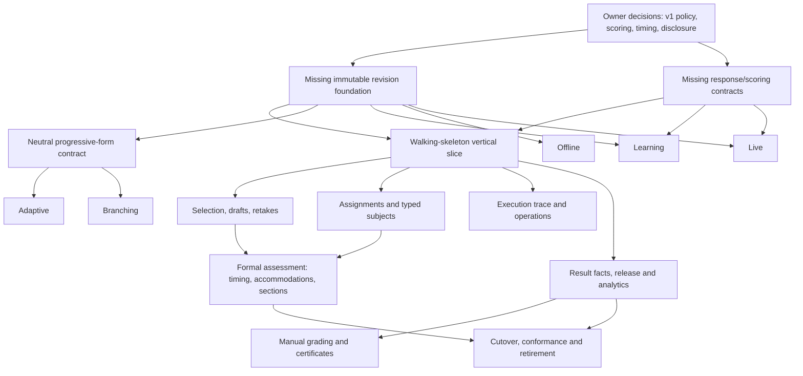
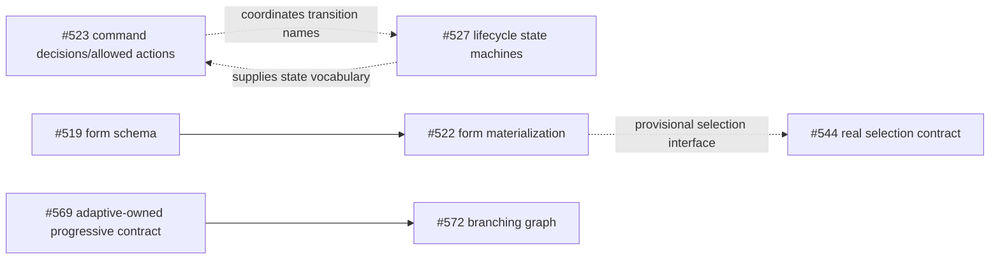
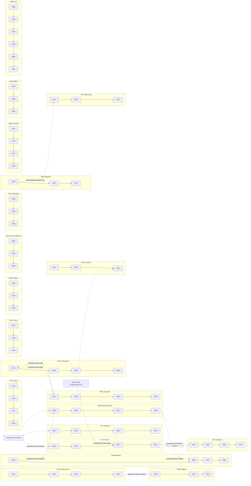

# Policy-Driven Quiz Backlog Review

## 1. Executive summary

**Overall verdict: `NOT_READY`.** If the current issues are implemented in their documented order, they will not reliably produce the architecture through a short sequence of reviewable, deployable increments. The architecture document is unusually strong, the parent-to-child decomposition is mechanically complete, and most child issues have good security, failure, test, and compatibility language. The delivery plan nevertheless treats several closed planning issues as if they were implemented foundations, leaves core migration and retirement work unowned, contains a dependency knot around commands/lifecycle/forms, and requires too many infrastructure-first merges before a functioning policy-driven attempt exists.

| Dimension | Verdict | Reason |
|---|---|---|
| Architecture coverage | **Not ready** | Immutable content identity, response/scoring contract versioning, timing/pause enforcement, normalized scoring facts, durable analytics, cutover, and legacy retirement lack executable ownership. |
| Dependency graph | **Not ready** | Native parent/child links are correct, but child-level prerequisites include missing foundations, false broad dependencies, and one conceptual cycle between command/lifecycle vocabulary. |
| Reviewability | **Needs targeted restructuring** | The nominal child slices are much better than their parents, but several are pseudo-horizontal, several are likely `MUST_SPLIT`, and issue prose does not predict actual diff size. |
| Migration readiness | **Not ready** | Additive compatibility is discussed, but no issue owns historical-state classification, activation/cutover, reconciliation, rollback/forward-fix, or retirement. |

- **Reviewed code:** `2ec344219eb00819e3caa9c011fc9c4fe42cc810` (tree `1f6b03ec44647d2b882d00ecdaf6b8d96f3f3439`, equal to `origin/master` when frozen).
- **Issue retrieval date:** 2026-08-07.
- **Issues reviewed:** 137: 94 programme nodes (one programme tracker, 20 feature parents, 73 implementation children) and 43 referenced/context issues; 109 were open and 28 closed at retrieval.
- **Scorecard verdict counts (94 programme nodes):** 21 `EPIC_TRACKER_ONLY`; 6 `READY_AFTER_DECISION`; 2 `READY_BUT_DEPENDENCY_TEXT_NEEDS_FIX`; 15 `BLOCKED_BY_UNIMPLEMENTED_FOUNDATION`; 19 `MUST_SPLIT`; 26 `HARD_SIZE_FAILURE`; 3 `COMBINE_WITH_ADJACENT`; 1 `NEEDS_SCOPE_TRIM`; 1 `REWRITE`. Contextual implementation-status classifications are separate in Section 8.
- **Context implementation-status counts (43 referenced issues):** 7 `IMPLEMENTED_AND_VERIFIED`; 10 `PARTIALLY_IMPLEMENTED`; 8 `PLANNING_SPEC_ONLY`; 15 `SUPERSEDED_BUT_REQUIREMENTS_REMAIN`; 3 `OBSOLETE`; 0 `UNKNOWN`.

### Top ten blockers

1. **No implementable immutable revision foundation.** Closed issue #447 has no verified implementation or replacement delivery child, yet at least ten children require revision-bound identity.
2. **No implementable response/scoring-contract foundation.** Closed issue #461 remains planning; current handlers have no persisted response-contract or grading-algorithm version.
3. **No timing and pause execution track.** #449 is closed, while the open programme defines policy fields without owning deadline, expiry, pause, restart, and clock enforcement.
4. **No authoritative normalized result-facts slice.** #448 is closed; downstream result, release, analytics, retake, and certificate work consumes facts no issue clearly creates.
5. **No replacement for durable analytics semantics.** #462 is closed and the implemented #157 snapshot does not satisfy the new architecture's exact, bounded, version-aware projections.
6. **No early disclosure-security closure.** The legacy answer-key oracle remains active until late release work; the walking skeleton must make disclosure server-owned from its first participant response.
7. **No cutover/retirement owner.** There is no issue for feature activation, historical-row classification, dual-read verification, old route retirement, final conformance, or deletion of obsolete branches.
8. **The first working vertical slice is undefined.** The documented order can merge more than fifteen model/schema/contract PRs without demonstrating a usable policy-driven attempt.
9. **Command and lifecycle ownership is ambiguous.** #523/#527 and their consumers coordinate vocabulary in both directions; form selection also introduces temporary contracts before their real owners.
10. **Review-size claims are not evidence-backed.** Comparable merged work ranged from roughly 400 to more than 2,000 meaningful changed lines; several children combine schema, concurrency, API, compatibility, and integration-test outcomes.

### Strongest parts

- The architecture explicitly separates immutable content, resolved policy, forms, evidence, lifecycle, learning, and live contexts.
- #472 has complete native sub-issue relationships: every one of the 20 parents exists and every one of the 73 documented delivery children has the correct native parent.
- Most children state authorization, privacy, RFC 7807, MySQL concurrency tests, OpenAPI, idempotency, and offline behavior rather than leaving these as implicit cleanup.
- Assignment, participant, execution-trace, manual-grading, accommodations, ungraded, branching, learning, offline, and live extensions are expressed as domain outcomes rather than controller/repository chores.

### Recommended next action

Do **not** begin #515. First perform one backlog-only correction pass: reopen or replace the unimplemented foundation requirements; approve the v1 product decisions needed by the walking skeleton; combine the pseudo-horizontal first slices; add migration/cutover/retirement and conformance issues; correct child-level dependencies; then make a single vertical “legacy-compatible policy-driven `ALL` attempt” the first executable milestone.

## 2. Scope and methodology

### Review freeze

| Item | Recorded value |
|---|---|
| Review date | 2026-08-07 (Europe/London) |
| Local branch at final freeze | `codex/issue-413-media-openapi-contract` |
| Commit | `2ec344219eb00819e3caa9c011fc9c4fe42cc810` |
| Git tree | `1f6b03ec44647d2b882d00ecdaf6b8d96f3f3439` |
| Default branch | `master` |
| Remote comparison | Final SHA equalled `origin/master` at freeze |
| Working tree | Clean before this report was created |
| Issue retrieval | 2026-08-07 |
| GitHub authentication | `gh` public issue/PR and GraphQL reads succeeded; authentication/status checks were intermittently unavailable |

An earlier observation began on branch `fix/453-single-use-refresh-rotation` at `a33b8522…`. Another task changed the shared workspace branch during the review. The code scope was therefore explicitly re-frozen at the final SHA above, and all implementation conclusions in this report refer only to that commit. GitHub issue text is mutable and is independently dated.

### Sources inspected

1. The complete architecture document, including decisions, unresolved decisions, roadmap, testing, cross-issue invariants, and completion criterion.
2. Issue #472's body and all three comments.
3. All 20 native parent issues and all 73 native delivery children.
4. Every issue referenced by those specifications that materially affects runtime delivery, plus nearby roadmap items needed to explain inclusion/exclusion.
5. Native GitHub parent/sub-issue relationships, labels, milestones, comments, state, and `closedByPullRequestsReferences`.
6. Current entities, services, controllers, repositories, Flyway migrations through V66, OpenAPI grouping, tests, and repository guidance.
7. Analogous merged PR diff surfaces and current CI evidence where they materially informed size or implementation status.

### Tools and method

- `git` froze and compared the code revision.
- `gh issue`, `gh pr`, and GitHub GraphQL were used read-only. A temporary collector stored the 115 initially discovered complete records, including comments, outside the repository under `/private/tmp/policy-driven-backlog-review/`; a second read-only closure pass inspected and added 22 omitted referenced/context records to the report inventory.
- `rg`, `sed`, and `jq` traced concepts from architecture to issue text and current code.
- No GitHub issue, comment, label, milestone, PR, or repository setting was changed.
- No production code, test, migration, configuration, or architecture file was changed.
- This report is the only repository file created.

### Limitations and assumptions

- GitHub issues are not commit-versioned; this is a 2026-08-07 snapshot.
- GitHub's `closedByPullRequestsReferences` field was empty for all initially collected 115 issues and for the additionally checked context issues. Absence of a native closing link is not proof of no implementation or other timeline references, so code, migrations, tests, comments, and commit history were also inspected.
- No prototype diff was identified in the inspected native closing links, comments, code/history evidence, or analogous PR review. Size estimates are ranges, calibrated with current packages and analogous merged PRs; they are not commitments.
- The review did not run the full Maven suite because it changed no runtime behavior. Existing tests were inspected as evidence, not treated as proof of future architecture.
- Product decisions marked open by the architecture remain open. Recommendations below name the decision owner and fail-closed default rather than inventing product policy.
- The architecture is a superset/candidate catalogue, not a promise to ship every preset or strategy in v1. A later explicit issue-specific approved decision may narrow it; this report calls an omission blocking only when it is a core invariant, a named scenario dependency, or an acceptance criterion already claimed by the programme.

## 3. Issue inventory

### Inventory summary

| Population | Count | State summary | Treatment |
|---|---:|---|---|
| Programme tracker | 1 | #472 open | Scorecard |
| Feature parents | 20 | #473–#492 open | Scorecard; tracker-only |
| Delivery children | 73 | #515–#587 open | Full implementation scorecard and size estimate |
| Foundation/related issues originally named by the programme | 11 | 9 closed, 2 open | Implementation-status verification |
| Recursively referenced/context issues | 32 | 19 closed, 13 open | Boundary/dependency verification |
| **Total reviewed** | **137** | 109 open, 28 closed | Complete policy-programme inventory plus explicitly bounded external context |

Only #32 has a milestone (`Quiz API MVP`). No #472 programme parent or child has a milestone. All 73 children are open, have no comments, and have no linked closing PR. Every parent checklist remains unchecked; that accurately reflects delivery status. Native GitHub relationships exactly match #472's 2026-08-06 breakdown.

### Programme parents and delivery plans

| Parent | Outcome | Native children | Inventory finding |
|---|---|---|---|
| #474 | Resolved attempt policies | #515–#518 | Complete decomposition; missing revision/timing prerequisites |
| #477 | Reproducible forms | #519–#522 | Complete; first slice is pseudo-horizontal and assumes #447/#461 |
| #475 | Commands, delivery, navigation | #523–#526 | Complete; vocabulary ownership overlaps lifecycle |
| #480 | Independent lifecycles | #527–#530 | Complete; missing timing/result-facts owner |
| #476 | Assignments and share-link compatibility | #531–#534 | Complete; subject adapter ordering creates churn |
| #489 | Participant subjects | #535–#537 | Complete; should precede permanent assignment binding |
| #478 | Execution trace | #538–#540 | Complete; boundary with #463/#32/#57 must be explicit |
| #479 | Answer drafts/submission | #541–#543 | Complete; final answer uniqueness must absorb #446 |
| #481 | Selection strategies | #544–#547 | Complete; selection interface is introduced twice |
| #482 | Retakes/result selection | #548–#550 | Complete; consumes missing normalized facts |
| #473 | Sections/case blocks | #551–#554 | Complete; depends on missing immutable revision aggregate |
| #483 | Release/certificates | #555–#558 | Complete; disclosure fix occurs too late for core migration |
| #485 | Rubrics/manual grading | #559–#562 | Complete; consumes missing scoring-contract/result facts |
| #492 | Accommodations | #563–#565 | Complete; product decision and restricted-data ownership needed |
| #491 | Ungraded/self-assessment | #566–#568 | Complete; analytics exclusion depends on missing durable analytics semantics |
| #484 | Adaptive | #569–#571 | Complete; progressive-form contract should be neutral/shared |
| #487 | Branching | #572–#574 | Complete; currently depends on adaptive track for a shared abstraction |
| #488 | Learning sessions | #575–#578 | Complete; correctly separate context, but flashcard/content dependency needs narrowing |
| #486 | Offline | #579–#581 | Complete; contract-only first issue is over-fragmented |
| #490 | Live/team | #582–#587 | Complete; separate context is correct, but should not depend on learning/offline |

### Programme label and milestone metadata

Every issue in each row is **Open**, has **no milestone**, has **zero comments**, and has no native linked closing PR. Labels are identical within each parent/child row in the retrieved snapshot. This does not claim that GitHub timelines contain no textual PR or commit reference.

| Parent / children | Labels |
|---|---|
| #474 / #515–#518 | `enhancement`, `backend`, `database`, `validation`, `priority:p2`, `quizzes`, `attempts`, `data-integrity` |
| #477 / #519–#522 | `enhancement`, `backend`, `database`, `priority:p2`, `quizzes`, `attempts`, `data-integrity` |
| #475 / #523–#526 | `enhancement`, `backend`, `api`, `priority:p2`, `concurrency`, `security`, `quizzes`, `attempts` |
| #480 / #527–#530 | `enhancement`, `backend`, `database`, `priority:p2`, `concurrency`, `attempts`, `data-integrity` |
| #476 / #531–#534 | `enhancement`, `backend`, `api`, `database`, `priority:p2`, `security`, `quizzes`, `attempts` |
| #489 / #535–#537 | `enhancement`, `backend`, `database`, `privacy`, `security`, `priority:p3`, `attempts`, `data-integrity` |
| #478 / #538–#540 | `enhancement`, `backend`, `database`, `priority:p2`, `privacy`, `security`, `attempts`, `observability` |
| #479 / #541–#543 | `enhancement`, `backend`, `api`, `database`, `concurrency`, `security`, `priority:p3`, `attempts` |
| #481 / #544–#547 | `enhancement`, `backend`, `validation`, `priority:p3`, `quizzes`, `attempts`, `data-integrity` |
| #482 / #548–#550 | `enhancement`, `backend`, `api`, `database`, `validation`, `priority:p3`, `quizzes`, `attempts` |
| #473 / #551–#554 | `enhancement`, `backend`, `database`, `validation`, `priority:p3`, `quizzes`, `attempts` |
| #483 / #555–#558 | `enhancement`, `backend`, `api`, `grading`, `security`, `priority:p3`, `attempts`, `analytics` |
| #485 / #559–#562 | `enhancement`, `backend`, `api`, `database`, `grading`, `security`, `priority:p3`, `attempts` |
| #492 / #563–#565 | `enhancement`, `backend`, `api`, `privacy`, `security`, `priority:p3`, `quizzes`, `attempts` |
| #491 / #566–#568 | `enhancement`, `backend`, `api`, `grading`, `privacy`, `priority:p3`, `quizzes`, `attempts` |
| #484 / #569–#571 | `enhancement`, `backend`, `database`, `validation`, `priority:p3`, `quizzes`, `attempts` |
| #487 / #572–#574 | `enhancement`, `backend`, `database`, `validation`, `security`, `priority:p3`, `quizzes`, `attempts` |
| #488 / #575–#578 | `enhancement`, `backend`, `learning`, `priority:p3`, `quizzes`, `attempts`, `data-integrity` |
| #486 / #579–#581 | `enhancement`, `backend`, `api`, `privacy`, `security`, `priority:p3`, `attempts` |
| #490 / #582–#587 | `enhancement`, `backend`, `api`, `database`, `concurrency`, `security`, `priority:p3`, `quizzes`, `attempts` |

#472 itself is Open, has no milestone, and is labelled `enhancement`, `backend`, `priority:p2`, `quizzes`, `attempts`, `data-integrity`.

### Foundation and contextual inventory

Implementation status here uses the required status vocabulary and is separate from the 94 programme-node readiness and reviewability verdicts. Exact titles are retained so inclusive supersession ranges are auditable.

| Issue and exact title | State | Implementation status | Programme role / boundary |
|---|---|---|---|
| #32 — Feature: Comprehensive Audit Logging for Security and Compliance | Open | `PARTIALLY_IMPLEMENTED` | Platform audit context; does not own attempt execution evidence. |
| #56 — Feature: Application Metrics and Observability | Open | `PARTIALLY_IMPLEMENTED` | Existing metric patterns are analogues; execution SLIs remain unowned. |
| #57 — Feature: Audit Log Query and Search Interface for Administrators | Open | `PLANNING_SPEC_ONLY` | Authorized consumer of redacted evidence, not its writer. |
| #157 — Quiz Analytics Snapshot & Event-Driven Caching | Closed | `IMPLEMENTED_AND_VERIFIED` | Original legacy snapshot exists; it does not satisfy version-aware ANALYTICS-01. |
| #232 — Create FlashcardReviewController for review sessions | Closed | `OBSOLETE` | Class-first predecessor superseded by Repetition and #488. |
| #233 — Implement POST /api/v1/decks/{deckId}/reviews endpoint | Closed | `SUPERSEDED_BUT_REQUIREMENTS_REMAIN` | No persisted Learning-session start; replaced by #575/#578. |
| #234 — Implement GET /api/v1/decks/{deckId}/reviews/next endpoint | Closed | `PARTIALLY_IMPLEMENTED` | Legacy due query exists, but not session/form-bound next delivery. |
| #235 — Implement POST /api/v1/decks/{deckId}/reviews/{cardId}/grade endpoint | Closed | `PARTIALLY_IMPLEMENTED` | Entry-scoped SM-2 review exists; no immutable Learning-session command. |
| #236 — Implement GET /api/v1/decks/{deckId}/reviews/summary endpoint | Closed | `SUPERSEDED_BUT_REQUIREMENTS_REMAIN` | Due/new-card session summary remains for #578. |
| #237 — Implement optional POST /api/v1/decks/{deckId}/reviews/sessions endpoint | Closed | `SUPERSEDED_BUT_REQUIREMENTS_REMAIN` | Optional session persistence is not implemented; replaced by #575/#578. |
| #238 — Implement optional GET /api/v1/decks/{deckId}/reviews/sessions/{sessionId}/next endpoint | Closed | `SUPERSEDED_BUT_REQUIREMENTS_REMAIN` | No persisted session-next behavior; replaced by #575/#576/#578. |
| #239 — Implement optional POST /api/v1/decks/{deckId}/reviews/sessions/{sessionId}/grade endpoint | Closed | `SUPERSEDED_BUT_REQUIREMENTS_REMAIN` | No session-scoped review command; replaced by #577/#578. |
| #240 — Create FlashcardReviewService for SRS logic | Closed | `OBSOLETE` | Class-first task is distributed across current Repetition services and future Learning slices. |
| #241 — Implement SM-2 spaced repetition algorithm | Closed | `IMPLEMENTED_AND_VERIFIED` | `Sm2Algorithm` and tests exist; #577 must preserve/version its historical semantics. |
| #242 — Add due card selection logic | Closed | `IMPLEMENTED_AND_VERIFIED` | Legacy due selection exists, but is not immutable Learning-form selection. |
| #243 — Enforce due ordering by next_review_at | Closed | `IMPLEMENTED_AND_VERIFIED` | Stable due-time/id ordering and tests exist. |
| #244 — Implement grade calculation and interval updates | Closed | `IMPLEMENTED_AND_VERIFIED` | Current SM-2 review service implements and tests the behavior. |
| #245 — Add session management and batch limits | Closed | `SUPERSEDED_BUT_REQUIREMENTS_REMAIN` | Pagination is not a session/batch ownership model. |
| #246 — Enforce daily new-card limits per deck and user | Closed | `SUPERSEDED_BUT_REQUIREMENTS_REMAIN` | No implementation; #576 needs an explicit product decision/owner. |
| #247 — Implement telemetry for grade distribution | Closed | `SUPERSEDED_BUT_REQUIREMENTS_REMAIN` | No Repetition metrics; generic child boilerplate is not ownership. |
| #248 — Add optimistic locking for concurrent reviews | Closed | `IMPLEMENTED_AND_VERIFIED` | `@Version`, retry/idempotency, migration, and tests exist outside this programme. |
| #269 — Add rate limiting for AI generation endpoints | Open | `PARTIALLY_IMPLEMENTED` | Optional AI-card path context only; shared-rate-policy outcome remains open and depends on #457's deferred store decision. |
| #270 — Add rate limiting for review grade endpoints | Closed | `OBSOLETE` | No limiter is present on the current route; replace only with a concrete Learning command policy. |
| #311 — Metrics: link fetch failures, durations, bytes fetched | Open | `PLANNING_SPEC_ONLY` | External observability context through #465; not an execution-runtime owner. |
| #312 — Metrics: transcription durations, error rates, tokens estimated vs. actual | Open | `PLANNING_SPEC_ONLY` | Direct #465 dependency inspected as an external observability boundary. |
| #440 — [Billing] Make generated-quiz entitlement and token commitment one recoverable outcome | Open | `PARTIALLY_IMPLEMENTED` | Optional #498 paid-job prerequisite; post-claim recovery exists, pre-claim handoff remains process-local. |
| #442 — [AI Generation] Bound provider concurrency and enforce one retry and quota budget | Open | `PARTIALLY_IMPLEMENTED` | Optional #498 provider prerequisite; configured outer bounds do not govern inner work/retry amplification. |
| #445 — [Attempts] Prevent answer-key disclosure before attempt completion | Closed | `SUPERSEDED_BUT_REQUIREMENTS_REMAIN` | Current participant API still accepts caller-influenced disclosure flags. |
| #446 — [Attempts] Enforce one answer per question under concurrency | Closed | `SUPERSEDED_BUT_REQUIREMENTS_REMAIN` | No unique attempt/form-item response key exists. |
| #447 — [Quizzes] Version published content and bind attempts to immutable revisions | Closed | `SUPERSEDED_BUT_REQUIREMENTS_REMAIN` | Core unmet dependency for forms, grading, and historical identity. |
| #448 — [Scoring] Persist versioned normalized results for trustworthy analytics | Closed | `SUPERSEDED_BUT_REQUIREMENTS_REMAIN` | Required by retakes, release, certificates, and analytics. |
| #449 — [Attempts] Make timed and paused transitions deterministic | Closed | `SUPERSEDED_BUT_REQUIREMENTS_REMAIN` | No open child owns server-clock timing/pause execution. |
| #450 — [Attempts] Isolate anonymous attempts by share-link identity | Closed | `PARTIALLY_IMPLEMENTED` | Legacy capability protection exists, but sentinel/subject semantics remain. |
| #455 — [AI Generation] Isolate untrusted prompts, enforce deadlines, and redact model logs | Open | `PLANNING_SPEC_ONLY` | Optional #498 security prerequisite; target controls are not implemented. |
| #457 — [Security] Enforce atomic distributed throttling for login and sensitive auth operations | Open | `PARTIALLY_IMPLEMENTED` | External shared-limiter decision inherited by #269; local non-atomic limits exist, distributed authority is deferred. |
| #461 — [Questions] Unify per-type response validation and scoring contracts | Closed | `SUPERSEDED_BUT_REQUIREMENTS_REMAIN` | No persisted response/scoring version exists. |
| #462 — [Analytics] Make completion snapshots durable, exact, and bounded at scale | Closed | `SUPERSEDED_BUT_REQUIREMENTS_REMAIN` | Existing snapshots do not replace the required version-aware projection. |
| #463 — [Security] Persist structured suspicious-attempt audit events | Open | `PLANNING_SPEC_ONLY` | Must consume, not duplicate, #478 evidence. |
| #465 — [Observability] Detect AI saturation, stuck jobs, quality loss, and billing drift | Open | `PARTIALLY_IMPLEMENTED` | Some platform/billing metrics exist; issue-specific AI/document/analytics signals do not. |
| #494 — [Documentation] Publish policy-driven quiz execution architecture | Closed | `IMPLEMENTED_AND_VERIFIED` | Architecture document exists at the pinned SHA. |
| #495 — [CI/CD] Skip backend workflows for docs-only changes | Open | `PLANNING_SPEC_ONLY` | Docs-only workflow optimization; stale dependency text in already-complete #494. |
| #497 — [Flashcards] Deliver private deck and card authoring as a vertical slice | Open | `PLANNING_SPEC_ONLY` | Required only for card-backed Learning, not quiz-revision-backed Learning. |
| #498 — [Flashcards] Generate reviewed draft cards through a safe AI job | Open | `PLANNING_SPEC_ONLY` | Directly named by #575, but optional to the core; no deck/card AI job implementation exists. |

Context metadata: #32 (`enhancement`, `backend`, `priority:medium`; milestone `Quiz API MVP`); #56 (`enhancement`, `backend`, `priority:low`, `metrics`); #57 (`enhancement`, `backend`, `api`, `priority:medium`); #157 (`backend`, `priority:medium`, `metrics`); #232–#239 (`enhancement`, `priority:high`, with `api` where endpoint-scoped); #240 (`enhancement`, `backend`, `priority:high`); #241–#248 (`enhancement`, `priority:high`, `learning` where algorithm/state-scoped); #269 (`enhancement`, `backend`, `priority:high`); #270 (`enhancement`, `backend`, `priority:high`); #311/#312 (`enhancement`, `priority:high`, `metrics`); #440 (`bug`, `backend`, `ai-generation`, `reliability`, `priority:p1`, `deep-review`, `billing`, `data-integrity`); #442 (`bug`, `backend`, `ai-generation`, `concurrency`, `reliability`, `priority:p1`, `deep-review`); #445–#450/#461–#465 have their exact issue-specific label sets recorded in the initial snapshot; #455 specifically has `bug`, `backend`, `ai-generation`, `priority:p2`, `reliability`, `privacy`, `security`, `deep-review`; #457 has `bug`, `backend`, `api`, `concurrency`, `reliability`, `priority:p1`, `security`, `deep-review`; #494/#495 (`documentation`); #497/#498 (`enhancement`). Except #32, all have no milestone. All 43 context issues had no native closing-PR reference in the reviewed fields; code/PR history, not that absence, determines the classifications above.

Comment inspection materially changed the inventory: #233–#236/#238–#241/#243 have explicit #488 supersession comments, while #237/#242/#244–#247 rely only on the inclusive range; #440 has three comments, #442 and #457 one each, and their latest owner/review comments are reflected in the partial classifications. #269/#312/#455/#498 had zero comments at retrieval. No context issue comment was treated as implementation evidence without matching code/PR evidence.

### Excluded nearby work and recursion boundary

- #249–#261 are closed horizontal AI-flashcard predecessors explicitly consolidated into open #498. Their exact old tasks cover controller/endpoints, prompt/client/parser/deduplication, jobs, rate limiting, validation, and low-confidence warnings. They were inspected as a range but are not counted as policy-execution issues because #498 is the single actionable boundary and no skeleton acceptance criterion depends on an old child.
- #179–#231 and #262–#268 are older flashcard/AI backlog outside the #488 policy-execution dependency path. Unlike #232–#248, #488 does not incorporate their individual acceptance criteria.
- #497/#498 are optional card-content adapters. Quiz-revision-backed Learning must not wait for either. #498's reference to revisions/attachments “in #496” is invalid because #496 is a merged architecture PR; the intended issue is #497.
- The external AI/billing chain was bounded after the directly named #269/#440/#442/#455/#457/#465 and #311/#312 context was classified. Recursing through every dependency of those external programmes would turn this audit into a second AI/billing/security audit without changing the policy-execution DAG. They are recorded as external non-blocking context, not silently treated as implemented dependencies.
- Generic ingestion, health, authentication, and media issues remain excluded unless a policy-execution child requires their acceptance criteria; thematic similarity alone is not dependency evidence.

## 4. Architecture Invariant Catalogue

The catalogue was extracted before judging the backlog. The source contains 41 explicit cross-cutting/foundational invariant statements; this review normalizes and, where one statement contains independently traceable obligations, decomposes them into **47 stable IDs** below. It also inventories **19 policy dimensions, 44 named presets, six product scenarios, 43 unresolved product decisions, and 18 already binding decisions**. Presets remain a candidate catalogue unless a named increment selects them; they are not all implied v1 commitments. “Core” means the minimum safe assessment/practice engine; “extension” means a separately deployable bounded context or later product capability.

| ID | Invariant | Tier | Architecture source |
|---|---|---|---|
| CONTENT-01 | A started attempt binds an immutable published quiz revision. | Core | Immutable snapshots; Quiz Revision |
| CONTENT-02 | Questions and all grading-relevant content are immutable revisions. | Core | Immutable Quiz Revisions |
| CONTENT-03 | Item and answer-option identifiers remain stable across display order and history. | Core | Question/response versioning; Answer Option Ordering |
| CONTENT-04 | Later author edits cannot alter active/completed attempt meaning. | Core | Attempts execute immutable snapshots |
| CONTRACT-01 | Response shape/validation has an explicit version owned by the question revision. | Core | Question and Response Contract Versioning |
| CONTRACT-02 | Scoring algorithm/configuration has an explicit persisted version. | Core | Grading; Reproducibility |
| POLICY-01 | Policy is typed, schema-versioned, validated, and unknown versions fail closed. | Core | Typed Policies; Policy Validation; Snapshot Versioning |
| POLICY-02 | Resolution uses explicit precedence, provenance, canonical serialization, and hash. | Core | Policy Resolution; Hashing and Integrity |
| POLICY-03 | Presets are versioned input defaults, never runtime mode branches. | Core | Modes are presets |
| POLICY-04 | Revision constraints, assignment rules, accommodations, and permitted start overrides are resolved before start. | Core | Policy Resolution; Assignments; Accommodations |
| FORM-01 | A fixed form is immutable and fully materialized before first delivery. | Core | Attempt Forms; Attempt Creation |
| FORM-02 | A progressive form records every extension decision before delivery. | Extension | Progressive form; Adaptive; Branching |
| FORM-03 | Selection is deterministic from versioned strategy/config and persists candidate/decision evidence. | Core | Question Bank Selection |
| FORM-04 | Item and option display order are persisted, stable, and participant-safe. | Core | Question/Answer Ordering |
| FORM-05 | Sections and atomic case blocks preserve constraints and ordered presentation. | Extension | Sections and Case Blocks |
| START-01 | Start validates eligibility and persists subject, revision, resolved policy, form, hash, and initial trace atomically. | Core | Attempt Creation; Persistence Model |
| COMMAND-01 | Consequential state changes use server-owned idempotent commands. | Core | Server owns decisions; Command Model |
| COMMAND-02 | The server reports allowed actions from persisted state/policy; clients never infer authority. | Core | Server-Reported Allowed Actions |
| DELIVERY-01 | Delivery/navigation obey persisted form, delivery state, and policy under concurrency. | Core | Delivery; Navigation |
| ANSWER-01 | Drafts and submitted answers are distinct; accepted answers have a canonical natural key. | Core | Answer Lifecycle; Idempotency and Concurrency |
| ANSWER-02 | Submission, retry, change, feedback lock, and final lock are atomic and policy-governed. | Core | Answer Lifecycle |
| LIFE-01 | Execution, answer, grading, result, release, and review are independent versioned lifecycles. | Core | Lifecycles |
| TIME-01 | Server clock, start, deadline, expiry, grace, and restart behavior are deterministic. | Core | Timing and Deadlines |
| TIME-02 | Pause eligibility, effective time, resume, expiry interaction, and audit evidence are deterministic. | Core | Pause Semantics |
| GRADE-01 | Automatic grading uses revision-bound response/scoring contracts and records provenance. | Core | Grading; Reproducibility |
| GRADE-02 | Manual grading uses immutable rubric versions, authorized queues, and append-only corrections. | Extension | Manual Grading and Rubrics |
| RESULT-01 | Normalized result facts, algorithm version, pass threshold, tie rules, and exclusions are immutable. | Core | Results; Teacher Reporting |
| RESULT-02 | Result, feedback, answer key, explanation, and review release are separate server decisions. | Core | Disclosure and Feedback; Results |
| RESULT-03 | Limits, cooldown, eligibility, and latest/best selection are concurrency-safe and deterministic. | Extension | Attempt Limits and Retakes |
| CERT-01 | Certificate eligibility, issuance, revocation, and verification are idempotent and privacy-minimal. | Extension | Certificates |
| ASSIGN-01 | Assignment versions immutably bind content/policy/audience/availability and adapt legacy share links. | Core formal-assessment | Assignments and Legacy Share Links |
| SUBJECT-01 | Participant identity is a typed subject; capabilities never become ambient user identity. | Core shared/guest | Participant Subjects; Capability Separation |
| SECURITY-01 | Ownership, audience, visibility, capability, and permission checks all fail closed server-side. | Core | Security and Privacy Invariants |
| TRACE-01 | Minimal append-only execution evidence is written transactionally, ordered, integrity-protected, and redacted. | Core operations | Execution Trace |
| ANALYTICS-01 | Analytics consume durable version-aware result facts, update exactly once, and remain bounded/reconcilable. | Core operations | Teacher Reporting; Observability |
| UNGRADED-01 | Completion-only/self-assessment activity never fabricates scores or pollutes assessment projections. | Extension | Ungraded Activities |
| ACCOM-01 | Approved restricted grants create bounded, authorized, provenance-bearing policy overlays. | Extension | Accessibility and Accommodations |
| ADAPT-01 | Adaptive execution is a versioned progressive-form strategy with persisted decisions. | Extension | Adaptive Execution |
| BRANCH-01 | Branching uses immutable validated graphs and versioned conditions, distinct from adaptive selection. | Extension | Branching Scenarios |
| LEARN-01 | Learning/spaced repetition is a separate context reusing contracts without mutating assessment attempts. | Extension | Learning and Spaced Repetition |
| OFFLINE-01 | Only eligible participant-safe forms are packaged; commands replay with integrity, expiry, conflicts, and resync. | Extension | Offline Boundary |
| LIVE-01 | Live/team orchestration is a separate server-clock context with immutable content binding and reconnectable state. | Extension | Live and Team Sessions |
| API-01 | Authoring, participant, acknowledgement, grader, review, and reporting DTOs are distinct and typed. | Core | API Representation Boundaries |
| MIGRATION-01 | Rollout is additive and classifies legacy attempts/forms/policies/share links without inventing history. | Core migration | Legacy Compatibility and Migration |
| MIGRATION-02 | Activation, verification, rollback/forward-fix, deprecation, and obsolete-code retirement have explicit owners. | Core migration | Migration; Completion Criterion |
| OBS-01 | Bounded metrics, stuck-state signals, reconciliation, privacy-safe logs, and operator evidence cover the runtime. | Core operations | Observability; Failure Semantics |
| TEST-01 | Unit, MVC/OpenAPI, MySQL concurrency, compatibility, and offline fake-provider gates travel with behavior. | Core quality | Testing Strategy; Quality Gates |

## 5. Architecture-to-issue coverage matrix

| Invariant | Architecture source | Authoritative owner / implementation child | Test owner | Migration owner | API owner | Compatibility owner | Current implementation | Coverage | Gap/overlap |
|---|---|---|---|---|---|---|---|---|---|
| CONTENT-01/02/04 | Immutable snapshots/revisions | #447 requirement → proposed M1 | M1 golden publication/history fixtures | M1 + M12 | M1 author/read adapter | M12/M13 | `SUPERSEDED_BUT_REQUIREMENTS_REMAIN` | `DESCRIBED_BUT_NO_IMPLEMENTATION_ISSUE` | Mutable `Quiz`/`Question`; no executable owner. |
| CONTENT-03 | Stable item/option identity | proposed M1/M2; #521 consumes | M1/M2/#521 | M1 | #521/#526 | M12 | `PLANNING_SPEC_ONLY` | `PARTIALLY_COVERED` | Ordering cannot create immutable IDs. |
| CONTRACT-01/02 | Response/scoring versions | #461 requirement → proposed M2 | M2 golden handler fixtures | M1/M2 | M2 question-schema contract | M12/M13 | `SUPERSEDED_BUT_REQUIREMENTS_REMAIN` | `DESCRIBED_BUT_NO_IMPLEMENTATION_ISSUE` | Many consumers, no persisted version. |
| POLICY-01 | Typed/versioned policy | #474 / #515 | #515 | none | none | #516/M12 | `PLANNING_SPEC_ONLY` | `PARTIALLY_COVERED` | Exact v1 fields/units/defaults undecided. |
| POLICY-02 | Precedence/provenance/hash | #474 / #517 + #518A | #517/#518A MySQL | #518A | none | M12/M13 | `PLANNING_SPEC_ONLY` | `PARTIALLY_COVERED` | Snapshot/start ownership overlaps. |
| POLICY-03 | Presets, no mode branches | #474 / #516 | #516 mapping fixtures | seed/additive only if chosen | none | #516/M12 | `PLANNING_SPEC_ONLY` | `PARTIALLY_COVERED` | Catalogue/storage decision remains. |
| POLICY-04 | Constraints/overlays | #517/#532/#553/#564/#565 | each owning child | owning persistence child | #532/#565 where exposed | M12/M13 | `PLANNING_SPEC_ONLY` | `PARTIALLY_COVERED` | Start-time override authority is unclear. |
| FORM-01 | Fixed precomputed form | #477 / #519–#522 | #519/#522 | #519 | #522/#526 | M12/M13 | `PLANNING_SPEC_ONLY` | `PARTIALLY_COVERED` | Blocked by M1/M2; #522 is oversized. |
| FORM-02 | Progressive form | neutral form issue + #569/#571/#574 | neutral contract + consumers | neutral form issue | #571B/#574B | fixed-form regression owner | `PLANNING_SPEC_ONLY` | `CONFLICTING` | Adaptive currently owns a Branching prerequisite. |
| FORM-03 | Deterministic selection | #481 / #544–#547 + M8 | each strategy child/property suite | evidence with form owner | failure via start API | M13 | `PLANNING_SPEC_ONLY` | `PARTIALLY_COVERED` | #522 duplicates SPI; stratified/weighted missing. |
| FORM-04 | Display order | #477 / #520/#521/#522 | #520/#521 | #519/#521 | #522/#526 | M12 | `PLANNING_SPEC_ONLY` | `PARTIALLY_COVERED` | Stable IDs require M1/M2. |
| FORM-05 | Sections/cases | #473 / #551–#554 + missing runtime child | #551–#554/runtime E2E | #551/#552 | #554B/runtime | M12 | `PLANNING_SPEC_ONLY` | `PARTIALLY_COVERED` | Persistence exists only in prose; runtime opening/timing missing. |
| START-01 | Atomic start bundle | proposed M4; inputs #518A/#522A/#535A/#536A/#538+#539 | M4 MySQL race + E2E | input schemas + M12 | M4 adapter/#526 | M12/M13 | `PLANNING_SPEC_ONLY` | `DUPLICATED` | Six candidate start writers; M4 must be sole coordinator. |
| COMMAND-01/02 | Commands/allowed actions | #475 / #527A → #523/#525/#526 | owning command + MySQL race tests | M3/#528 | #523/#526 | M12/M13 | `PLANNING_SPEC_ONLY` | `CONFLICTING` | Command/lifecycle vocabulary was bidirectional. |
| DELIVERY-01 | Delivery/navigation | #475 / #524–#526 | each command/view child | #528 if state added | #524/#526 | M12/M13 | `PLANNING_SPEC_ONLY` | `PARTIALLY_COVERED` | No early form-integrated slice in current order. |
| ANSWER-01/02 | Draft/submit/unique lock | #479 / #541–#543 + proposed M3 | M3/#541–#543 races | M3/#541 | #542/#543 | M12/M13 | `PLANNING_SPEC_ONLY` | `PARTIALLY_COVERED` | #446 natural-key requirement is otherwise orphaned. |
| LIFE-01 | Independent lifecycles | #480 / split #527/#528/#529 + M7/#555 | transition tables + race tests | #528/M7/#556 | #526/release APIs | M12/M13 | `PLANNING_SPEC_ONLY` | `PARTIALLY_COVERED` | Timing/result facts absent; #530 overlaps. |
| TIME-01/02 | Timing/pause | #449 requirement → proposed M5/M6 | M5/M6 Clock, restart, race suites | M5/M6 | command/participant APIs | M12/M13 | `SUPERSEDED_BUT_REQUIREMENTS_REMAIN` | `DESCRIBED_BUT_NO_IMPLEMENTATION_ISSUE` | Policy fields do not enforce clocks. |
| GRADE-01 | Versioned auto grading | proposed M2 + M7 | M2/M7 golden/finalization tests | M2/M7 | result view after release | M12/M13 | `SUPERSEDED_BUT_REQUIREMENTS_REMAIN` | `DESCRIBED_BUT_NO_IMPLEMENTATION_ISSUE` | #530 does not supply contract-version facts. |
| GRADE-02 | Manual grading/rubric | #485 / #559–#562 | each child + correction E2E | #559/#561/#562 | #560–#562 | M12/M13 | `PLANNING_SPEC_ONLY` | `PARTIALLY_COVERED` | Blocked by M1/M2/M7 and oversized. |
| RESULT-01 | Normalized result facts | #448 requirement → proposed M7 | M7 | M7 | released view only | M12/M13 | `SUPERSEDED_BUT_REQUIREMENTS_REMAIN` | `DESCRIBED_BUT_NO_IMPLEMENTATION_ISSUE` | No current immutable fact aggregate. |
| RESULT-02 | Disclosure/review release | #445 + #483 / #555/#556 | #555/#556 security/E2E | #556 | #526/#556 | M12/M13 | `SUPERSEDED_BUT_REQUIREMENTS_REMAIN` | `PARTIALLY_COVERED` | Legacy caller flags remain until late release work. |
| RESULT-03 | Retakes/best/latest | #482 / #548–#550 | #548–#550 Clock/MySQL | #549/#550 | #550B | M12/M13 | `PLANNING_SPEC_ONLY` | `PARTIALLY_COVERED` | Requires M7; #550 need not wait for #549. |
| CERT-01 | Certificate lifecycle | #483 / #557/#558 | #557/#558 | #557 | #558 | M13 + deprecation owner | `PLANNING_SPEC_ONLY` | `PARTIALLY_COVERED` | Size/abuse-control splits still required. |
| ASSIGN-01 | Assignment/share adapter | #476 / #531–#534 | #531–#534 | #531/#533 | #533/#534 | M12/M13 | `PLANNING_SPEC_ONLY` | `PARTIALLY_COVERED` | Typed subjects/capability foundation must precede binding. |
| SUBJECT-01 | Typed participants | #489 / #535–#537 + proposed M15 for guests | #535–#537/M15 negatives | #535/M15 | #536/#537 | M12/M13 | `PARTIALLY_IMPLEMENTED` | `PARTIALLY_COVERED` | Legacy capabilities exist; sentinel authority remains. |
| SECURITY-01 | Fail-closed access | owning route child; #537 participant access | each route child + M13 matrix | M15 where capability state persists | each API child | M12/M13 | `PARTIALLY_IMPLEMENTED` | `DUPLICATED` | Cross-cutting prose lacks one negative-E2E owner. |
| TRACE-01 | Execution evidence | #478 / combined #538+#539; #540 reads | combined writer + #540 | combined writer | #540 | M12/M13 | `PLANNING_SPEC_ONLY` | `PARTIALLY_COVERED` | Trace store and sequence must land together; M4 owns first integration. |
| ANALYTICS-01 | Durable analytics | #462 requirement → proposed M10/M11 | M10 reconciliation/M11 API | M10 | M11 | M12/M13 | `PARTIALLY_IMPLEMENTED` | `DESCRIBED_BUT_NO_IMPLEMENTATION_ISSUE` | #157 is legacy-only. |
| UNGRADED-01 | Completion-only | #491 / #566–#568; M10 owns exclusion semantics | #566–#568/M10 | #566/#567 | #567/#568C | M12/M13 | `PLANNING_SPEC_ONLY` | `PARTIALLY_COVERED` | Must avoid an M10↔#568 cycle. |
| ACCOM-01 | Restricted overlays | #492 / #563–#565 | each child + privacy tests | #563/#565 | #563B/#565B | M12/M13 | `PLANNING_SPEC_ONLY` | `PARTIALLY_COVERED` | Product limits/retention/access decisions remain. |
| ADAPT-01 | Adaptive strategy | #484 / neutral contract + #569–#571 | strategy/property/command tests | neutral form/#571 | #571B | M13 extension gate | `PLANNING_SPEC_ONLY` | `CONFLICTING` | Neutral progressive contract is misplaced. |
| BRANCH-01 | Branch graph | #487 / #572–#574 | publication/property/command tests | #572/#574 | #574B | M13 extension gate | `PLANNING_SPEC_ONLY` | `PARTIALLY_COVERED` | False dependency on Adaptive must be removed. |
| LEARN-01 | Separate Learning | #488 / #575–#578 + migration authority issue | #575–#578 + compatibility fixtures | Learning migration owner | #578 | M12/Learning cutover | `PARTIALLY_IMPLEMENTED` | `PARTIALLY_COVERED` | Repetition is adjacent baseline; target issues remain planning. |
| OFFLINE-01 | Package/replay | #486 / #579–#581 | contract/crypto/replay tests | #580 | #580B/#581 | M12/M13 | `PLANNING_SPEC_ONLY` | `PARTIALLY_COVERED` | #579 alone is horizontally fragmented. |
| LIVE-01 | Separate Live context | #490 / #582–#587 | each state/transport E2E | #582–#587 | #587 | independent Live cutover | `PLANNING_SPEC_ONLY` | `PARTIALLY_COVERED` | Product decisions and oversized slices remain. |
| API-01 | Typed representation boundaries | API-bearing child; conformance in M13 | each API child + M13 schema scan | none | each API child | M12/M13 | `PARTIALLY_IMPLEMENTED` | `PARTIALLY_COVERED` | Group/DTO ownership remains incomplete. |
| MIGRATION-01 | Additive compatibility | proposed M12/M13 + per-slice adapters | M12/M13 | M12/M13 | M13 adapters | M12/M13 | `PLANNING_SPEC_ONLY` | `PARTIALLY_COVERED` | Per-slice prose is not a historical-state matrix. |
| MIGRATION-02 | Cutover/retirement | proposed M13/M14 | M13/M14 conformance | M13/M14 | M13/M14 | M13/M14 | `PLANNING_SPEC_ONLY` | `DESCRIBED_BUT_NO_IMPLEMENTATION_ISSUE` | No current activation/retirement issue. |
| OBS-01 | Runtime operations | M13 minimum activation signals/rollback + proposed operations child + #478/#465 | M13 activation tests plus reconciliation tests | proposed operations issue owns repair | operator-only surface | M13 | `PARTIALLY_IMPLEMENTED` | `PARTIALLY_COVERED` | Skeleton detection/rollback has a proposed owner; automated repair, cross-mode SLIs, alerts, and fleet reconciliation remain absent. |
| TEST-01 | Quality gates | each behavior child; M13 phase exit | each child + M13 | migration-owning child | API-owning child | M12/M13 | `PLANNING_SPEC_ONLY` | `PARTIALLY_COVERED` | Boilerplate is not scenario-level conformance. |

## 6. Product-scenario coverage

| Scenario | Required implementation chain | Test owner | Migration owner | API owner | Compatibility owner | Current implementation | Coverage |
|---|---|---|---|---|---|---|---|
| A — learner practice | M1/M2 → #515–#523/#527A/#528A → M4 → #524A/#526A/#543A/#529A → M7 → #555/#556A; M9 for hint/retry semantics | M13 core E2E; M9 interaction E2E | M12/M13 | M4/#526/#543/#556 | M12/M13 | Legacy practice exists, target path `PLANNING_SPEC_ONLY` | `DESCRIBED_BUT_NO_IMPLEMENTATION_ISSUE`: core foundations/results and practice feedback owners are missing. |
| B — consistent learner practice | Scenario A + #575–#578 + Learning authority/migration | Dedicated Learning phase-exit E2E | M12 + Learning migration owner | #578 | Learning cutover owner | Repetition is `PARTIALLY_IMPLEMENTED`; target Learning is planning | `PARTIALLY_COVERED`: immutable content/contracts and one schedule authority are unresolved. |
| C — timed randomized student assignment | Core → #531–#537/M15 → #545/#546/#547/M8 → #551–#554/section runtime → M5/M6 → #548–#550/#563–#565 → release | New formal-assessment scenario E2E owner | M12/M13 + assignment/timing migrations | #533/#534/#526/result APIs | M12/M13 | Legacy assignment-like share links only; target planning | `DESCRIBED_BUT_NO_IMPLEMENTATION_ISSUE`: timing/pause, stratified selection, section runtime, revisions, and result facts have gaps. |
| D — mixed automatic/manual grading | Core/M2/M7 → #559–#562 → #555/#556 → correction consumers | Manual-grading correction/release E2E owner | rubric/grade/result migrations + M12 | #560–#562/#556 | M12/M13 | Legacy automatic grading is partial; target mixed facts planning | `PARTIALLY_COVERED`: manual workflow exists in issues, automatic/result foundations do not. |
| E — branching scenario | M1/M2/core → neutral progressive-form contract → #572/#573/#574 → commands/trace | New branching phase-exit E2E owner | #572/#574 + M12 | #574B/#526 | M13 extension gate | `PLANNING_SPEC_ONLY` | `CONFLICTING`: implementable after removing the false Adaptive dependency and assigning the neutral contract. |
| F — live competition | M1/M2 + trusted subjects/capabilities → #582–#587 | New Live reconnect/restart E2E owner | Live-owned migrations/cutover | #587 | Independent Live compatibility/cutover owner | `PLANNING_SPEC_ONLY` | `PARTIALLY_COVERED`: later bounded context is coherent but decisions/splits/conformance owner remain. |

No named scenario currently has an issue that owns the complete end-to-end acceptance test named above. M13 is the proposed owner for the core slice; Scenarios B–F each require a separately named phase-exit conformance child before their parent can be called complete.

## 7. Source-of-truth inconsistencies

1. **`BLOCKING` — Closed means “moved,” not “implemented,” but child dependencies read as implemented.** #472's comment explicitly warns that #445–#450 and #461–#462 were consolidated, yet the child plan does not supply replacements for #447, #448, #449, #461, or #462.
2. **`BLOCKING` — Architecture breadth exceeds issue ownership.** The architecture covers timing, pause, scoring facts, analytics, cutover, and retirement; the open children do not.
3. **`BLOCKING` — Current code contradicts assumed immutable identity.** `Attempt` points to mutable `Quiz`; `Answer` points to mutable `Question`; no revision/policy/form/subject version columns exist in the V26 schema or later migrations.
4. **`BLOCKING` — Current code contradicts assumed versioned contracts.** There is no `responseContractVersion` or `gradingAlgorithmVersion`; handlers operate on mutable current question content.
5. **`BLOCKING` — Disclosure requirements were “moved,” but remain active in legacy code.** Participant review behavior still accepts correctness/answer/explanation include flags, so the migration would preserve an answer oracle unless the first vertical slice owns the fix.
6. **`BLOCKING` — #474 policy owns timing fields, while no issue owns timing behavior.** A typed field and validator do not implement a clock, deadline, expiry action, pause ledger, restart behavior, or race semantics.
7. **`BLOCKING` — #480 coordinates results without an authoritative result-facts issue.** #530 can transition state, but #448's algorithm/provenance facts are not clearly in its scope.
8. **`IMPORTANT` — #477 and #481 both introduce selection contracts.** #522 allows a provisional interface before #544 defines the real versioned strategy contract, creating planned churn.
9. **`IMPORTANT` — #484 and #487 blur distinct concepts.** Architecture explicitly separates adaptive selection from branching; #572 currently depends on an adaptive-owned progressive-form issue.
10. **`MINOR` — #494's dependency text is stale.** Architecture publication is closed/verified while its docs-only workflow dependency #495 remains open.
11. **`IMPORTANT` — Generic related issues do not match current implementation.** #248's concurrency protection exists; #270's rate limit does not appear on the review endpoint; both are closed without native closing PR evidence.
12. **`IMPORTANT` — OpenAPI group ownership is incomplete.** Current groups include quizzes, questions, attempts, and repetition, but no decision assigns assignment, learning, live, accommodation, grading, or operator-trace routes to exact groups.
13. **`MINOR` — Every programme child has the same broad completion boilerplate.** Pure deterministic contract issues require manual guides, production MySQL, and OpenAPI updates even when they expose neither persistence nor API. This obscures real per-slice evidence.
14. **`IMPORTANT` — #488 supersession traceability is incomplete.** #233–#247 are included by the phrase “#232 through #248”, but six have no individual closure link/comment; implemented legacy Repetition behavior is mixed with unmet Learning-session requirements.
15. **`IMPORTANT` — #498 references the wrong GitHub object.** Its Scope says accepted revisions/attachments are created in #496, but #496 is the merged architecture PR; its own Dependencies correctly point to issue #497.
16. **`BLOCKING` — Parent release/manual-grading dependencies are conditionally cyclic.** #483 requires #485 when manual grading is enabled while #485 also names #483; only child-level release-decision → grading → correction-consumer edges are safe.
17. **`IMPORTANT` — #575 makes optional flashcard sources look mandatory.** #497/#498 are required only for card-backed/AI-generated Learning, not quiz-revision-backed Learning; leaving the wording broad serializes unrelated programmes.

## 8. Implementation-status verification

### Closed/superseded dependencies

| Issue | Classification | Evidence and consequence |
|---|---|---|
| #445 | `SUPERSEDED_BUT_REQUIREMENTS_REMAIN` | Current participant/review API still supports caller-influenced correctness disclosure. Must be integrated into core release/participant view. |
| #446 | `SUPERSEDED_BUT_REQUIREMENTS_REMAIN` | No unique `(attempt_id, question_id)` key in current answers; #543 must explicitly absorb it. |
| #447 | `SUPERSEDED_BUT_REQUIREMENTS_REMAIN` | No QuizRevision/QuestionRevision/stable option revision model or migrations. Blocker. |
| #448 | `SUPERSEDED_BUT_REQUIREMENTS_REMAIN` | No immutable normalized result-facts/versioned scoring record satisfying its acceptance criteria. Blocker. |
| #449 | `SUPERSEDED_BUT_REQUIREMENTS_REMAIN` | No replacement timing/pause execution track. Blocker. |
| #450 | `PARTIALLY_IMPLEMENTED` | Share-link capability protections exist in legacy endpoints, but attempts still use legacy identity/sentinel semantics; #535–#537 remain necessary. |
| #461 | `SUPERSEDED_BUT_REQUIREMENTS_REMAIN` | No persisted versioned response/scoring contract. Blocker. |
| #462 | `SUPERSEDED_BUT_REQUIREMENTS_REMAIN` | Existing snapshot is not the new durable exact/version-aware analytics projection. |
| #494 | `IMPLEMENTED_AND_VERIFIED` | Architecture document exists at the reviewed SHA; its issue comment identifies merged documentation work. |
| #157 | `IMPLEMENTED_AND_VERIFIED` for original scope | `QuizAnalyticsSnapshot`, V41, event listener/service/tests exist; it remains only a legacy compatibility input, not completion of ANALYTICS-01. |
| #232 | `OBSOLETE` | Class-centric FlashcardReviewController proposal is superseded by the Repetition bounded context and #497/#575 delivery model. |
| #248 | `IMPLEMENTED_AND_VERIFIED` outside programme | `SpacedRepetitionEntry` uses `@Version`; service retries optimistic conflicts and has idempotent review logging/tests. |
| #270 | `OBSOLETE` | Generic old task is closed, while current `POST /repetition/entries/{id}/review` has no rate-limit call. Re-evaluate as a concrete security requirement if learning needs it. |

### Open programme work

All 73 delivery children #515–#587 are `PLANNING_SPEC_ONLY` **for their target issue outcome** at the reviewed SHA. No target policy/form/revision/subject/trace/live classes or schema versions were found, all children remain open with zero comments, and GitHub reports no native linked closing PRs. #576–#578 have substantial adjacent legacy Repetition analogues, but those do not implement their revision-bound Learning-session/form/API acceptance criteria. The 20 feature parents and #472 are correctly treated as `EPIC_TRACKER_ONLY`, not implementation.

The complete 43-issue context classification is in Section 3 and reconciles to 7 `IMPLEMENTED_AND_VERIFIED`, 10 `PARTIALLY_IMPLEMENTED`, 8 `PLANNING_SPEC_ONLY`, 15 `SUPERSEDED_BUT_REQUIREMENTS_REMAIN`, 3 `OBSOLETE`, and 0 `UNKNOWN`. Open #32/#56/#269/#440/#442/#457/#465 are partial baselines; open #57/#311/#312/#455/#463/#495/#497/#498 remain planning-only for their target outcome.

Current implementation evidence establishes the migration baseline rather than partial programme completion:

- `Attempt` stores `user_id`, `quiz_id`, share-link identity, one legacy status/mode, and total score.
- `Answer` stores a mutable question reference, one serialized response, correctness, and score, without a unique natural key.
- `Quiz` and `Question` are mutable; there is no immutable revision aggregate.
- `AttemptServiceImpl` retains legacy anonymous and caller-shaped disclosure behavior.
- The existing analytics snapshot aggregates legacy attempt totals.

## 9. Dependency graph

### Corrected high-level graph

### Current conceptual knot

The #523/#527 edge is a **conceptual specification cycle**, not a native GitHub graph cycle: either issue can compile first only by inventing the other's vocabulary. Resolve it with one small approved lifecycle/command decision record or one combined domain-contract slice, then build persistence and commands in one direction. #522→#544 is planned interface churn. #569→#572 is a false bounded-context dependency; extract a neutral progressive-form contract.

### Complete current programme-node graph

The graph below contains every implementation issue #515–#587 exactly once. Solid arrows reproduce each parent delivery plan's stated within-track order; dotted arrows show the principal cross-track edges that make the current programme invalid or over-serialized. Because several bodies use whole parents rather than exact children, this is the most precise graph the current text supports without pretending those broad references are child edges. The scorecards record each issue's other stated/recommended prerequisites and edge type.

The current graph has **no valid topological implementation order**: it terminates on closed planning nodes and contains semantic/conditional cycles. The graph is therefore evidence for `NOT_READY`, not a proposed merge plan.

### Corrected child-level topological waves

This is a complete **current-node first-slice disposition order** after the Section 15 replacements exist. Nodes in braces may run in parallel because every prerequisite is in an earlier wave; A/B/C replacement slices not shown as current nodes follow the exact per-slice merge order in Section 15. #530 is shown but is absorbed by M7 rather than receiving its own PR. Every current child #515–#587 appears exactly once; the table is not a claim that every later B/C extension is part of the walking skeleton.

| Wave | Missing/replacement gate before wave | Current children in topological order |
|---:|---|---|
| 0 | Approve only the product decisions needed by the selected slice; land M1 immutable revisions and M2 response/scoring contracts | — |
| 1 | M1/M2 available | {#515, #519A, #527A, #535A, #551, #559A, rewritten #577 authority decision} |
| 2 | Wave 1 contracts | {#516, #520, #536A, #552, neutral #569A} |
| 3 | Policy/identity/vocabulary inputs | {#517, #521A, #523, #531A, #544, #553, #572, #575A} |
| 4 | Wave 3 persistence/structure; the rewritten #577 migration/transition slice follows #575A before due selection | {#518A, #528A, #532, #545, #573, #576A} |
| 5 | Stable policy/form/subject/event inputs | {#522A, #533A, combined #538+#539, #541A, #546} |
| 6 | Stable form-item, trace and constraint identity | {#540A, #548, adaptive #570}; then M3 command idempotency/form-item key and M12 executable compatibility fixtures complete |
| 7 | M1–M3 plus all M4 inputs | M4 canonical authenticated `ALL` start transaction |
| 8 | M4 dark start exists | #537A authenticated self-attempt access |
| 9 | M4/#537A and independent context prerequisites | {#524A, #534A, #549A, #563A, #578A, #579A, #582} |
| 10 | Delivered/access-controlled core and context inputs | {#525A, #526A, #542, #543A, rewritten #547, #564, #580A, #583A} |
| 11 | Accepted response and prior structure; #580B issuance/API has followed #580A before replay | {#529A, #554A, #565A, #571A, #574A, #581A, #584A, #585A} |
| 12 | Terminal evidence available | {#530 absorbed into M7, #586A}; M7 supplies the normalized automatic grading/result facts |
| 13 | M7 plus #559B rubric persistence | {#550A, #555, #560A, #566, #587A} |
| 14 | Result/release/classification writers | {#556A, #561A, #567A}; M10 then owns version-aware analytics and ungraded-exclusion semantics |
| 15 | Immediate release and grading decisions | {#557A, #562A} |
| 16 | Section 15's later #557B/#567B consumer slices and M10 have landed | {#558, #568A} |

Later B/C slices follow their corresponding A slice and the exact dependencies in Section 15. This current-node order is therefore not a substitute for the replacement-issue merge plan and does not claim that later extensions belong in the 29-PR walking skeleton.

### Cycles, false/missing dependencies, and edge types

| Relationship | Edge type | Finding | Corrected direction |
|---|---|---|---|
| #523 ↔ #527 | Product-decision/compile-time contract | Semantic cycle: both can invent state/action vocabulary. | Approve one vocabulary; #527A lifecycle contract → #523 decisions. |
| #483 ↔ #485 | Conditional runtime/product dependency | Parent-level cycle when manual grading is enabled. | #555 decision → manual grading/finalization; #557B pre-exposes correction consumer; #562B emits correction one way. |
| #526 / #537 | API/security integration ambiguity | View says it needs access while access needs a consumer; neither should own the other's domain. | #535A/#536A/M4 → #537A reusable post-start access → #524A/#526A/#543A; M15/#535B/#536B later extend it for guests. |
| #546 / #554 | Persistence/runtime dependency | A proposed draft accidentally made each depend on the other. | #551/#552/#553/#544 → #546 → #547/#554A. |
| M10 / #568 | Analytics contract | A proposed draft accidentally made exclusion producer and consumer cyclic. | #566 classification → M10 exclusion semantics → #568 downstream enforcement. |
| #557B / #562B | Correction consumer | A proposed draft made certificate correction depend on the correction emitter and vice versa. | #557B consumer contract → #562B correction emission/application. |
| #572/#574 → Adaptive | Compile-time abstraction | False dependency; Branching does not need adaptive rules. | Neutral Form progressive contract → Adaptive and Branching in parallel. |
| #550 → #549 | Runtime behavior | False serialization; result selection applies even with unlimited attempts. | M7 → #550; #549 only gates limited starts. |
| #520 → #519/#473 | Persistence | Excessive; pure authored ordering needs stable revision IDs, not form persistence/sections. | M1/#515 → #520. |
| #535 → #518/#522 | Persistence | Excessive; typed subject storage is additive. | #535 can run after its schema decision; M4 later consumes it. |
| #585 → #584 | Runtime variant | False for individual Live; teams are optional. | #582/#583A/form contracts → #585; #584 only gates team views. |
| Closed #447/#461/#448/#449/#462 | Missing executable dependencies | Planning text is not a mergeable capability. | Replace with M1/M2/M7/M5–M6/M10–M11 exact children. |
| Start writers #518/#522/#534/#536/#538/#565 | Transaction/runtime | Duplicated ownership and rollback ambiguity. | Pure inputs/writers → M4 sole `StartAttempt` transaction; optional integrations extend M4. |

Dependency kinds are deliberately distinguished: M1/M2 are persistence/contract prerequisites; #527A→#523 is compile-time vocabulary; #535A/#536A/M4→#537A is authenticated authorization while M15/#535B/#536B→#537B is guest authorization; M4→#524/#543 is runtime behavior; M12/M13 are compatibility/test-fixture/activation gates. A parent tracker, label, comment, or closed planning issue never satisfies any of those edges by itself.

### Current topological order versus recommended order

The parent order documented in #472 is policy → forms → delivery → lifecycle → assignment → participants → trace → answers → selection → retakes → sections → release → grading → accommodations → ungraded → adaptive → branching → learning → offline → live. Its nominal list is linear, but the bodies add a conditional #483↔#485 cycle and child-level semantic cycles, so it is not a valid DAG.

Recommended prerequisite order:

1. Resolve v1 decisions and restore CONTENT/CONTRACT foundations.
2. Deliver one fixed-`ALL`, authenticated, legacy-compatible walking skeleton that owns policy, form, command/lifecycle, safe answer, grading facts, and immediate safe release.
3. Extract reusable child issues only after that slice proves interfaces.
4. Add typed subjects before permanent assignment/share-link binding.
5. Add trace/observability alongside the first authoritative command transactions.
6. Add selection, drafts, retakes, sections/cases, formal timing, accommodations, durable analytics, and richer release.
7. Proceed to manual grading/certificates and separate extension contexts in parallel where foundations allow.
8. Finish activation, conformance, reconciliation, deprecation, and retirement.

### Corrected high-value consumer map

This is an intentionally summarized **target** consumer map, not an inverse of the inconsistent current issue bodies and not a substitute for the complete node graph/topological waves above. It records the edges whose correction changes sequencing or ownership. A dash means the next consumer is a phase-exit or proposed missing issue. Parent trackers are never dependency nodes.

| Track | Child → direct dependants/consumers |
|---|---|
| Policy | #515→#516,#517,#523,#544,#548,#553,#555,#564,#566,#582; #516→#517,#531,#534B; #517→#518,#553,#564; #518→M4,#522,#565,#579 |
| Form | #519→#521,#522,#569,#575,#579,#582,#585; #520→#521,#522,#547; #521→#522,#554,#579,#585; #522→#524,#526,#534,#547,#554,#565,#579 |
| Commands | #523→#524,#525,#529,M4; #524→#525,#526,#542,#543; #525→#526,#571B,#574B,#581; #526→#534B,#555,#565B,#567B,#571B,#574B,#579 |
| Lifecycle | #527A→#523,#528,#548,#555,#566; #528A→M4,#524,#525,#529,#541,#542; #529A→M7; M7 replaces the minimal #530 outcome and feeds #550,#555,#557,#559–#562 |
| Assignment | #531→#532,#533,#534,#563; #532→#533,#534; #533→#534; #534→#549,#565 and formal-assessment activation |
| Subjects | #535→#536,#537,#532,#534,#563,#575,#582/#583; #536→#537,#532,#534; #537→#540,#542,#543,#555,#565,#567,#571,#574,#578–#580,#583 |
| Trace | combined #538/#539 writer→M4,#540,#543,#571,#574 and execution operations; M4, not the trace-store PR, owns atomic `AttemptStarted` integration; #540→support/dispute tooling only |
| Answers | #541→#542; #542→optional #543 draft cleanup,#581A; #543→#529/#530,#571,#574,#578,#581B |
| Selection | #544→#545,#546,#547,#569; #545→#547; #546→#547,#554,#570; #547→#549,#554 |
| Retakes/results | #548→#549; #549→formal start variants only; #550→#555,#568,M10/M11 |
| Sections/cases | #551→#552,#553; #552→#553; #553→#546; #546/#547→#554; #554→section-runtime issues and structured delivery |
| Release/certificates | #555→#556,#557,#562,M9; #556→#557,#562,#550B,M13; #557A→#557B,#558; #557B exposes the correction-consumer contract used by #562B |
| Manual grading | #559→#560,#561; #560→#561; #561→#562; #557B→#562B; #562→M10 |
| Accommodations | #563→#564,#565; #564→#565; #565→formal-assessment activation |
| Ungraded | #566→#567,M10; #567→#568; M10→#568; #568→M11 |
| Adaptive | neutral #569A→#570/#571/#574; adaptive #570→#571; #571→adaptive product activation |
| Branching | #572→#573,#574; #573→#574; #574→branching activation |
| Learning | #575→#576,#577,#578; #576→#578; rewritten #577→#576,#578; #578→Learning activation |
| Offline | #579→#580; #580→#581; #581→offline activation |
| Live | #582→#583,#585; #583→#584,#585,#587; #584→#587 team variant; #585→#586,#587; #586→#587; #587→Live activation |

Context dependants: #445→core safe release; #446→M3 and command consumers; #447→M1; #448→M7/#550/#568/M10; #449→M5/M6; #450→M15/#535B/#536B/#537B/#534B; #461→M2; #462→M10/M11; #463 consumes execution trace and feeds #57; #465/#56 feed the proposed operations track, while #311/#312 remain external signal sources; #157 feeds legacy analytics coexistence; #232–#248 feed the #488 compatibility baseline; #497/#498 optionally feed card-backed Learning only. #269/#440/#442/#455/#457 are optional AI-card external prerequisites, not policy-runtime edges. #32/#57, #270, and #494/#495 have no runtime programme child beyond the boundary stated in Section 3.

### Critical path

`Owner decisions → immutable revision → response/scoring contract → policy/preset/resolver + lifecycle/command vocabulary + authenticated subject → immutable form-item/order/ALL + policy/state/trace stores → command idempotency/natural key → executable compatibility matrix → M4 atomic start → authenticated self-attempt access → delivery/view → accepted response/terminal submit → M7 grading/result facts → release → conformance/cutover`.

Assignments, manual grading, adaptive, branching, learning, offline, and live are not prerequisites for the first working policy-driven attempt. Treating their parent trackers as dependencies instead of exact children would unnecessarily lengthen the critical path.

### Parallel tracks

- Revision and response/scoring-contract foundations can run in parallel after shared identity decisions.
- Typed subject persistence and execution-event schema can be prepared in parallel, but must integrate through the skeleton's authoritative start/command transactions.
- Assignment authoring can proceed after revision/policy contracts; attempt binding waits for typed subjects and walking-skeleton start.
- Manual grading, certificates, accommodations, ungraded, and advanced selection can proceed after result/lifecycle contracts stabilize.
- Adaptive and branching can proceed independently after a neutral progressive-form contract.
- Learning, offline, and live are separate contexts and should not depend on each other.

## 10. Walking-skeleton analysis

### Earliest useful outcome

An authenticated participant starts a quiz's immutable published revision using a versioned built-in `ALL` preset; the server atomically persists the resolved policy, a fixed deterministic form, subject, initial lifecycle, and trace; participant-safe views report allowed actions; one idempotent answer per item is accepted; completion grades through a versioned contract into normalized result facts; immediate release exposes only policy-authorized feedback; the existing legacy start/play/submit contract continues through an adapter.

This is intentionally narrower than assignments, random selection, drafts, retakes, sections, manual grading, accommodations, analytics projections, learning, offline, or live. It exercises the architecture's core seams early and is deployable behind an activation flag/route adapter.

### Proposed review-sized PR sequence

| PR | Proposed implementation issue | Observable outcome | Target size |
|---:|---|---|---:|
| 1 | **M1: immutable published quiz/question/option revision identity** (replacement for #447) | Stable publication identity and legacy read compatibility. | 550–750 |
| 2 | **M2: versioned response and automatic-scoring contract v1** (replacement for #461) | Current compatible validation/grading resolves from revision evidence and unknown versions fail closed. | 450–700 |
| 3 | **#515: minimal typed policy vocabulary v1** | One fail-closed set of fields, units, defaults, and version identifiers exists. | 340–590 |
| 4 | **#516: one versioned open-practice preset** | Legacy practice mode maps to typed defaults; no runtime mode branch is added. | 410–700 |
| 5 | **#517: canonical resolver, provenance, and hash** | The same inputs produce one canonical policy value/provenance/hash. | 430–720 |
| 6 | **#535A: typed authenticated participant subject storage** | An additive user subject can be persisted without policy/form dependencies. | 450–650 |
| 7 | **#536A: trusted authenticated-subject resolver** | The server, not caller-supplied identity, resolves the user subject; guest capability work stays out. | 300–500 |
| 8 | **#527A: execution and answer lifecycle contract** | One versioned state/transition vocabulary is total and fail-closed. | 300–500 |
| 9 | **#523: command-decision and allowed-action contract** | Commands consume #527A in one direction, breaking the vocabulary cycle. | 440–690 |
| 10 | **#519A: immutable form identity and item store** | Exact fixed-form and form-item identity can be persisted and constrained. | 400–600 |
| 11 | **#520: authored item-order contract** | Stable revision item IDs produce deterministic authored order. | 370–580 |
| 12 | **#521A: stable option display-order contract** | Stable option IDs and display positions are persisted without changing correctness. | 510–750 |
| 13 | **#544: built-in `ALL` selection contract** | One versioned strategy selects the immutable revision deterministically. | 350–560 |
| 14 | **#518A: immutable resolved-policy snapshot store** | Canonical value/version/provenance/hash persists independently of start orchestration. | 500–750 |
| 15 | **#528A: authoritative execution/answer state persistence** | Versioned state is additive and legacy projection remains separate. | 400–600 |
| 16 | **Combined #538/#539: append-only sequenced trace store** | A redacted transactional writer allocates a unique per-attempt sequence; no start route is wired yet. | 600–750 |
| 17 | **#522A: redacted fixed-form materializer** | Immutable inputs produce participant-safe form data without creating an attempt. | 350–550 |
| 18 | **M3: canonical command idempotency and form-item response natural key** | Now that form-item identity exists, replay/conflict and one-response constraints can be enforced. | 450–700 |
| 19 | **M12: executable legacy compatibility matrix** | Every observed legacy attempt shape is fixture-classified before activation. | 350–550 |
| 20 | **M4: canonical authenticated `ALL` start transaction** | Subject, revision, policy snapshot, form, lifecycle, idempotency, and first trace event commit once or not at all. | 550–750 |
| 21 | **#537A: authenticated self-attempt access boundary** | Post-start view/answer/result ownership checks fail closed through one reusable, non-enumerating policy; M4 retains initial-start authorization. | 450–700 |
| 22 | **#524A: flat `ALL_AT_ONCE` delivery** | The authorized participant reads only the persisted delivered form. | 400–600 |
| 23 | **#526A: participant query and allowed-actions view** | New state/actions appear through one legacy-compatible response with protected evidence absent. | 400–600 |
| 24 | **#543A: accept one immutable response** | A response is contract-validated and accepted exactly once under race/retry. | 450–700 |
| 25 | **#529A: one terminal submit winner** | Submit versus duplicate/expiry has one atomic winner and emits evidence. | 450–700 |
| 26 | **M7: automatic finalization and normalized result facts** (replaces #448 and minimal #530A) | Submitted evidence produces reproducible lifecycle/result facts without releasing hidden data. | 600–750 |
| 27 | **#555: immediate-release decision contract** | Score, correctness, key, explanation, and review categories have separate server decisions. | 375–600 |
| 28 | **#556A: immediate safe release command and disclosure adapter** | One authorized immediate release exposes only approved categories; client include flags gain no authority. | 450–650 |
| 29 | **M13: walking-skeleton conformance and controlled activation** | One MySQL/MVC/OpenAPI/E2E compatibility gate, bounded activation signals, rollback/forward-fix, and one limited route activation; automated repair stays out. | 450–650 |

The corrected plan has two explicit completion points: **PR 28 completes a dark/internal end-to-end flow through safe release; PR 29 is the first verified and publicly usable controlled activation**. The requested public walking-skeleton count is therefore **29 review-sized PRs**. This is a challenge to the programme, not an endorsement of a long infrastructure runway: PR 20 is only the first complete dark start transaction, and the path remains disabled/unverified until M13. Every row is one retained, split replacement, combined replacement, or missing implementation issue, so the count is reproducible under the one-issue-per-PR policy. The current issue set still has **no finite valid count** until these replacements exist; a literal traversal already consumes at least 28 current children, then encounters absent foundations and competing start writers. Reducing the corrected count requires an explicitly proposed replacement issue whose combined estimate remains at or below 750 lines; silent multi-issue bundling is not valid.

### Deployability after each merge

- PRs 1–19 are additive and dark: no existing route changes semantics; M12 supplies executable legacy evidence rather than changing authority.
- PR 20 writes the complete new start bundle only through a disabled/internal adapter and never rewrites legacy history.
- PRs 21–28 complete the dark/internal access, delivery, response, grading, and immediate-release path while old attempts remain on legacy reads.
- PR 29 is the first verified public activation. It owns one conformance gate, bounded activation signals, and the supported rollback/forward-fix procedure; automated reconciliation/repair remains a separately reviewable operations issue, and database changes remain additive.
- Historical rows are classified as legacy/unknown rather than backfilled with invented policy, form, or revision semantics.

## 11. Issue scorecard

### Legend and scoring method

- `A/C/T/D/R` means architecture alignment / scope cohesion / acceptance-test quality / dependency quality / reviewability, each scored 0–5.
- `P/T/M/API/Ops/Mech` means production code / tests / migration / OpenAPI and substantive API documentation / operational or manual documentation / generated or mechanical change.
- Total ranges count meaningful hand-written additions and deletions. `Mech` is stated separately and excluded from the meaningful total.
- File ranges are hand-edited files. Confidence is `H`, `M`, or `L`.
- Dependencies are recommended exact delivery dependencies; where the body names a parent or closed planning issue, the validity column calls that out.
- All 73 open children are `PLANNING_SPEC_ONLY` for their specified target outcome. Legacy Repetition is estimate and compatibility evidence for #576–#578, not target implementation.

### Programme tracker

| Issue (state; role; parent) | Coverage; implementation; primary outcome | Dependencies and validity | Missing decisions | Scores A/C/T/D/R | Files; meaningful lines; confidence | Verdict; action |
|---|---|---|---|---|---|---|
| #472 Policy-driven attempt architecture (Open; programme tracker; —) | All catalogue invariants; `PLANNING_SPEC_ONLY`; coordinate 20 outcomes/73 children | Native child graph is complete, but foundation and migration edges are missing | 43 architecture decisions; approve only phase-specific subsets | 5/4/5/2/5 | 0 implementation files/0 lines; H | `EPIC_TRACKER_ONLY`; retain, replace historical ordering comments with one canonical child-level roadmap and never attach an implementation PR |

### Parent and child scorecards

The tables below are deliberately dense: they preserve all mandatory fields without repeating the same issue template prose. Supplemental `CORE-*`/`EXT-*` names refine the stable invariant catalogue for a particular track; the owning architectural invariant remains listed in the outcome column.

#### Core parent scorecards

| Issue (Open parent; #472) | Coverage/outcome; status | Dependency validity | Missing decisions | Scores A/C/T/D/R | Files/lines/confidence | Verdict/action |
|---|---|---|---|---|---|---|
| #474 Policy snapshots | POLICY-01–04; immutable resolved policy; `PLANNING_SPEC_ONLY` | #447/#461 concepts valid but not implemented | v1 fields/defaults/overrides/canonical/version lifecycle | 5/4/5/2/5 | 0/0/N/A | `EPIC_TRACKER_ONLY`; exact foundation/child edges |
| #477 Attempt forms | FORM-01/03/04 + CONTENT/CONTRACT; reproducible form; `PLANNING_SPEC_ONLY` | #447/#461 absent; #473 excessive for flat form | revision/redaction/algorithms/legacy no-form | 5/4/5/2/5 | 0/0/N/A | `EPIC_TRACKER_ONLY`; flat skeleton independent of sections |
| #475 Commands/delivery | COMMAND/DELIVERY/API; server actions; `PLANNING_SPEC_ONLY` | Claims precedence over #480 while #523 needs lifecycle | vocabulary/legacy routes/idempotency | 5/4/5/1/5 | 0/0/N/A | `EPIC_TRACKER_ONLY`; use #527A→#523 |
| #480 Lifecycles | LIFE-01; separate meanings; `PLANNING_SPEC_ONLY` | Parent depends #475 while its contract is prerequisite | state/transition/legacy/release matrix | 5/3/5/1/5 | 0/0/N/A | `EPIC_TRACKER_ONLY`; interleave exact children |
| #476 Assignments | ASSIGN-01/SECURITY; immutable binding; `PLANNING_SPEC_ONLY` | Depends planning-only #447/#450; before subjects | audience/deadline/revoke/org | 5/4/5/1/5 | 0/0/N/A | `EPIC_TRACKER_ONLY`; subjects before binding |
| #489 Participants | SUBJECT-01; remove sentinel authority; `PLANNING_SPEC_ONLY` | Parent depends assignment but #535/#536 must precede #534 | guest reuse/minimization/retention/capability | 5/4/5/1/5 | 0/0/N/A | `EPIC_TRACKER_ONLY`; move core subjects earlier |
| #478 Trace | TRACE-01; private ordered evidence; `PLANNING_SPEC_ONLY` | Broad command/lifecycle deps; split sequence unsafe | retention/roles/hash chain | 5/4/5/2/5 | 0/0/N/A | `EPIC_TRACKER_ONLY`; combine #538/#539 core |
| #479 Answers | ANSWER-01/02; drafts/finals; `PLANNING_SPEC_ONLY` | Broad deps; drafts unnecessarily block final | retention/edit/final/batch | 5/4/5/2/5 | 0/0/N/A | `EPIC_TRACKER_ONLY`; split #543/no-draft path |
| #481 Selection | FORM-03; exact bank selection; `PLANNING_SPEC_ONLY` | `ALL` unnecessarily downstream; #473 broad | seed/rounding/quotas/case overshoot | 5/4/5/2/5 | 0/0/N/A | `EPIC_TRACKER_ONLY`; #544 before materialization |
| #482 Retakes/results | RESULT-03; limits/selected results; `PLANNING_SPEC_ONLY` | Broad deps; #550 falsely depends #549 | count/cooldown/status/ties/nulls | 5/4/5/2/5 | 0/0/N/A | `EPIC_TRACKER_ONLY`; parallelize projection |

#### #474 children — policy

| Issue (Open slice; parent) | Coverage/outcome; status | Exact dependencies; validity | Missing decisions | Scores | Files; P/T/M/API/Ops/Mech = total; confidence | Verdict/action |
|---|---|---|---|---|---|---|
| #515 / #474 | POLICY-01; typed fail-closed vocabulary; `PLANNING_SPEC_ONLY` | real revision/response/scoring contracts missing | fields/defaults/units/version/override vocabulary | 5/4/4/2/5 | 6–10; 140–240/170–260/0/0–30/30–60/0–10 = 340–590; M | `READY_AFTER_DECISION`; freeze minimal v1 |
| #516 / #474 | POLICY-03/MIGRATION; version legacy modes; `PLANNING_SPEC_ONLY` | exact #515 + real contract semantics; text vague | code vs seeded catalogue/mappings/drift | 5/4/4/2/4 | 8–14; 180–300/200–320/0–100/0–20/30–60/0–10 = 410–800; L | `READY_AFTER_DECISION`; decide persistence/name #515 |
| #517 / #474 | POLICY-02; precedence/provenance/hash; `PLANNING_SPEC_ONLY` | #515/#516; accommodation waits #564/#565, not vice versa | canonical standard/hash/provenance/privacy | 5/5/5/3/4 | 7–12; 180–300/220–360/0/0/30–60/0–10 = 430–720; M | `READY_AFTER_DECISION`; keep cohesive |
| #518 / #474 | POLICY-02/START-01; immutable snapshot; `PLANNING_SPEC_ONLY` | #515–#517; #446/#447 not implemented; start owner missing | schema/idempotency retention/legacy/cutover | 5/4/4/1/2 | 10–17; 250–400/300–450/80–130/50–100/30–60/0–15 = 710–1,140; M | `MUST_SPLIT`; foundation-blocked; narrow store then canonical start |

#### #477 children — forms

| Issue | Coverage/outcome; status | Exact dependencies; validity | Missing decisions | Scores | Files; P/T/M/API/Ops/Mech = total; confidence | Verdict/action |
|---|---|---|---|---|---|---|
| #519 | FORM-01; immutable form store/hash; `PLANNING_SPEC_ONLY` | #447/#461 are planning only; policy parallel | reference vs render/hash/legacy/retention | 5/4/4/4/3 | 10–16; 220–350/260–400/90–140/0/40–70/0–15 = 610–960; M | `MUST_SPLIT`; foundation-blocked; schema/store then integrity/legacy adapter |
| #520 | FORM-03; deterministic ordering; `PLANNING_SPEC_ONLY` | only #515 + stable revision IDs; remove #519/#473 | strategies/seed/pinned constraints | 5/5/5/2/5 | 5–9; 140–230/200–300/0/0/30–50/0–10 = 370–580; H | `READY_BUT_DEPENDENCY_TEXT_NEEDS_FIX`; remove excess edges |
| #521 | FORM-04/CONTRACT-01; option order/stable IDs; `PLANNING_SPEC_ONLY` | #519/#520 + real #461 replacement | constraints/version/legacy IDs | 5/4/5/4/3 | 8–14; 180–300/240–360/60–100/0–40/30–60/0–10 = 510–860; M | `BLOCKED_BY_UNIMPLEMENTED_FOUNDATION`; do not invent IDs |
| #522 | FORM-01/START-01/API; materialize/start/view; `PLANNING_SPEC_ONLY` | missing #544/#528/#535/#536/trace/start owner; overlaps six writers | DTO boundary/legacy no-form/activation | 5/2/5/1/1 | 16–26; 350–550/400–650/0–80/150–250/50–90/0–20 = 950–1,620; L | `HARD_SIZE_FAILURE`; materializer then canonical start/read |

#### #475 children — commands, delivery, navigation

| Issue | Coverage/outcome; status | Exact dependencies; validity | Missing decisions | Scores | Files; P/T/M/API/Ops/Mech = total; confidence | Verdict/action |
|---|---|---|---|---|---|---|
| #523 | COMMAND-01/02; decisions/actions; `PLANNING_SPEC_ONLY` | #515 + split #527 execution/answer; no #518 | commands/timing/denial reasons | 5/5/5/2/4 | 6–10; 160–260/220–320/0/20–50/40–60/0–10 = 440–690; H | `READY_BUT_DEPENDENCY_TEXT_NEEDS_FIX`; #527A→#523 |
| #524 | DELIVERY-01; delivered/current protection; `PLANNING_SPEC_ONLY` | #522/#523 + #527/#528/access/trace; sections later | v1 modes/state/activation/errors | 5/2/5/1/1 | 14–22; 300–500/350–550/70–120/100–180/40–80/0–20 = 860–1,430; L | `HARD_SIZE_FAILURE`; flat ALL, one-at-time, sections |
| #525 | DELIVERY-01; navigation; `PLANNING_SPEC_ONLY` | #523/#524/#527/#528/access/trace/real idempotency | free/sequential/backtrack/skip/conflict | 5/3/5/1/2 | 12–20; 280–430/350–500/20–70/100–170/40–70/0–15 = 790–1,240; M | `HARD_SIZE_FAILURE`; flat then section/backtrack |
| #526 | API-01/SECURITY; participant view; `PLANNING_SPEC_ONLY` | #537→#526 is reversed; needs early access first | canonical view/legacy provenance/action fields | 5/3/5/1/2 | 13–22; 250–400/350–550/0/150–240/40–70/0–20 = 790–1,260; M | `HARD_SIZE_FAILURE`; safe query then acknowledgement adapters |

#### #480 children — lifecycle

| Issue | Coverage/outcome; status | Exact dependencies; validity | Missing decisions | Scores | Files; P/T/M/API/Ops/Mech = total; confidence | Verdict/action |
|---|---|---|---|---|---|---|
| #527 | LIFE-01; six state machines; `PLANNING_SPEC_ONLY` | #515 conceptual; coordinate #523; no persistence needed | states/events/terminals/guards/legacy | 5/2/5/3/1 | 10–16; 250–400/400–600/0/0/60–100/0–10 = 710–1,100; M | `MUST_SPLIT`; execution+answer, grade+result, release+review |
| #528 | LIFE-01/MIGRATION; persisted state/legacy projection; `PLANNING_SPEC_ONLY` | exact split #527 contracts | schema/mapping/index/constraints | 5/4/5/2/3 | 9–15; 200–320/260–400/80–130/0–50/40–70/0–10 = 580–970; M | `MUST_SPLIT`; authoritative schema first, legacy projection/adapter second |
| #529 | LIFE-01; start/resume/submit/expire/abandon/cancel; `PLANNING_SPEC_ONLY` | missing trace/access; duplicates start and answer owners | ownership/races/idempotency/evidence | 5/1/5/1/0 | 18–30; 450–700/550–800/0–60/180–280/60–100/0–20 = 1,240–1,940; L | `HARD_SIZE_FAILURE`; submit/expire then abandon/cancel/pause; remove start/answers |
| #530 | GRADE-01/RESULT; downstream coordination; `PLANNING_SPEC_ONLY` | overlaps #555/#556/#559–#562/#566–#568 | corrections/roles/windows/supersession | 4/1/4/1/0 | 20–34; 500–800/600–900/80–160/150–250/70–120/0–20 = 1,400–2,230; L | `HARD_SIZE_FAILURE`; retain auto grade/result only |

#### #476 children — assignments

| Issue | Coverage/outcome; status | Exact dependencies; validity | Missing decisions | Scores | Files; P/T/M/API/Ops/Mech = total; confidence | Verdict/action |
|---|---|---|---|---|---|---|
| #531 | ASSIGN-01; immutable versions; `PLANNING_SPEC_ONLY` | real revision + #516; #447 invalid | fields/owner/lifecycle/audience | 5/4/5/4/3 | 9–16; 220–340/260–400/100–170/0/40–70/0–10 = 620–980; M | `MUST_SPLIT`; foundation-blocked; contract/schema then publication persistence |
| #532 | ASSIGN-01/SECURITY; eligibility; `PLANNING_SPEC_ONLY` | #531/#515 + exact #536/capability foundation | audiences/bounds/revoke/deadline/roster | 5/4/5/1/4 | 7–12; 170–280/220–330/0–40/0/30–60/0–10 = 420–710; M | `BLOCKED_BY_UNIMPLEMENTED_FOUNDATION`; authenticated-only or capability first |
| #533 | ASSIGN-01/API; authoring/publication; `PLANNING_SPEC_ONLY` | #531/#532/#515; five operations independent | paths/group/draft/idempotency/org permission | 5/2/5/4/0 | 18–30; 400–650/500–750/0–60/200–320/60–100/0–25 = 1,160–1,880; M | `HARD_SIZE_FAILURE`; draft CRUD then publish/version |
| #534 | ASSIGN-01/START/SECURITY; assignment/link start; `PLANNING_SPEC_ONLY` | must require #535/#536/access/capability + canonical start; no temporary sentinel | paths/scopes/preset/subject/cutover | 4/1/5/0/0 | 22–36; 550–850/650–950/100–180/180–300/70–120/0–25 = 1,550–2,400; L | `HARD_SIZE_FAILURE`; assignment entry then share adapter |

#### #489 children — participant subjects

| Issue | Coverage/outcome; status | Exact dependencies; validity | Missing decisions | Scores | Files; P/T/M/API/Ops/Mech = total; confidence | Verdict/action |
|---|---|---|---|---|---|---|
| #535 | SUBJECT-01/MIGRATION; typed subject; `PLANNING_SPEC_ONLY` | remove #518/#522 blocker; additive to existing attempt | guest reuse/minimum/retention/sentinel projection | 5/5/5/2/4 | 8–13; 180–300/220–350/80–130/0/40–60/0–10 = 520–840; M | `READY_AFTER_DECISION`; land early |
| #536 | SUBJECT-01/SECURITY; trusted resolver; `PLANNING_SPEC_ONLY` | #535 + real capability foundation; must precede #534 | transport/scope/reuse/mixed auth | 5/5/5/4/3 | 8–14; 200–330/260–400/0–70/40–90/40–70/0–10 = 540–960; M | `BLOCKED_BY_UNIMPLEMENTED_FOUNDATION`; authenticated part first only if explicit |
| #537 | SECURITY/API; all subject-scoped access; `PLANNING_SPEC_ONLY` | current dependency on #526 creates corrective cycle; four families differ | scope matrix/legacy/review/operator/revoke | 5/1/5/0/0 | 20–35; 500–800/650–950/0/180–280/70–110/0–20 = 1,400–2,140; L | `HARD_SIZE_FAILURE`; execution access early, other consumers own checks |

#### #478 children — trace

| Issue | Coverage/outcome; status | Exact dependencies; validity | Missing decisions | Scores | Files; P/T/M/API/Ops/Mech = total; confidence | Verdict/action |
|---|---|---|---|---|---|---|
| #538 | TRACE-01; minimal event store; `PLANNING_SPEC_ONLY` | IDs from policy/form; missing vocabulary/integration; unsafe without #539 sequence | event set/retention/fail-whole list | 5/3/5/2/2 | 10–17; 240–380/300–450/90–140/0/40–70/0–10 = 670–1,040; M | `COMBINE_WITH_ADJACENT`; merge required sequence/first event |
| #539 | TRACE-01; sequence/integrity; `PLANNING_SPEC_ONLY` | must ship safe allocation with #538; hash chain undecided | chain requirement/version/recovery | 5/3/5/4/4 | 6–10; 130–230/220–330/20–60/0/40–70/0–10 = 410–690; M | `COMBINE_WITH_ADJACENT`; optional chain later |
| #540 | TRACE-01/API; redacted operator evidence; `PLANNING_SPEC_ONLY` | combined store + exact operator-access slice | roles/retention/cursor/filters/corruption | 5/5/5/4/3 | 11–18; 240–380/330–480/0–50/120–190/40–70/0–15 = 730–1,170; M | `MUST_SPLIT`; protected redaction/query port then HTTP/OpenAPI endpoint |

#### #479 children — answers

| Issue | Coverage/outcome; status | Exact dependencies; validity | Missing decisions | Scores | Files; P/T/M/API/Ops/Mech = total; confidence | Verdict/action |
|---|---|---|---|---|---|---|
| #541 | ANSWER-01/CONTRACT; drafts; `PLANNING_SPEC_ONLY` | #519/real #461/#535/#527 + #515/#528 | partial validation/protection/retention/cleanup | 5/4/5/1/3 | 9–15; 220–340/280–420/80–130/0/40–70/0–10 = 620–960; M | `MUST_SPLIT`; foundation-blocked; draft store then retention/cleanup policy |
| #542 | ANSWER-02/API; draft commands; `PLANNING_SPEC_ONLY` | #541/access/delivery/#523/#528/trace/real idempotency | headers/versions/last-write/ack fields | 5/5/5/1/3 | 13–20; 280–430/400–550/0–40/120–190/40–70/0–15 = 840–1,280; M | `HARD_SIZE_FAILURE`; trim command API and move participant-view/legacy rewiring |
| #543 | ANSWER-01/02/LIFE/TRACE; accept/batch/finalize; `PLANNING_SPEC_ONLY` | drafts optional; needs real #446/#461 + form/delivery/access/trace | API split/trigger/draft cleanup/conflicts | 5/1/5/1/0 | 24–40; 550–850/650–950/100–180/180–300/70–110/0–25 = 1,550–2,390; L | `HARD_SIZE_FAILURE`; single answer, batch, submit/lock |

#### #481 children — selection

| Issue | Coverage/outcome; status | Exact dependencies; validity | Missing decisions | Scores | Files; P/T/M/API/Ops/Mech = total; confidence | Verdict/action |
|---|---|---|---|---|---|---|
| #544 | FORM-03; `ALL`/manual SPI; `PLANNING_SPEC_ONLY` | real revision + #515; no #519; cases exact #552/#554 | manual identity/order/candidate/version | 5/5/5/2/5 | 5–9; 140–230/180–280/0/0/30–50/0–10 = 350–560; H | `BLOCKED_BY_UNIMPLEMENTED_FOUNDATION`; land before #522 |
| #545 | FORM-03; random count/percent; `PLANNING_SPEC_ONLY` | #544; parallel with form persistence | random source/seed/rounding/overshoot | 5/5/5/4/5 | 4–8; 120–210/180–280/0/0/30–50/0–10 = 330–540; H | `READY_AFTER_DECISION`; keep focused |
| #546 | FORM-03/FORM-05; constraints; `PLANNING_SPEC_ONLY` | exact #551/#552/#553 + #544, not parent #473; #554 is a consumer | quota/exclusion/taxonomy/insufficiency | 5/4/5/1/3 | 7–12; 180–300/260–400/0/0/40–70/0–10 = 480–770; M | `BLOCKED_BY_UNIMPLEMENTED_FOUNDATION`; flat selection unblocked |
| #547 | FORM-03/START; selection/form integration; `PLANNING_SPEC_ONLY` | canonical start extension; may not own start | enablement/safe summary/error | 5/2/5/1/1 | 14–22; 300–480/400–600/0–60/100–170/40–70/0–15 = 840–1,380; L | `HARD_SIZE_FAILURE`; rewrite as random/constraint extension only |

#### #482 children — retakes and selected results

| Issue | Coverage/outcome; status | Exact dependencies; validity | Missing decisions | Scores | Files; P/T/M/API/Ops/Mech = total; confidence | Verdict/action |
|---|---|---|---|---|---|---|
| #548 | RESULT-03; eligibility/cooldown; `PLANNING_SPEC_ONLY` | #515/#531/#535/split #527 | statuses/cooldown/continuation/legacy/reset | 5/5/5/4/5 | 6–10; 150–250/220–330/0/0/30–60/0–10 = 400–640; H | `READY_AFTER_DECISION`; pure Clock-based |
| #549 | RESULT-03/START; limit gate; `PLANNING_SPEC_ONLY` | canonical start + #548 + actual entry context; #446 invalid, assignment/random not universal | lock/reservation/status/deadlock/reset | 5/3/5/1/2 | 12–20; 280–450/380–550/40–100/80–140/40–70/0–15 = 820–1,310; M | `HARD_SIZE_FAILURE`; rewrite gate extension and exclude reset |
| #550 | RESULT-01/03/API; latest/best projection; `PLANNING_SPEC_ONLY` | no #549; depend auto result/invalidation; visible API on #555/#556 | null/ungraded/manual/invalidation/query/history | 5/2/5/1/1 | 16–25; 350–550/450–650/80–140/150–240/50–90/0–20 = 1,080–1,670; L | `HARD_SIZE_FAILURE`; projection then authorized API |

#### Extension parent scorecards

| Issue (state; role; parent) | Coverage; implementation; primary outcome | Exact children/dependency validity | Missing decisions | Scores A/C/T/D/R | Estimated files; P/T/M/API/Ops/Mech = total; confidence | Verdict; action |
|---|---|---|---|---|---|---|
| #473 Sections/case blocks (Open; parent; #472) | FORM-05; `PLANNING_SPEC_ONLY`; preserve grouping through revision/form | #551→#552→#553→#554; #554 must split and #473 must not block flat forms | fields, empty sections, partial cases, runtime completion | 4/4/4/2/5 | 35–55; 860–1300/920–1340/110–220/60–130/100–170/0 = 2,050–3,160; M | `EPIC_TRACKER_ONLY`; add runtime-section child/correct order |
| #483 Release/certificates (Open; parent; #472) | RESULT-02/CERT-01; `PLANNING_SPEC_ONLY`; server-owned release/credentials | #555→#556→#557→#558; manual-grade edge is conditional | windows/roles, schedule SLA, eligibility/invalidation/public fields | 5/4/4/2/5 | 45–70; 1000–1550/1110–1650/120–230/120–250/115–190/0 = 2,465–3,870; M | `EPIC_TRACKER_ONLY`; split #556/#557, remove unconditional #485 edge |
| #485 Manual grading (Open; parent; #472) | GRADE-02; `PLANNING_SPEC_ONLY`; rubric→queue→decision→result | rewritten #559→trimmed #560→split #561→split #562 | rubric/scale, grader scope, corrections, feedback/release | 5/4/4/2/5 | 55–85; 1270–1940/1300–1960/160–340/180–340/115–195/0 = 3,025–4,775; M | `EPIC_TRACKER_ONLY`; add authoring path/use child release edges |
| #492 Accommodations (Open; parent; #472) | ACCOM-01; `PLANNING_SPEC_ONLY`; grant→overlay→start | rewritten #563→#564→split #565; accessibility child missing | codes/roles/retention, composition, revoke/start, a11y ownership | 4/4/4/2/5 | 32–50; 730–1110/780–1180/70–150/40–100/85–140/0 = 1,705–2,680; M | `EPIC_TRACKER_ONLY`; add accessibility child/make grant API definite |
| #491 Ungraded (Open; parent; #472) | UNGRADED-01; `PLANNING_SPEC_ONLY`; completion without fabricated assessment | #566→split #567→consumer-split #568; analytics owner missing | mixed sections, consent/retention, privacy thresholds | 5/4/4/2/5 | 35–55; 800–1260/880–1310/60–140/120–230/85–140/0 = 1,945–3,080; M | `EPIC_TRACKER_ONLY`; split consumers/name analytics dependency |
| #484 Adaptive (Open; parent; #472) | FORM-02/ADAPT-01; `PLANNING_SPEC_ONLY`; deterministic progressive selection | move generic #569 to Form; combine remainder/#570; split #571 | inputs/ties/stops/no-candidate/evidence privacy | 5/4/4/2/5 | 30–45; 600–950/660–1000/50–90/50–90/80–130/0 = 1,440–2,260; M | `EPIC_TRACKER_ONLY`; correct generic ownership |
| #487 Branching (Open; parent; #472) | BRANCH-01; `PLANNING_SPEC_ONLY`; immutable graph/persisted path | #572→#573→split #574 + neutral progressive contract; no adaptive edge | grammar, cycles/default, terminal/no-match/review path | 5/4/4/2/5 | 38–58; 700–1070/760–1130/100–180/50–140/85–130/0 = 1,695–2,650; M | `EPIC_TRACKER_ONLY`; remove #484/#571 runtime dependency |
| #488 Learning (Open; parent; #472) | LEARN-01; `PLANNING_SPEC_ONLY` target with a partially implemented Repetition baseline; revision-aware separate Learning | authority decision→#575→#576 + rewritten #577→split #578 | Repetition migration, scheduling/rating/version, rate policy, retention | 4/4/4/1/5 | 60–95; 1170–1830/1250–1880/120–250/80–170/120–200/0 = 2,740–4,330; L | `EPIC_TRACKER_ONLY`; add coexistence/cutover child first |
| #486 Offline (Open; parent; #472) | OFFLINE-01; `PLANNING_SPEC_ONLY`; package→issuance→replay | #579→split #580→split #581 after online commands | modes/fields, expiry/key rotation, batch/resync/retention | 5/4/4/2/5 | 48–75; 850–1330/940–1430/90–190/160–280/85–140/0 = 2,125–3,370; M | `EPIC_TRACKER_ONLY`; defer until online core |
| #490 Live (Open; parent; #472) | LIVE-01; `PLANNING_SPEC_ONLY`; separate Live runtime | #582→split #583; optional #584; split #585/#586/#587 | transport/capacity/roster/team/reconnect/scoring/release | 5/4/4/2/5 | 95–145; 2100–3250/2230–3390/340–640/340–600/190–320/0 = 5,200–8,200; L | `EPIC_TRACKER_ONLY`; slice-specific DoR and splits |

#### #473 children — sections and cases

| Issue (state; role; parent) | Coverage; implementation; outcome | Exact dependencies; validity | Missing decisions | Scores | Files; P/T/M/API/Ops/Mech = total; confidence | Verdict; action |
|---|---|---|---|---|---|---|
| #551 Ordered sections (Open; slice; #473) | FORM-05; `PLANNING_SPEC_ONLY`; sections + implicit flat | real revision child missing; #447 insufficient | fields, empty rule, order source | 5/4/4/1/3 | 12–18; 200–300/220–320/40–70/0–10/25–40/0 = 485–740; M | `BLOCKED_BY_UNIMPLEMENTED_FOUNDATION`; replace #447 dependency |
| #552 Atomic case blocks (Open; slice; #473) | FORM-05; `PLANNING_SPEC_ONLY`; ordered atomic blocks | #551 + real revision; current parent edge ambiguous | stimulus model, atomic-only/partial | 5/4/4/2/3 | 12–18; 210–320/230–330/40–80/0–10/25–40/0 = 505–780; M | `BLOCKED_BY_UNIMPLEMENTED_FOUNDATION`; keep focused |
| #553 Section overrides (Open; slice; #473) | POLICY-04/FORM-05; `PLANNING_SPEC_ONLY`; safe composition | #551/#552/#515/#517; parent refs excessive | exact fields/units/precedence/contradictions | 5/4/5/2/4 | 7–11; 150–230/170–260/0/0–10/25–40/0 = 345–540; H | `BLOCKED_BY_UNIMPLEMENTED_FOUNDATION`; keep after decisions |
| #554 Structure→form/APIs (Open; slice; #473) | FORM-05; `PLANNING_SPEC_ONLY`; materialize and expose | #551–#553/#546/#547/#526; two outcomes | schema compatibility/stimulus release/failure | 5/2/4/3/1 | 18–28; 300–450/300–430/30–70/60–100/25–50/0 = 715–1,100; M | `MUST_SPLIT`; form integration then APIs |

#### #483 children — release and certificates

| Issue | Coverage; implementation; outcome | Exact dependencies; validity | Missing decisions | Scores | Files; P/T/M/API/Ops/Mech = total; confidence | Verdict; action |
|---|---|---|---|---|---|---|
| #555 Release decisions | RESULT-02; `PLANNING_SPEC_ONLY`; category decisions | #515/#527; #530 may consume later | conditions/manual role/window/revoke | 5/4/5/3/4 | 8–12; 150–240/200–300/0/0–20/25–40/0 = 375–600; H | `BLOCKED_BY_UNIMPLEMENTED_FOUNDATION`; approve vocabulary |
| #556 Durable release | RESULT-02; `PLANNING_SPEC_ONLY`; manual/immediate/scheduled state | #555/#530/#537; command+worker+API combined | zone/SLA/auth/retries/legacy | 5/2/4/3/1 | 20–30; 350–520/360–520/50–90/50–100/30–50/0 = 840–1,280; M | `HARD_SIZE_FAILURE`; transitions/API then scheduler/recovery |
| #557 Certificate lifecycle | CERT-01; `PLANNING_SPEC_ONLY`; issue/revoke/supersede | #555/#556/#530; #562 only correction path | eligibility/display/correction/provider | 5/2/4/3/1 | 17–26; 280–440/300–450/50–90/20–60/30–50/0 = 680–1,090; M | `MUST_SPLIT`; issuance then revocation |
| #558 Public verification | CERT-01/SECURITY-01; `PLANNING_SPEC_ONLY`; opaque verification | #557B + rate-policy boundary missing | fields/status/retention/cache/rate | 5/3/4/2/2 | 14–22; 220–350/250–380/20–50/50–90/30–50/0 = 570–920; M | `NEEDS_SCOPE_TRIM`; verification only, no management API |

#### #485 children — manual grading

| Issue | Coverage; implementation; outcome | Exact dependencies; validity | Missing decisions | Scores | Files; P/T/M/API/Ops/Mech = total; confidence | Verdict; action |
|---|---|---|---|---|---|---|
| #559 Rubric persistence | GRADE-02; `PLANNING_SPEC_ONLY`; immutable rubric | real revision + response/scoring children missing | schema/scale/hash/privacy/author path | 4/2/4/1/2 | 15–23; 240–380/250–380/50–90/20–50/25–45/0 = 585–945; M | `MUST_SPLIT`; foundation-blocked; contract then publication/API |
| #560 Grader queue | GRADE-02; `PLANNING_SPEC_ONLY`; authorized queue/read | rewritten #559B/#543/#530/#537 | scope/order/filter/projection | 5/3/4/3/2 | 16–24; 300–450/300–450/20–60/50–90/30–50/0 = 700–1,100; M | `MUST_SPLIT`; minimal list/read now, advanced filters/projection later |
| #561 Decisions/corrections | GRADE-02; `PLANNING_SPEC_ONLY`; first grade + correction | #559B/#560/#530/#538; two transitions | unit/role/reason/window/current rule | 5/2/5/3/1 | 20–30; 370–560/380–560/60–100/50–90/30–50/0 = 890–1,360; M | `HARD_SIZE_FAILURE`; initial then correction/supersession |
| #562 Recalculate/release | GRADE-02/RESULT-01; `PLANNING_SPEC_ONLY`; mixed result + correction propagation | #561A/#530/#555/#556; correction deps conditional | denominator/version/feedback/certificate | 5/2/4/2/1 | 20–30; 360–550/370–550/40–90/60–110/30–50/0 = 860–1,350; M | `HARD_SIZE_FAILURE`; initial finalization then correction propagation |

#### #492 children — accommodations

| Issue | Coverage; implementation; outcome | Exact dependencies; validity | Missing decisions | Scores | Files; P/T/M/API/Ops/Mech = total; confidence | Verdict; action |
|---|---|---|---|---|---|---|
| #563 Grant persistence | ACCOM-01; `PLANNING_SPEC_ONLY`; restricted grant lifecycle | #531/#535/#537; API/access owner omitted | codes/roles/scope/time/retention/API | 5/2/4/2/2 | 16–25; 260–400/270–420/50–90/40–90/30–50/0 = 650–1,050; M | `MUST_SPLIT`; commands then restricted reads/audit |
| #564 Overlay rules | ACCOM-01; `PLANNING_SPEC_ONLY`; typed composition | #563A/#515/#517; replace parent ref | codes/limits/order/overflow | 5/4/5/2/4 | 8–12; 150–230/180–280/0/0–10/25–40/0 = 355–560; H | `BLOCKED_BY_UNIMPLEMENTED_FOUNDATION`; keep |
| #565 Atomic start | START-01/ACCOM-01; `PLANNING_SPEC_ONLY`; capture overlay once | #563A/#564/#518/#522/#534/#537 | revoke race/later grant/views/evidence | 5/3/4/3/2 | 18–27; 320–480/330–480/20–60/40–80/30–50/0 = 740–1,150; M | `MUST_SPLIT`; atomic start then representations |

#### #491 children — ungraded activity

| Issue | Coverage; implementation; outcome | Exact dependencies; validity | Missing decisions | Scores | Files; P/T/M/API/Ops/Mech = total; confidence | Verdict; action |
|---|---|---|---|---|---|---|
| #566 Ungraded model | UNGRADED-01; `PLANNING_SPEC_ONLY`; completion-only outcome | #515/#527/#530 foundations absent | mixed sections/denominator/incompatibilities | 5/4/5/3/4 | 8–12; 150–240/180–270/0/0–20/25–40/0 = 355–570; H | `BLOCKED_BY_UNIMPLEMENTED_FOUNDATION`; keep after decision |
| #567 Ungraded API | UNGRADED-01/API-01; `PLANNING_SPEC_ONLY`; response + safe DTO | #566/#526/#529/#543/#537 | response/consent/retention/union schema | 5/3/4/3/2 | 18–27; 300–470/320–480/20–60/60–100/30–50/0 = 730–1,160; M | `MUST_SPLIT`; handler/persistence then API activation |
| #568 Projection exclusions | UNGRADED-01/ANALYTICS-01; `PLANNING_SPEC_ONLY`; exclude consumers | #567B/#550/#557A + missing analytics | reporting/privacy/mixed legacy | 5/1/4/2/1 | 20–34; 350–550/380–560/40–80/60–110/30–50/0 = 860–1,350; M | `HARD_SIZE_FAILURE`; results/analytics, credentials/rankings, reporting |

#### #484 and #487 children — progressive, adaptive, branching

| Issue | Coverage; implementation; outcome | Exact dependencies; validity | Missing decisions | Scores | Files; P/T/M/API/Ops/Mech = total; confidence | Verdict; action |
|---|---|---|---|---|---|---|
| #569 Progressive/adaptive contracts | FORM-02/ADAPT-01; `PLANNING_SPEC_ONLY`; generic + adaptive strategy | generic belongs to Form after #519; ownership conflicts | ownership/config/inputs/stops/errors | 4/2/4/2/3 | 7–11; 130–210/150–230/0/0–10/25–40/0 = 305–490; H | `REWRITE`; move generic, combine remainder with #570 |
| #570 V1 adaptive rules | ADAPT-01; `PLANNING_SPEC_ONLY`; deterministic rules | adaptive #569 remainder + #546 only if used | evidence/ties/threshold/no-candidate | 5/3/5/2/3 | 7–11; 130–220/150–230/0/0–10/25–40/0 = 305–500; H | `COMBINE_WITH_ADJACENT`; combine after move |
| #571 Adaptive persistence/API | FORM-02/ADAPT-01; `PLANNING_SPEC_ONLY`; persist then return | neutral contract + adaptive rules/#519/#525/#538/#543/#537 | terminal/reason/version/idempotency | 5/2/5/2/1 | 20–30; 340–520/360–540/50–90/50–90/30–50/0 = 830–1,290; M | `HARD_SIZE_FAILURE`; app transaction then API |
| #572 Graph persistence | BRANCH-01; `PLANNING_SPEC_ONLY`; immutable graph | real revision + neutral progressive; adaptive edge invalid | node/edge/terminal/stimulus/retention | 5/4/4/1/3 | 13–20; 220–340/220–330/50–90/0–20/25–40/0 = 515–820; M | `BLOCKED_BY_UNIMPLEMENTED_FOUNDATION`; keep |
| #573 Graph validation | BRANCH-01; `PLANNING_SPEC_ONLY`; bounded grammar | #572 only | operators/cycles/default/exclusivity/bounds | 5/4/5/3/4 | 8–13; 150–230/190–280/0/0–30/25–40/0 = 365–580; H | `BLOCKED_BY_UNIMPLEMENTED_FOUNDATION`; keep |
| #574 Branch decision/API | BRANCH-01; `PLANNING_SPEC_ONLY`; persist path then deliver | #572/#573/neutral form/#519/#525/#538/#543/#537; remove #571 | no-match/terminal/review/evidence/schema | 5/2/5/1/1 | 19–29; 330–500/350–520/50–90/50–90/30–50/0 = 810–1,250; M | `HARD_SIZE_FAILURE`; atomic command then API |

#### #488 children — Learning

| Issue | Coverage; implementation; outcome | Exact dependencies; validity | Missing decisions | Scores | Files; P/T/M/API/Ops/Mech = total; confidence | Verdict; action |
|---|---|---|---|---|---|---|
| #575 Learning sessions/forms | LEARN-01; `PLANNING_SPEC_ONLY`; separate session/form | revision + safe form ports + migration decision; #497 optional | content/retention/Repetition coexistence | 5/4/4/1/3 | 15–23; 250–400/260–400/50–90/0–20/30–50/0 = 590–960; M | `MUST_SPLIT`; foundation-blocked; session aggregate then fixed-form materialization |
| #576 Learning selection | LEARN-01; `PLANNING_SPEC_ONLY` target, legacy due-selection analogue; due/mistake/unseen | #575; rewritten #577 for due; legacy-mistake adapter | ordering/limits/ties/import/no-item | 4/3/4/2/2 | 13–20; 260–400/290–430/0/0–20/30–50/0 = 580–900; M | `MUST_SPLIT`; due then mistake/unseen |
| #577 Due-state transitions | LEARN-01; `PLANNING_SPEC_ONLY` target, legacy SM-2 analogue; versioned due state | authority/migration decision + #575; #576 is false prerequisite | authority/mapping/algorithm/revision cutover | 3/2/4/1/2 | 15–24; 280–450/300–450/50–100/0–20/30–50/0 = 660–1,070; M | `MUST_SPLIT`; overlapping authority decision first, then migration/adapter+transition |
| #578 Learning API | LEARN-01; `PLANNING_SPEC_ONLY` target, legacy endpoint analogue; start/resume/respond/complete | #575/#576/rewritten #577/contracts/#537/rate policy; omissions | no-due/rating/rate/compat/cutover | 5/1/4/2/1 | 22–34; 380–580/400–600/20–60/80–130/30–50/0 = 910–1,420; M | `HARD_SIZE_FAILURE`; start/resume then respond/complete |

#### #486 children — offline

| Issue | Coverage; implementation; outcome | Exact dependencies; validity | Missing decisions | Scores | Files; P/T/M/API/Ops/Mech = total; confidence | Verdict; action |
|---|---|---|---|---|---|---|
| #579 Safe package contract | OFFLINE-01; `PLANNING_SPEC_ONLY`; eligibility/redaction | #518/#522/#526/#537 all unimplemented | fields/modes/expiry/client versions | 5/4/5/3/4 | 9–14; 150–240/190–280/0/20–50/25–40/0 = 385–610; H | `BLOCKED_BY_UNIMPLEMENTED_FOUNDATION`; valid security invariant |
| #580 Package issuance | OFFLINE-01; `PLANNING_SPEC_ONLY`; sign/persist/download | #579/#537 + crypto/key decision; two concerns | algorithm/rotation/expiry/revoke/cache | 5/3/5/3/2 | 17–26; 280–440/300–450/50–90/60–100/30–50/0 = 720–1,130; M | `MUST_SPLIT`; issuance core then HTTP/security |
| #581 Replay/resync | OFFLINE-01; `PLANNING_SPEC_ONLY`; replay ordinary commands | #580B/#525/#542/#543/#529/#537 | batch rule/commands/deadline/receipts/resync | 5/1/5/3/1 | 24–38; 420–650/450–700/40–100/80–130/30–50/0 = 1,020–1,630; M | `HARD_SIZE_FAILURE`; drafts then final commands/resync |

#### #490 children — Live

| Issue | Coverage; implementation; outcome | Exact dependencies; validity | Missing decisions | Scores | Files; P/T/M/API/Ops/Mech = total; confidence | Verdict; action |
|---|---|---|---|---|---|---|
| #582 Live aggregate | LIVE-01; `PLANNING_SPEC_ONLY`; lifecycle/content binding | real revision/#515/#519/#522; #447 invalid | lifecycle/content/retention; transport/teams not needed | 5/4/4/1/3 | 14–21; 220–350/240–360/50–90/0–20/30–50/0 = 540–870; M | `BLOCKED_BY_UNIMPLEMENTED_FOUNDATION`; narrow DoR |
| #583 Admission/membership | LIVE-01; `PLANNING_SPEC_ONLY`; join/capacity/reconnect | #582/#535–#537; several transitions/API concerns | admission/capacity/late/reconnect/revoke/remove | 5/1/5/2/1 | 22–34; 380–580/400–600/60–110/70–110/30–50/0 = 940–1,450; L | `HARD_SIZE_FAILURE`; admission/capacity then reconnect/removal |
| #584 Teams/visibility | LIVE-01; `PLANNING_SPEC_ONLY`; teams + roster | #583A; optional/parallel | algorithm/lock/composition/visibility | 5/2/4/3/2 | 17–26; 280–430/300–450/50–90/50–90/30–50/0 = 710–1,110; M | `MUST_SPLIT`; team commands then roster view |
| #585 Rounds/phases | LIVE-01; `PLANNING_SPEC_ONLY`; clock state + recovery/view | #582/#583A/#519/#521; not #584 | states/durations/late/restart/precedence | 5/2/5/3/1 | 20–31; 340–520/360–550/50–100/60–100/30–50/0 = 840–1,320; M | `HARD_SIZE_FAILURE`; transitions then recovery/snapshot |
| #586 Responses/scoring | LIVE-01/CONTRACT-01; `PLANNING_SPEC_ONLY`; response + provisional score | #583A/#585A/real contracts; #461 invalid | edits/speed/latency/ties/version/release | 5/2/5/2/1 | 21–32; 360–550/380–580/50–100/60–110/30–50/0 = 880–1,390; M | `HARD_SIZE_FAILURE`; response evidence then scoring |
| #587 Transport/leaderboard | LIVE-01; `PLANNING_SPEC_ONLY`; outbox/resume/projection | split producer/snapshot/score edges; “all prior” excessive | transport/cursor/capacity/ties/release | 5/1/4/1/1 | 30–45; 520–800/550–850/80–150/100–160/40–70/0 = 1,290–2,030; L | `HARD_SIZE_FAILURE`; publisher, resume, leaderboard |

### Readiness and estimate-evidence annex

Scope: frozen GitHub issue snapshot retrieved 2026-08-07; programme nodes #472–#492 and #515–#587; report SHA `2ec344219eb00819e3caa9c011fc9c4fe42cc810`. This annex is analysis only and does not change GitHub.

Readiness is an issue-level execution state, separate from the report’s reviewability verdict. Parent/tracker nodes are `NOT_READY` because they must never receive implementation PRs. Track-level evidence keys apply to each child row that references them; the child’s scorecard retains its individual size range and confidence.

#### Readiness counts

| Readiness | Count |
|---|---:|
| `READY` | 0 |
| `READY_AFTER_NAMED_DECISION` | 6 |
| `BLOCKED_BY_UNIMPLEMENTED_DEPENDENCY` | 16 |
| `BLOCKED_BY_ARCHITECTURE_AMBIGUITY` | 2 |
| `NOT_READY` | 70 |
| `OBSOLETE` | 0 |
| **Total** | **94** |

#### Estimate-evidence keys

| Key | Likely packages/files | Current-code or merged-PR analogue | Complexity drivers |
|---|---|---|---|
| `EV-POLICY` | `features/attempt/domain/policy/**`, policy resolver/application code, `AttemptMode`, `Attempt`, additive `V*` migration where persisted, unit/MySQL compatibility tests. | `AttemptMode`, `AttemptServiceImpl`, `QuizHashCalculator`; merged PR #590 is the closest persistence/concurrency/compatibility size analogue. | Typed/versioned values, canonical serialization/hash, precedence/provenance, legacy-mode mapping, immutable snapshot constraints. |
| `EV-FORM` | `features/attempt/domain/form/**`, form repositories/migrations, form materializer, `QuestionContentShuffler`, safe question mapping, persistence/integrity tests. | `QuestionContentShuffler`, `SafeQuestionContentBuilder`, `SafeQuestionMapper`, `QuizHashCalculator`, V26 attempt/answer schema; PR #509 for schema+tests breadth. | Stable revision/option identity, exact item and option order, deterministic fingerprints, corruption handling, participant redaction, legacy no-form reads. |
| `EV-COMMAND` | `features/attempt/application/command/**`, command decision/domain types, `AttemptController`, participant DTOs, `ProblemDetail` advice, OpenAPI and concurrency tests. | `AttemptController`, `AttemptServiceImpl`, billing `IdempotencyConflictException`; PRs #509/#590 for security+idempotency+API integration. | Single command vocabulary, allowed actions, idempotency fingerprints, optimistic races, non-enumerating authorization, legacy route adapters. |
| `EV-LIFECYCLE` | `features/attempt/domain/lifecycle/**`, `Attempt`/repository, additive state migrations, Clock/scheduler integration, transition and MySQL race tests. | `AttemptStatus`, `AttemptServiceImpl`, `ModerationStateMachine`; PR #590 for persisted state and race-test surface. | Independent execution/answer/grading/result/release/review states, versioned transitions, terminal races, restart recovery, legacy projection. |
| `EV-ASSIGN` | New `features/assignment/**`, `features/quiz` share-link boundary, attempt start integration, additive migrations, author/participant APIs, OpenAPI/security tests. | `ShareLink`, `ShareLinkServiceImpl`, `ShareLinkController`, `ShareLinkRepository`; PR #509 for a security-sensitive persisted API slice. | Immutable versions, audience/availability rules, publication idempotency, assignment-start atomicity, exact capability scope, share-link compatibility. |
| `EV-SUBJECT` | `features/attempt/domain/subject/**`, subject repository/migration, trusted resolver, `shared/security/**`, share-link capability adapters, access-negative tests. | `AccessPolicy`, `PermissionAspect`, `ShareLinkCookieManager`, current Attempt user/sentinel handling; PR #590 for identity/session security breadth. | Typed user/guest identity, trusted authentication/capability resolution, sentinel coexistence, cross-route access matrices, retention/privacy. |
| `EV-TRACE` | `features/attempt/domain/trace/**`, event repository/migration, transaction integration, operator query/API, redaction/pagination and MySQL sequence tests. | `QuizModerationAudit`, `QuizModerationAuditRepository`, V36/V38 moderation-audit migrations; PR #509 for additive audit persistence breadth. | Append-only ordering under concurrency, optional integrity chain, atomic event/state writes, payload allow-list/redaction, bounded operator access. |
| `EV-ANSWER` | `features/question` Answer model/repository, attempt answer/draft commands and APIs, additive constraints/migrations, handler-contract and concurrency tests. | `Answer`, `AnswerRepository`, `AttemptServiceImpl`, `RepetitionReviewServiceImpl` optimistic retry/idempotency; PR #590 for race-safe mutation. | Draft versus accepted evidence, natural-key uniqueness, versioned validation, batch atomicity, command replay, final locking and lifecycle/trace coupling. |
| `EV-SELECTION` | `features/attempt/domain/selection/**`, quiz/question candidate queries, form/start integration, deterministic/property tests and selection-failure contracts. | `QuestionContentShuffler`, `QuizHashCalculator`, `QuestionRepository`; PR #514 is a focused deterministic-invariant size analogue. | Seed/version semantics, percentage rounding, quotas/exclusions, case atomicity, deterministic evidence, preflight failure before attempt writes. |
| `EV-RESULT` | `features/attempt/domain/result/**`, attempt-limit gate, `features/result/**` projections/APIs, additive indexes/migrations, Clock and race tests. | `ScoringService`, `UserQuizResult`, `QuizAnalyticsSnapshot`, V41 analytics snapshot; PR #509 for transactional projection/API breadth. | Eligibility/cooldown locks, latest/best tie rules, invalidation/recomputation, manual/ungraded null semantics, authorization and release filtering. |
| `EV-STRUCTURE` | `features/quiz` immutable revision structures, question/case models, form selection/materialization, participant/author DTOs, migrations and contract tests. | `Quiz`, `Question`, `QuizRelationServiceImpl`, quiz export/import assemblers and question handlers; PR #512 for cross-parser/content breadth. | Ordered sections, atomic case blocks, override precedence, structured selection, stimulus disclosure, flat-form compatibility and runtime opening. |
| `EV-RELEASE` | `features/attempt/domain/release/**`, release commands/workers, result/review DTOs, certificate persistence/API, schedulers, OpenAPI/security tests. | `AttemptReviewDto`, `AttemptResultDto`, `AttemptServiceImpl` disclosure path, existing cleanup schedulers; PRs #509/#590 for protected state/API breadth. | Independent disclosure categories, immediate/manual/scheduled release, restart safety, correction propagation, certificate issue/revoke and public abuse controls. |
| `EV-GRADING` | `features/question` scoring contracts/handlers, `features/attempt/domain/grading/**`, rubric/queue/decision repositories and APIs, result/release integration tests. | `QuestionHandlerFactory`, concrete `QuestionHandler`s, `ScoringService`; PR #512 for multi-strategy integration breadth. | Immutable rubric/scoring versions, authorized queues, concurrent first decision, append-only corrections, mixed-result finalization and release/certificate effects. |
| `EV-ACCOM` | Assignment/subject grant model, policy overlay resolver, attempt-start integration, protected grant APIs, additive migrations and privacy/concurrency tests. | `AccessPolicy`, `OwnerRef`, `PermissionAspect`, share-link/start authorization; PR #509 for restricted persisted state. | Restricted-data ownership, grant lifecycle/retention, overlay precedence and bounds, revoke-versus-start race, participant-safe representations. |
| `EV-UNGRADED` | Attempt ungraded lifecycle/handler/API, result and analytics projections, certificate/ranking guards, migrations and compatibility/contract tests. | `AttemptResultDto`, `QuizAnalyticsSnapshot`, `QuizAnalyticsServiceImpl`, `UserQuizResult`; PR #589 for corrective cross-consumer integration size. | Completion without fabricated scores, graded/ungraded schema compatibility, persistence and API separation, exclusion across analytics/results/credentials. |
| `EV-ADAPT` | Form-owned progressive contract plus adaptive strategy, attempt form/trace/answer transaction, participant next-item API and deterministic/restart tests. | `QuestionContentShuffler`, `QuestionHandlerFactory`, attempt current-question flow; PR #588 for a narrow contract that expands with tests. | Neutral versus adaptive ownership, strategy versions/ties/stops, append-before-delivery atomicity, idempotent resume and participant redaction. |
| `EV-BRANCH` | Quiz-revision branch graph/validator, progressive-form integration, trace/answer command transaction, participant progress API, migrations and graph/property tests. | `QuizRelationServiceImpl`, question handler/validation patterns, attempt current-question flow; PR #512 for graph-like content integration breadth. | Immutable graph grammar, cycle/default/terminal validation, deterministic condition evaluation, decision-before-delivery, hidden-node security. |
| `EV-LEARN` | New `features/learning/**` plus `features/repetition/**` adapter/migration, revision-bound form/session, selection and response APIs, coexistence tests. | `SpacedRepetitionEntry`, `RepetitionReviewServiceImpl`, `RepetitionController`, V29/V58/V59 and repetition tests. | One scheduling authority, mutable-question to revision identity, due/mistake/unseen selection, algorithm versions, idempotent response and measured cutover. |
| `EV-OFFLINE` | `features/attempt/offline/**`, package/replay ports and APIs, command/idempotency integration, crypto/key configuration, persistence and replay/resync tests. | `OAuthTokenCryptoService`, auth-session rotation/concurrency tests, canonical attempt commands; PR #590 for crypto+state+compatibility breadth. | Participant-safe redaction, signed versioned packages, key rotation/expiry, bounded batch atomicity, deadline/state revalidation, conflict receipts and resync. |
| `EV-LIVE` | New `features/live/**` aggregate/repositories/APIs, server-clock scheduler, outbox/transport port, revision/scoring adapters, migration and concurrency/reconnect tests. | Auth-session concurrency in PRs #509/#590, `QuizGenerationRequestedEvent`/listener, persisted generation recovery patterns. | Admission/capacity races, reconnectable membership, optional teams, round clock/recovery, response/scoring versions, outbox gaps and release-aware leaderboards. |

#### Programme-node readiness

| Issue | Exact GitHub title | Role | Parent | Readiness | Estimate evidence | Basis |
|---|---|---|---|---|---|---|
| [#472](https://github.com/Gegcuk/QuizMaker/issues/472) | [Quiz Execution] Establish a policy-driven attempt architecture | Programme tracker | — | `NOT_READY` | — | Tracker/parent only; no implementation PR is valid. |
| [#473](https://github.com/Gegcuk/QuizMaker/issues/473) | [Quiz Execution] Add sections and atomic case blocks to immutable quiz revisions | Feature parent | #472 | `NOT_READY` | — | Tracker/parent only; no implementation PR is valid. |
| [#474](https://github.com/Gegcuk/QuizMaker/issues/474) | [Quiz Execution] Resolve versioned attempt policy snapshots from presets | Feature parent | #472 | `NOT_READY` | — | Tracker/parent only; no implementation PR is valid. |
| [#475](https://github.com/Gegcuk/QuizMaker/issues/475) | [Quiz Execution] Enforce policy-driven delivery, navigation, and allowed actions | Feature parent | #472 | `NOT_READY` | — | Tracker/parent only; no implementation PR is valid. |
| [#476](https://github.com/Gegcuk/QuizMaker/issues/476) | [Quiz Execution] Bind immutable assignment configurations without breaking share links | Feature parent | #472 | `NOT_READY` | — | Tracker/parent only; no implementation PR is valid. |
| [#477](https://github.com/Gegcuk/QuizMaker/issues/477) | [Quiz Execution] Persist reproducible attempt forms and display order | Feature parent | #472 | `NOT_READY` | — | Tracker/parent only; no implementation PR is valid. |
| [#478](https://github.com/Gegcuk/QuizMaker/issues/478) | [Quiz Execution] Record privacy-safe execution traces for reproducibility and disputes | Feature parent | #472 | `NOT_READY` | — | Tracker/parent only; no implementation PR is valid. |
| [#479](https://github.com/Gegcuk/QuizMaker/issues/479) | [Quiz Execution] Add policy-governed answer drafts and safe final submission | Feature parent | #472 | `NOT_READY` | — | Tracker/parent only; no implementation PR is valid. |
| [#480](https://github.com/Gegcuk/QuizMaker/issues/480) | [Quiz Execution] Separate execution, answer, grading, and review lifecycle states | Feature parent | #472 | `NOT_READY` | — | Tracker/parent only; no implementation PR is valid. |
| [#481](https://github.com/Gegcuk/QuizMaker/issues/481) | [Quiz Execution] Add validated question-bank selection strategies | Feature parent | #472 | `NOT_READY` | — | Tracker/parent only; no implementation PR is valid. |
| [#482](https://github.com/Gegcuk/QuizMaker/issues/482) | [Quiz Execution] Enforce attempt limits, retakes, and result-selection policies | Feature parent | #472 | `NOT_READY` | — | Tracker/parent only; no implementation PR is valid. |
| [#483](https://github.com/Gegcuk/QuizMaker/issues/483) | [Quiz Execution] Add policy-driven result release and certificate lifecycle | Feature parent | #472 | `NOT_READY` | — | Tracker/parent only; no implementation PR is valid. |
| [#484](https://github.com/Gegcuk/QuizMaker/issues/484) | [Quiz Execution] Add adaptive selection as a versioned progressive-form strategy | Feature parent | #472 | `NOT_READY` | — | Tracker/parent only; no implementation PR is valid. |
| [#485](https://github.com/Gegcuk/QuizMaker/issues/485) | [Quiz Execution] Add manual grading and rubric workflow | Feature parent | #472 | `NOT_READY` | — | Tracker/parent only; no implementation PR is valid. |
| [#486](https://github.com/Gegcuk/QuizMaker/issues/486) | [Quiz Execution] Deliver participant-safe full forms and offline replay contracts | Feature parent | #472 | `NOT_READY` | — | Tracker/parent only; no implementation PR is valid. |
| [#487](https://github.com/Gegcuk/QuizMaker/issues/487) | [Quiz Execution] Add branching scenario graphs as immutable revision content | Feature parent | #472 | `NOT_READY` | — | Tracker/parent only; no implementation PR is valid. |
| [#488](https://github.com/Gegcuk/QuizMaker/issues/488) | [Learning] Reuse policy-driven forms for spaced-repetition and mistake-review sessions | Feature parent | #472 | `NOT_READY` | — | Tracker/parent only; no implementation PR is valid. |
| [#489](https://github.com/Gegcuk/QuizMaker/issues/489) | [Quiz Execution] Generalize attempt participants without weakening capability security | Feature parent | #472 | `NOT_READY` | — | Tracker/parent only; no implementation PR is valid. |
| [#490](https://github.com/Gegcuk/QuizMaker/issues/490) | [Quiz Execution] Orchestrate live and team quiz sessions outside the attempt engine | Feature parent | #472 | `NOT_READY` | — | Tracker/parent only; no implementation PR is valid. |
| [#491](https://github.com/Gegcuk/QuizMaker/issues/491) | [Quiz Execution] Support ungraded and self-assessment activities without fabricated scores | Feature parent | #472 | `NOT_READY` | — | Tracker/parent only; no implementation PR is valid. |
| [#492](https://github.com/Gegcuk/QuizMaker/issues/492) | [Quiz Execution] Add accessibility accommodations to resolved attempt policies | Feature parent | #472 | `NOT_READY` | — | Tracker/parent only; no implementation PR is valid. |
| [#515](https://github.com/Gegcuk/QuizMaker/issues/515) | [Quiz Execution][Policy] Define and validate the versioned attempt-policy v1 contract | Implementation child | #474 | `READY_AFTER_NAMED_DECISION` | `EV-POLICY` | The scorecard names the remaining product/schema decisions. |
| [#516](https://github.com/Gegcuk/QuizMaker/issues/516) | [Quiz Execution][Policy] Version built-in run presets and legacy AttemptMode mappings | Implementation child | #474 | `READY_AFTER_NAMED_DECISION` | `EV-POLICY` | The scorecard names the remaining product/schema decisions. |
| [#517](https://github.com/Gegcuk/QuizMaker/issues/517) | [Quiz Execution][Policy] Resolve canonical policy precedence, provenance, and hashes | Implementation child | #474 | `READY_AFTER_NAMED_DECISION` | `EV-POLICY` | The scorecard names the remaining product/schema decisions. |
| [#518](https://github.com/Gegcuk/QuizMaker/issues/518) | [Quiz Execution][Policy] Persist the resolved snapshot atomically at attempt start | Implementation child | #474 | `NOT_READY` | `EV-POLICY` | Scorecard verdict `MUST_SPLIT` requires backlog reshaping before implementation. |
| [#519](https://github.com/Gegcuk/QuizMaker/issues/519) | [Quiz Execution][Form] Persist immutable precomputed attempt forms | Implementation child | #477 | `NOT_READY` | `EV-FORM` | Scorecard verdict `MUST_SPLIT` requires backlog reshaping before implementation. |
| [#520](https://github.com/Gegcuk/QuizMaker/issues/520) | [Quiz Execution][Form] Implement deterministic question-order strategies | Implementation child | #477 | `BLOCKED_BY_UNIMPLEMENTED_DEPENDENCY` | `EV-FORM` | Required immutable foundation or corrected predecessor is not implemented. |
| [#521](https://github.com/Gegcuk/QuizMaker/issues/521) | [Quiz Execution][Form] Persist stable answer-option display order | Implementation child | #477 | `BLOCKED_BY_UNIMPLEMENTED_DEPENDENCY` | `EV-FORM` | Required immutable foundation or corrected predecessor is not implemented. |
| [#522](https://github.com/Gegcuk/QuizMaker/issues/522) | [Quiz Execution][Form] Materialize forms atomically and expose participant-safe views | Implementation child | #477 | `NOT_READY` | `EV-FORM` | Scorecard verdict `HARD_SIZE_FAILURE` requires backlog reshaping before implementation. |
| [#523](https://github.com/Gegcuk/QuizMaker/issues/523) | [Quiz Execution][Commands] Define command decisions and server-reported allowed actions | Implementation child | #475 | `BLOCKED_BY_ARCHITECTURE_AMBIGUITY` | `EV-COMMAND` | Command/lifecycle vocabulary ownership must be made one-way or combined. |
| [#524](https://github.com/Gegcuk/QuizMaker/issues/524) | [Quiz Execution][Delivery] Persist and enforce current-item delivery state | Implementation child | #475 | `NOT_READY` | `EV-COMMAND` | Scorecard verdict `HARD_SIZE_FAILURE` requires backlog reshaping before implementation. |
| [#525](https://github.com/Gegcuk/QuizMaker/issues/525) | [Quiz Execution][Navigation] Enforce idempotent server-side navigation commands | Implementation child | #475 | `NOT_READY` | `EV-COMMAND` | Scorecard verdict `HARD_SIZE_FAILURE` requires backlog reshaping before implementation. |
| [#526](https://github.com/Gegcuk/QuizMaker/issues/526) | [Quiz Execution][API] Publish allowed actions through legacy-compatible participant views | Implementation child | #475 | `NOT_READY` | `EV-COMMAND` | Scorecard verdict `HARD_SIZE_FAILURE` requires backlog reshaping before implementation. |
| [#527](https://github.com/Gegcuk/QuizMaker/issues/527) | [Quiz Execution][Lifecycle] Define independent versioned lifecycle state machines | Implementation child | #480 | `NOT_READY` | `EV-LIFECYCLE` | Scorecard verdict `MUST_SPLIT` requires backlog reshaping before implementation. |
| [#528](https://github.com/Gegcuk/QuizMaker/issues/528) | [Quiz Execution][Lifecycle] Persist independent lifecycle state with legacy status mapping | Implementation child | #480 | `NOT_READY` | `EV-LIFECYCLE` | Scorecard verdict `MUST_SPLIT` requires backlog reshaping before implementation. |
| [#529](https://github.com/Gegcuk/QuizMaker/issues/529) | [Quiz Execution][Lifecycle] Apply execution and answer-completion transitions atomically | Implementation child | #480 | `NOT_READY` | `EV-LIFECYCLE` | Scorecard verdict `HARD_SIZE_FAILURE` requires backlog reshaping before implementation. |
| [#530](https://github.com/Gegcuk/QuizMaker/issues/530) | [Quiz Execution][Lifecycle] Coordinate grading, result, release and review transitions | Implementation child | #480 | `NOT_READY` | `EV-LIFECYCLE` | Scorecard verdict `HARD_SIZE_FAILURE` requires backlog reshaping before implementation. |
| [#531](https://github.com/Gegcuk/QuizMaker/issues/531) | [Quiz Execution][Assignment] Persist immutable assignment versions and publication lifecycle | Implementation child | #476 | `NOT_READY` | `EV-ASSIGN` | Scorecard verdict `MUST_SPLIT` requires backlog reshaping before implementation. |
| [#532](https://github.com/Gegcuk/QuizMaker/issues/532) | [Quiz Execution][Assignment] Evaluate visibility, audience, availability, and eligibility | Implementation child | #476 | `BLOCKED_BY_UNIMPLEMENTED_DEPENDENCY` | `EV-ASSIGN` | Required immutable foundation or corrected predecessor is not implemented. |
| [#533](https://github.com/Gegcuk/QuizMaker/issues/533) | [Quiz Execution][Assignment API] Publish versioned assignment authoring operations | Implementation child | #476 | `NOT_READY` | `EV-ASSIGN` | Scorecard verdict `HARD_SIZE_FAILURE` requires backlog reshaping before implementation. |
| [#534](https://github.com/Gegcuk/QuizMaker/issues/534) | [Quiz Execution][Assignment] Bind attempt start to immutable assignments and adapt legacy share links | Implementation child | #476 | `NOT_READY` | `EV-ASSIGN` | Scorecard verdict `HARD_SIZE_FAILURE` requires backlog reshaping before implementation. |
| [#535](https://github.com/Gegcuk/QuizMaker/issues/535) | [Quiz Execution][Participant] Persist typed attempt-subject bindings | Implementation child | #489 | `READY_AFTER_NAMED_DECISION` | `EV-SUBJECT` | The scorecard names the remaining product/schema decisions. |
| [#536](https://github.com/Gegcuk/QuizMaker/issues/536) | [Quiz Execution][Participant] Resolve authenticated and capability-guest subjects server-side | Implementation child | #489 | `BLOCKED_BY_UNIMPLEMENTED_DEPENDENCY` | `EV-SUBJECT` | Required immutable foundation or corrected predecessor is not implemented. |
| [#537](https://github.com/Gegcuk/QuizMaker/issues/537) | [Quiz Execution][Participant] Enforce subject-scoped attempt access with legacy compatibility | Implementation child | #489 | `NOT_READY` | `EV-SUBJECT` | Scorecard verdict `HARD_SIZE_FAILURE` requires backlog reshaping before implementation. |
| [#538](https://github.com/Gegcuk/QuizMaker/issues/538) | [Quiz Execution][Trace] Persist minimal append-only execution events transactionally | Implementation child | #478 | `NOT_READY` | `EV-TRACE` | Scorecard verdict `COMBINE_WITH_ADJACENT` requires backlog reshaping before implementation. |
| [#539](https://github.com/Gegcuk/QuizMaker/issues/539) | [Quiz Execution][Trace] Guarantee event sequence and integrity under concurrency | Implementation child | #478 | `NOT_READY` | `EV-TRACE` | Scorecard verdict `COMBINE_WITH_ADJACENT` requires backlog reshaping before implementation. |
| [#540](https://github.com/Gegcuk/QuizMaker/issues/540) | [Quiz Execution][Trace API] Expose redacted paginated dispute evidence to authorized operators | Implementation child | #478 | `NOT_READY` | `EV-TRACE` | Scorecard verdict `MUST_SPLIT` requires backlog reshaping before implementation. |
| [#541](https://github.com/Gegcuk/QuizMaker/issues/541) | [Quiz Execution][Answers] Persist policy-governed answer drafts separately | Implementation child | #479 | `NOT_READY` | `EV-ANSWER` | Scorecard verdict `MUST_SPLIT` requires backlog reshaping before implementation. |
| [#542](https://github.com/Gegcuk/QuizMaker/issues/542) | [Quiz Execution][Answers API] Add idempotent save and delete draft commands | Implementation child | #479 | `NOT_READY` | `EV-ANSWER` | Scorecard verdict `HARD_SIZE_FAILURE` requires backlog reshaping before implementation. |
| [#543](https://github.com/Gegcuk/QuizMaker/issues/543) | [Quiz Execution][Answers] Submit and lock accepted answers atomically | Implementation child | #479 | `NOT_READY` | `EV-ANSWER` | Scorecard verdict `HARD_SIZE_FAILURE` requires backlog reshaping before implementation. |
| [#544](https://github.com/Gegcuk/QuizMaker/issues/544) | [Quiz Execution][Selection] Define the versioned strategy contract with ALL and MANUAL_SET | Implementation child | #481 | `BLOCKED_BY_UNIMPLEMENTED_DEPENDENCY` | `EV-SELECTION` | Required immutable foundation or corrected predecessor is not implemented. |
| [#545](https://github.com/Gegcuk/QuizMaker/issues/545) | [Quiz Execution][Selection] Implement deterministic RANDOM_COUNT and RANDOM_PERCENTAGE strategies | Implementation child | #481 | `READY_AFTER_NAMED_DECISION` | `EV-SELECTION` | The scorecard names the remaining product/schema decisions. |
| [#546](https://github.com/Gegcuk/QuizMaker/issues/546) | [Quiz Execution][Selection] Validate section, case, quota, and exclusion constraints before start | Implementation child | #481 | `BLOCKED_BY_UNIMPLEMENTED_DEPENDENCY` | `EV-SELECTION` | Required immutable foundation or corrected predecessor is not implemented. |
| [#547](https://github.com/Gegcuk/QuizMaker/issues/547) | [Quiz Execution][Selection] Materialize selected items and evidence into attempt forms | Implementation child | #481 | `NOT_READY` | `EV-SELECTION` | Scorecard verdict `HARD_SIZE_FAILURE` requires backlog reshaping before implementation. |
| [#548](https://github.com/Gegcuk/QuizMaker/issues/548) | [Quiz Execution][Retakes] Calculate attempt eligibility, cooldown, and retry policy | Implementation child | #482 | `READY_AFTER_NAMED_DECISION` | `EV-RESULT` | The scorecard names the remaining product/schema decisions. |
| [#549](https://github.com/Gegcuk/QuizMaker/issues/549) | [Quiz Execution][Retakes] Enforce attempt limits atomically under concurrent starts | Implementation child | #482 | `NOT_READY` | `EV-RESULT` | Scorecard verdict `HARD_SIZE_FAILURE` requires backlog reshaping before implementation. |
| [#550](https://github.com/Gegcuk/QuizMaker/issues/550) | [Quiz Execution][Results] Project latest and best valid attempt results deterministically | Implementation child | #482 | `NOT_READY` | `EV-RESULT` | Scorecard verdict `HARD_SIZE_FAILURE` requires backlog reshaping before implementation. |
| [#551](https://github.com/Gegcuk/QuizMaker/issues/551) | [Quiz Execution][Revision] Persist ordered sections with implicit-flat compatibility | Implementation child | #473 | `BLOCKED_BY_UNIMPLEMENTED_DEPENDENCY` | `EV-STRUCTURE` | Required immutable foundation or corrected predecessor is not implemented. |
| [#552](https://github.com/Gegcuk/QuizMaker/issues/552) | [Quiz Execution][Revision] Persist and validate immutable atomic case blocks | Implementation child | #473 | `BLOCKED_BY_UNIMPLEMENTED_DEPENDENCY` | `EV-STRUCTURE` | Required immutable foundation or corrected predecessor is not implemented. |
| [#553](https://github.com/Gegcuk/QuizMaker/issues/553) | [Quiz Execution][Policy] Validate bounded section overrides and precedence | Implementation child | #473 | `BLOCKED_BY_UNIMPLEMENTED_DEPENDENCY` | `EV-STRUCTURE` | Required immutable foundation or corrected predecessor is not implemented. |
| [#554](https://github.com/Gegcuk/QuizMaker/issues/554) | [Quiz Execution][Sections] Materialize section and case structure into forms and revision APIs | Implementation child | #473 | `NOT_READY` | `EV-STRUCTURE` | Scorecard verdict `MUST_SPLIT` requires backlog reshaping before implementation. |
| [#555](https://github.com/Gegcuk/QuizMaker/issues/555) | [Quiz Execution][Release] Define versioned result and review release decisions | Implementation child | #483 | `BLOCKED_BY_UNIMPLEMENTED_DEPENDENCY` | `EV-RELEASE` | Required immutable foundation or corrected predecessor is not implemented. |
| [#556](https://github.com/Gegcuk/QuizMaker/issues/556) | [Quiz Execution][Release] Persist and execute immediate, scheduled, and manual release | Implementation child | #483 | `NOT_READY` | `EV-RELEASE` | Scorecard verdict `HARD_SIZE_FAILURE` requires backlog reshaping before implementation. |
| [#557](https://github.com/Gegcuk/QuizMaker/issues/557) | [Quiz Execution][Certificate] Persist idempotent eligibility and issuance lifecycle | Implementation child | #483 | `NOT_READY` | `EV-RELEASE` | Scorecard verdict `MUST_SPLIT` requires backlog reshaping before implementation. |
| [#558](https://github.com/Gegcuk/QuizMaker/issues/558) | [Quiz Execution][Certificate API] Expose privacy-minimal public verification | Implementation child | #483 | `NOT_READY` | `EV-RELEASE` | Scorecard verdict `NEEDS_SCOPE_TRIM` requires backlog reshaping before implementation. |
| [#559](https://github.com/Gegcuk/QuizMaker/issues/559) | [Quiz Execution][Rubric] Persist immutable revision-bound rubric versions | Implementation child | #485 | `NOT_READY` | `EV-GRADING` | Scorecard verdict `MUST_SPLIT` requires backlog reshaping before implementation. |
| [#560](https://github.com/Gegcuk/QuizMaker/issues/560) | [Quiz Execution][Manual Grading] Build authorized deterministic grader queue | Implementation child | #485 | `NOT_READY` | `EV-GRADING` | Scorecard verdict `MUST_SPLIT` requires backlog reshaping before implementation. |
| [#561](https://github.com/Gegcuk/QuizMaker/issues/561) | [Quiz Execution][Manual Grading] Record immutable idempotent grade decisions and corrections | Implementation child | #485 | `NOT_READY` | `EV-GRADING` | Scorecard verdict `HARD_SIZE_FAILURE` requires backlog reshaping before implementation. |
| [#562](https://github.com/Gegcuk/QuizMaker/issues/562) | [Quiz Execution][Manual Grading] Recalculate results and release approved grader feedback | Implementation child | #485 | `NOT_READY` | `EV-GRADING` | Scorecard verdict `HARD_SIZE_FAILURE` requires backlog reshaping before implementation. |
| [#563](https://github.com/Gegcuk/QuizMaker/issues/563) | [Quiz Execution][Accommodation] Persist approved grants with restricted access | Implementation child | #492 | `NOT_READY` | `EV-ACCOM` | Scorecard verdict `MUST_SPLIT` requires backlog reshaping before implementation. |
| [#564](https://github.com/Gegcuk/QuizMaker/issues/564) | [Quiz Execution][Accommodation] Define and validate versioned policy overlays | Implementation child | #492 | `BLOCKED_BY_UNIMPLEMENTED_DEPENDENCY` | `EV-ACCOM` | Required immutable foundation or corrected predecessor is not implemented. |
| [#565](https://github.com/Gegcuk/QuizMaker/issues/565) | [Quiz Execution][Accommodation] Apply authorized overlays atomically at attempt start | Implementation child | #492 | `NOT_READY` | `EV-ACCOM` | Scorecard verdict `MUST_SPLIT` requires backlog reshaping before implementation. |
| [#566](https://github.com/Gegcuk/QuizMaker/issues/566) | [Quiz Execution][Ungraded] Model explicit ungraded policy and completion outcomes | Implementation child | #491 | `BLOCKED_BY_UNIMPLEMENTED_DEPENDENCY` | `EV-UNGRADED` | Required immutable foundation or corrected predecessor is not implemented. |
| [#567](https://github.com/Gegcuk/QuizMaker/issues/567) | [Quiz Execution][Ungraded API] Accept self-assessment responses without score disclosure | Implementation child | #491 | `NOT_READY` | `EV-UNGRADED` | Scorecard verdict `MUST_SPLIT` requires backlog reshaping before implementation. |
| [#568](https://github.com/Gegcuk/QuizMaker/issues/568) | [Quiz Execution][Ungraded] Exclude completion-only activities from assessment projections | Implementation child | #491 | `NOT_READY` | `EV-UNGRADED` | Scorecard verdict `HARD_SIZE_FAILURE` requires backlog reshaping before implementation. |
| [#569](https://github.com/Gegcuk/QuizMaker/issues/569) | [Quiz Execution][Adaptive] Define progressive-form and versioned strategy contracts | Implementation child | #484 | `BLOCKED_BY_ARCHITECTURE_AMBIGUITY` | `EV-ADAPT` | Neutral progressive-form ownership versus Adaptive scope is unresolved. |
| [#570](https://github.com/Gegcuk/QuizMaker/issues/570) | [Quiz Execution][Adaptive] Implement the initial deterministic rules strategy | Implementation child | #484 | `NOT_READY` | `EV-ADAPT` | Scorecard verdict `COMBINE_WITH_ADJACENT` requires backlog reshaping before implementation. |
| [#571](https://github.com/Gegcuk/QuizMaker/issues/571) | [Quiz Execution][Adaptive] Persist each decision and extend forms before delivery | Implementation child | #484 | `NOT_READY` | `EV-ADAPT` | Scorecard verdict `HARD_SIZE_FAILURE` requires backlog reshaping before implementation. |
| [#572](https://github.com/Gegcuk/QuizMaker/issues/572) | [Quiz Execution][Branching] Persist immutable scenario graph revisions | Implementation child | #487 | `BLOCKED_BY_UNIMPLEMENTED_DEPENDENCY` | `EV-BRANCH` | Required immutable foundation or corrected predecessor is not implemented. |
| [#573](https://github.com/Gegcuk/QuizMaker/issues/573) | [Quiz Execution][Branching] Validate graphs and versioned condition grammar at publication | Implementation child | #487 | `BLOCKED_BY_UNIMPLEMENTED_DEPENDENCY` | `EV-BRANCH` | Required immutable foundation or corrected predecessor is not implemented. |
| [#574](https://github.com/Gegcuk/QuizMaker/issues/574) | [Quiz Execution][Branching] Evaluate and persist branch decisions before path delivery | Implementation child | #487 | `NOT_READY` | `EV-BRANCH` | Scorecard verdict `HARD_SIZE_FAILURE` requires backlog reshaping before implementation. |
| [#575](https://github.com/Gegcuk/QuizMaker/issues/575) | [Learning] Persist independent learning sessions and fixed learning forms | Implementation child | #488 | `NOT_READY` | `EV-LEARN` | Scorecard verdict `MUST_SPLIT` requires backlog reshaping before implementation. |
| [#576](https://github.com/Gegcuk/QuizMaker/issues/576) | [Learning] Select deterministic mistake, unseen, and due review items | Implementation child | #488 | `NOT_READY` | `EV-LEARN` | Scorecard verdict `MUST_SPLIT` requires backlog reshaping before implementation. |
| [#577](https://github.com/Gegcuk/QuizMaker/issues/577) | [Learning] Persist versioned spaced-repetition due-state transitions | Implementation child | #488 | `NOT_READY` | `EV-LEARN` | Scorecard verdict `MUST_SPLIT` requires backlog reshaping before implementation. |
| [#578](https://github.com/Gegcuk/QuizMaker/issues/578) | [Learning API] Run review sessions without changing assessment or flashcard contracts | Implementation child | #488 | `NOT_READY` | `EV-LEARN` | Scorecard verdict `HARD_SIZE_FAILURE` requires backlog reshaping before implementation. |
| [#579](https://github.com/Gegcuk/QuizMaker/issues/579) | [Quiz Execution][Offline] Define eligible participant-safe package contracts | Implementation child | #486 | `BLOCKED_BY_UNIMPLEMENTED_DEPENDENCY` | `EV-OFFLINE` | Required immutable foundation or corrected predecessor is not implemented. |
| [#580](https://github.com/Gegcuk/QuizMaker/issues/580) | [Quiz Execution][Offline] Issue expiring integrity-protected form packages | Implementation child | #486 | `NOT_READY` | `EV-OFFLINE` | Scorecard verdict `MUST_SPLIT` requires backlog reshaping before implementation. |
| [#581](https://github.com/Gegcuk/QuizMaker/issues/581) | [Quiz Execution][Offline] Replay queued commands with atomic conflict and resynchronization | Implementation child | #486 | `NOT_READY` | `EV-OFFLINE` | Scorecard verdict `HARD_SIZE_FAILURE` requires backlog reshaping before implementation. |
| [#582](https://github.com/Gegcuk/QuizMaker/issues/582) | [Live Quiz] Persist live-session lifecycle and immutable content binding | Implementation child | #490 | `BLOCKED_BY_UNIMPLEMENTED_DEPENDENCY` | `EV-LIVE` | Required immutable foundation or corrected predecessor is not implemented. |
| [#583](https://github.com/Gegcuk/QuizMaker/issues/583) | [Live Quiz] Enforce admission, membership, capacity, and reconnection | Implementation child | #490 | `NOT_READY` | `EV-LIVE` | Scorecard verdict `HARD_SIZE_FAILURE` requires backlog reshaping before implementation. |
| [#584](https://github.com/Gegcuk/QuizMaker/issues/584) | [Live Quiz] Persist immutable team assignments and visibility rules | Implementation child | #490 | `NOT_READY` | `EV-LIVE` | Scorecard verdict `MUST_SPLIT` requires backlog reshaping before implementation. |
| [#585](https://github.com/Gegcuk/QuizMaker/issues/585) | [Live Quiz] Drive rounds and phases from an authoritative server clock | Implementation child | #490 | `NOT_READY` | `EV-LIVE` | Scorecard verdict `HARD_SIZE_FAILURE` requires backlog reshaping before implementation. |
| [#586](https://github.com/Gegcuk/QuizMaker/issues/586) | [Live Quiz] Accept idempotent round responses and compute provisional scores | Implementation child | #490 | `NOT_READY` | `EV-LIVE` | Scorecard verdict `HARD_SIZE_FAILURE` requires backlog reshaping before implementation. |
| [#587](https://github.com/Gegcuk/QuizMaker/issues/587) | [Live Quiz API] Publish reconnectable state and policy-governed leaderboards | Implementation child | #490 | `NOT_READY` | `EV-LIVE` | Scorecard verdict `HARD_SIZE_FAILURE` requires backlog reshaping before implementation. |

#### Validation

- Exact issue titles come from `/private/tmp/policy-driven-backlog-review/issues.json`.
- Every node in #472–#492 and #515–#587 appears exactly once: 94 rows.
- Every implementation child references exactly one estimate-evidence key; every referenced key is defined above.
- Readiness values are restricted to the six values requested for this annex.

## 12. Review-size analysis

### Calibration

The estimate model was checked against recent merged backend changes in this repository:

| Analogous PR | Actual change surface | Lesson |
|---|---:|---|
| #509 auth sessions | +1,276/−203, 29 files | A security “slice” with migration, service, API, and tests becomes XXL quickly. |
| #512 document ingestion | +2,224/−376, 40 files | Resource bounds plus lifecycle compensation across parsers/storage is not one reviewable slice. |
| #514 deterministic test gate | +385/−39, 9 files | A focused tooling invariant can fit in M. |
| #588 health contract | +778/−59, 23 files | Even a narrow compatibility/security contract can cross 750 lines with tests/docs. |
| #589 health follow-up | +761/−311, 18 files | Corrective integration work can exceed 1,000 meaningful changes. |
| #590 refresh rotation | +718/−93, 15 files | Security, persistence, concurrency, and compatibility together approach XL. |

These analogs demonstrate why “approximately 500 lines” in an issue body is not size evidence. The scorecards count tests, migration, OpenAPI, and substantive documentation with the behavior they verify; they do not game the threshold by deferring them.

### Aggregate estimate

| Size class by range midpoint | Children | Issues |
|---|---:|---|
| XS (1–150) | 0 | — |
| S (151–300) | 0 | — |
| M (301–500) | 12 | #515, #520, #544, #545, #553, #555, #564, #566, #569, #570, #573, #579 |
| L (501–750) | 16 | #516, #517, #521, #523, #532, #535, #536, #539, #546, #548, #551, #552, #558, #572, #576, #582 |
| XL (751–1000) | 19 | #518, #519, #527, #528, #531, #538, #540, #541, #554, #557, #559, #560, #563, #565, #567, #575, #577, #580, #584 |
| XXL (>1000) | 26 | #522, #524–#526, #529–#530, #533–#534, #537, #542–#543, #547, #549–#550, #556, #561–#562, #568, #571, #574, #578, #581, #583, #585–#587 |
| **Total implementation children** | **73** | — |

- **Likely above 500 meaningful lines:** 61/73.
- **Likely above 750:** 45/73. Every one requires a split, rewrite, combination, or explicit narrow-L justification before coding, even where a different primary scorecard verdict communicates the more fundamental blocker.
- **Likely above 1,000:** 26/73 by range midpoint. All 26 receive primary `HARD_SIZE_FAILURE` and must be replaced/re-estimated before coding.
- **Likely more than ~20 hand-edited files:** #522, #529, #530, #533, #534, #537, #543, #550, #556, #561, #562, #568, #571, #574, #578, #581, #583, #585, #586, #587; #524, #526, #547, #554, #565 may cross at the upper bound.
- **Strict `TOO_FRAGMENTED` by <150 lines:** none. Structural fragmentation still requires combining #538/#539, moving the generic part of #569 and combining its Adaptive remainder with #570, and unifying the #523/#527 core vocabulary.
- **Mechanical/generated change:** no issue currently predicts material generated output. If client generation/snapshots appear later, list them separately and do not use them to hide semantic size.

Estimate confidence is mostly medium. Pure policy/validator slices have high confidence because current package analogs are clear. Live, Learning migration, offline crypto, and cross-context result propagation have lower confidence because unresolved product decisions can materially change schemas and concurrency work.

## 13. Detailed findings

### [BACKLOG-001] Closed planning issues are treated as implemented foundations

- **Severity:** Blocker
- **Area:** Coverage
- **Affected issues:** #447, #461, #515–#587 (especially #519, #521, #531, #544, #551, #559, #572, #575, #582, #586)
- **Confidence:** High

#### Problem

Immutable quiz/question revisions and versioned response/scoring contracts are mandatory inputs, but their issues were closed during consolidation and no delivery children replace them.

#### Evidence

At the pinned SHA, `Attempt` still references mutable `Quiz`, `Answer` references mutable `Question`, and migrations contain no base revision aggregate, stable option revision identity, response-contract version, or scoring-contract version. GitHub has no closing PR references for #447/#461. #472's comment explicitly says closure is not implementation.

#### Consequence

Forms, assignments, grading, sections, branching, learning, offline packages, and live responses either cannot compile against the intended model or will invent incompatible local substitutes.

#### Recommendation

Add two executable foundation tracks before #515: immutable publication/revision identity and versioned response/scoring contracts. Replace every dependency on closed #447/#461 with exact new children.

#### Verification

Require migrations, publication/compatibility fixtures, stable-ID tests, fail-closed version tests, and a real current-question-type grading adapter before unblocking consumers.

### [BACKLOG-002] Timing, expiry, and pause have policy fields but no runtime owner

- **Severity:** Blocker
- **Area:** Coverage
- **Affected issues:** #449, #474, #475, #476, #480, #515, #523–#530
- **Confidence:** High

#### Problem

#515 can describe timing and pause, and #523 mentions command hooks, but no child owns authoritative clock checkpoints, deadline/expiry calculation, grace, draft behavior on expiry, pause accounting, restart recovery, or scheduler/command races.

#### Evidence

#449 is closed planning. #523 explicitly excludes pause implementation; #525 excludes timing. The architecture's flagship timed assignment and multiple presets require behavior, not merely values.

#### Consequence

Scenario C and every timed preset are undeliverable; implementers will likely scatter time checks across controllers, schedulers, and lifecycle services.

#### Recommendation

Create a timing parent with two review-sized children: (1) server-clock deadline/expiry and restart-safe due transition; (2) pause/resume ledger and effective-time calculation. Depend on the lifecycle kernel, draft/final-answer commands where expiry affects them, and trace.

#### Verification

Use injected `Clock`, MySQL barrier tests for submit-versus-expire/pause-versus-expire, restart fixtures, and OpenAPI tests that prove clients never submit authoritative time.

### [BACKLOG-003] Automatic grading and normalized result facts have no authoritative creator

- **Severity:** Blocker
- **Area:** Coverage
- **Affected issues:** #448, #461, #480, #482, #483, #485, #491, #530, #550, #555–#568
- **Confidence:** High

#### Problem

#530 coordinates lifecycle, #550 selects results, and #559–#562 cover manual grading, but no child implements revision-bound automatic grading strategies or immutable normalized result facts with algorithm/threshold/tie provenance.

#### Evidence

#448/#461 are closed planning. The current implementation persists mutable-question correctness and a legacy numeric total. The architecture requires separate grading and result facts.

#### Consequence

Retakes, release, certificates, analytics, ungraded exclusions, and manual-grade corrections have no trustworthy input contract.

#### Recommendation

Add an automatic-grading/result-facts track before #530 can claim finalization. Start with the currently supported binary/partial subset, stable units, algorithm version, denominator, pass threshold, idempotent finalization, and explicit pending-manual state.

#### Verification

Golden contract-version fixtures, mixed-type grading tests, regrade/supersession tests, duplicate-finalization MySQL tests, and assertions that later author edits cannot change facts.

### [BACKLOG-004] The flagship selection scenario is not in the delivery plan

- **Severity:** High
- **Area:** Coverage
- **Affected issues:** #481, #544–#547
- **Confidence:** High

#### Problem

The architecture's Scenario C requires topic-and-difficulty stratification and equivalent individualized forms. #544/#545 deliver only `ALL`, `MANUAL_SET`, `RANDOM_COUNT`, and `RANDOM_PERCENTAGE`; #546 explicitly does not implement `STRATIFIED` or `WEIGHTED_RANDOM`.

#### Evidence

The strategy catalogue names both values, but no #515–#587 child owns their algorithm, insufficiency semantics, deterministic allocation, or reporting evidence.

#### Consequence

The issue programme can be “complete” while a representative architectural scenario remains impossible.

#### Recommendation

Add a later #481 child for deterministic stratified allocation and a separate weighted-random child only when a selected preset requires it. Do not put them on the open-practice skeleton path.

#### Verification

Property tests for quotas/ties/seeded determinism, impossible-selection errors, persisted selection evidence, and equivalent-form reporting fixtures.

### [BACKLOG-005] Hint, retry, and immediate per-answer feedback behavior is unowned

- **Severity:** High
- **Area:** Coverage
- **Affected issues:** #475, #479, #483, #488, #525, #543, #555–#556
- **Confidence:** High

#### Problem

Policy enumerates hints, retry limits, “until correct,” locking after feedback, and immediate correctness/explanation, but answer issues explicitly avoid release logic and release issues do not define hint-use commands or retry-state transitions.

#### Evidence

Scenario A depends on this interaction. Current issue boundaries leave it between navigation, answer locking, release, and Learning.

#### Consequence

The first learner-practice preset will either omit promised behavior or duplicate logic across answer and release services.

#### Recommendation

Add one vertical “practice feedback attempt” child after canonical answer submission and release decisions: request/use hint, record penalty/evidence, release allowed categories, advance retry counter, and lock when policy requires.

#### Verification

Test every hint/retry/feedback transition, duplicate command, disclosure negative, and resume/replay path as one state table.

### [BACKLOG-006] Durable analytics and reporting are missing consumers

- **Severity:** High
- **Area:** Coverage
- **Affected issues:** #157, #448, #462, #482, #483, #491, #550, #568
- **Confidence:** High

#### Problem

The architecture specifies participant, teacher/cohort, result-selection, aggregate privacy, exact update, and reconciliation semantics. #462 is closed; #157 implements only the legacy quiz snapshot; no child consumes new versioned result facts.

#### Evidence

#568 asks every assessment projection to exclude ungraded outcomes without naming a modern analytics implementation. No issue owns minimum-cohort thresholds or equivalent-form reporting.

#### Consequence

New results can silently pollute legacy analytics or remain invisible; ungraded/manual-correction semantics will be applied inconsistently.

#### Recommendation

Add a Results/Reporting track after normalized result facts: exactly-once projection/outbox or idempotent consumer, reconciliation, participant/teacher schemas, privacy thresholds, form/revision dimensions, and legacy snapshot coexistence/cutover.

#### Verification

Duplicate/out-of-order event tests, correction/ungraded exclusions, bounded-query tests, reconciliation counts, cohort privacy negatives, and old/new projection comparison.

### [BACKLOG-007] The documented order has no finite walking-skeleton completion point

- **Severity:** Blocker
- **Area:** Dependency
- **Affected issues:** #472, #474–#482, #515–#550
- **Confidence:** High

#### Problem

The programme starts with policy, form, command, and lifecycle layers, each split again, but never names one endpoint/preset that proves all seams. Missing foundations make the nominal path non-executable.

#### Evidence

#515, #519, #523, #527, #535, #538, #544, #569, #579, and #582 can all create types/tables without a production consumer. No phase-exit E2E/conformance issue exists.

#### Consequence

The repository can accumulate months of unused abstractions, adapters, and migrations while the legacy attempt path remains the only functioning path.

#### Recommendation

Adopt the 29-PR fixed-`ALL` skeleton in Section 10 and make its activation/conformance issue a milestone exit criterion.

#### Verification

One compatibility fixture must traverse start → view/actions → answer → complete → grade facts → safe release using both the new command path and the supported legacy envelope.

### [BACKLOG-008] Command and lifecycle vocabulary has a specification cycle

- **Severity:** High
- **Area:** Dependency
- **Affected issues:** #475, #480, #523, #527, #529
- **Confidence:** High

#### Problem

#523 needs lifecycle state/transition vocabulary to compute decisions; #527/#529 need command decisions and names. Parent ordering differs between architecture and #472 comments.

#### Evidence

Both edges are described as coordination rather than an exact stable prerequisite, so whichever lands first must invent an interface the other may rewrite.

#### Consequence

At best, duplicate churn; at worst, mutually inconsistent state/action enumerations and a parent-level cycle.

#### Recommendation

Approve one minimal command/lifecycle state table and combine the core of #523/#527 into one domain-contract slice, or explicitly land lifecycle vocabulary first and make commands depend one-way on it.

#### Verification

A table-driven invariant test must assert every state/action/command outcome, invalid transition, and legacy mapping from one authoritative vocabulary.

### [BACKLOG-009] Parent-level dependencies create false cycles and serialization

- **Severity:** High
- **Area:** Dependency
- **Affected issues:** #473/#477, #476/#489, #483/#485, #484/#487, #488, #490
- **Confidence:** High

#### Problem

Parents name whole parents as prerequisites even when only one child contract is needed. #483 and #485 refer to each other; Branching depends on Adaptive's progressive implementation; assignments and subjects are ordered inconsistently; Learning/Live acquire unrelated parent dependencies.

#### Evidence

At child level, release decisions can precede manual grading; corrections alone need downstream revocation. Branching needs a neutral progressive append contract, not an adaptive algorithm. Individual Live does not need teams.

#### Consequence

Parallel safe work is serialized, optional extensions block base behavior, and the graph appears cyclic even when a correct child graph is not.

#### Recommendation

Delete parent-to-parent runtime dependencies and list exact children. Apply the dependency corrections in Section 15.

#### Verification

Generate a child-level DAG and fail backlog validation on missing nodes/cycles; separately mark optional feature edges.

### [BACKLOG-010] Several “review-sized” children are hard size failures

- **Severity:** High
- **Area:** Reviewability
- **Affected issues:** #533, #534, #537, #540, #547, #550, #556, #561, #562, #568, #571, #574, #578, #581, #583, #585, #586, #587 and other scorecard entries
- **Confidence:** Medium

#### Problem

These issues combine multiple independent outcomes—schema, commands/workers, APIs, security, compatibility, concurrency, migration, and broad integration tests—and are likely above 1,000 meaningful changed lines or 20 files.

#### Evidence

Scorecard ranges are calibrated against recent 800–2,600-line backend PRs. Extension analysis alone identifies 12 likely XXL children and 23 above 750.

#### Consequence

Reviewers cannot isolate invariants, rollback becomes coarse, and security/concurrency/API concerns compete in one review.

#### Recommendation

Use the vertical split proposals in Section 15. Keep each state-changing invariant with its migration/tests; split independent workers, read APIs, corrections, projections, and optional variants.

#### Verification

Before coding, attach a file/range estimate and reviewer map; split again if projected over 750 or more than ~20 hand-edited files.

### [BACKLOG-011] Some small children are pseudo-horizontal and create planned churn

- **Severity:** Medium
- **Area:** Scope
- **Affected issues:** #515, #519, #523, #527, #535, #538, #544, #569/#570, #579, #582
- **Confidence:** Medium

#### Problem

Several first children define only records/interfaces/tables and explicitly defer the first writer or consumer. Some are valuable independent invariants; others will be immediately reshaped by adjacent issues.

#### Evidence

#522 proposes a selection interface before #544 owns it. #569 combines a generic Form abstraction with Adaptive, leaving #570 too small after correction. #523/#527 split one vocabulary. Contract-only #579 has no issuing consumer until #580.

#### Consequence

Unused production code, speculative abstractions, repeated migrations, and a false sense of incremental value.

#### Recommendation

Combine #523/#527 core contracts, #569 adaptive remainder with #570, and—if the revised estimates remain below 750—#579 with the issuance core. Preserve genuinely independent fail-closed validators such as #515/#544 only when a direct consumer follows immediately.

#### Verification

Every foundation PR must have an executable invariant test and a named next consumer; no temporary interface may have two competing owners.

### [BACKLOG-012] Legacy disclosure remains unsafe until a late extension

- **Severity:** Blocker
- **Area:** Compatibility
- **Affected issues:** #445, #477, #479, #483, #522, #543, #555–#556
- **Confidence:** High

#### Problem

Answer/correctness/explanation disclosure is currently shaped by legacy include flags. #445 was closed as consolidated, but the first explicit release work appears after sections/retakes in the parent roadmap.

#### Evidence

Current `AttemptServiceImpl` and participant DTO construction still accept disclosure choices rather than deriving every protected category from persisted release state.

#### Consequence

The new engine could preserve or re-expose the answer oracle through a compatibility adapter.

#### Recommendation

Make immediate safe release and a legacy disclosure adapter part of the core walking skeleton. Ignore or reject client disclosure flags unless server policy independently permits the category.

#### Verification

Negative MVC/OpenAPI tests before/during/after release for every protected field, across owner, participant, foreign user, capability guest, and legacy route.

### [BACKLOG-013] Start-transaction ownership is fragmented across six tracks

- **Severity:** High
- **Area:** Scope
- **Affected issues:** #518, #522, #534, #536, #538, #565
- **Confidence:** High

#### Problem

Policy persistence, form materialization, assignment binding, subject resolution, initial trace, and accommodation overlay all claim atomic start behavior, but no integration issue is authoritative for transaction order and rollback.

#### Evidence

Each child has locally correct acceptance criteria; together they can produce nested transactions, partial rows, or duplicated idempotency checks.

#### Consequence

The architecture's strongest invariant—one atomic start bundle—can fail between individually “done” issues.

#### Recommendation

Name one `StartAttempt` application service/transaction owner. Other children supply pure resolvers or prevalidated inputs and integrate through that owner. Add one start-bundle conformance child as each optional input arrives.

#### Verification

Failure injection after every write, concurrent same/different key starts, assignment revoke/start, grant revoke/start, and exact row-count assertions.

### [BACKLOG-014] Learning would create a second scheduling authority

- **Severity:** High
- **Area:** Migration
- **Affected issues:** #232, #248, #270, #488, #497, #575–#578
- **Confidence:** High

#### Problem

The repository already has `SpacedRepetitionEntry`, `RepetitionReviewLog`, SM-2, due/history/review endpoints, migrations, optimistic locking, and idempotency. #577 proposes new revision-aware due state without deciding whether it replaces, adapts, or coexists with that authority.

#### Evidence

Legacy repetition keys schedules by `(user, mutable question)`. Target Learning requires immutable revision identity and versioned algorithms. No migration/cutover child exists.

#### Consequence

Two writable schedules can diverge, users can see inconsistent due queues, and historical learning state can be silently reinterpreted.

#### Recommendation

Create a Learning/Repetition authority decision and migration issue before #575/#577. Rewrite #577 as the chosen adapter/migration plus versioned transition rather than another table in isolation.

#### Verification

Reconcile row counts/states, mark unmappable rows explicitly, prove no dual writer, preserve legacy route behavior during activation, and define retirement/forward-fix.

### [BACKLOG-015] No programme issue owns activation, conformance, or retirement

- **Severity:** Blocker
- **Area:** Migration
- **Affected issues:** #472, #516, #526, #528, #534, #537 and every legacy adapter
- **Confidence:** High

#### Problem

Compatibility is distributed among children, but no issue owns historical-state inventory, feature activation, dual-read comparison, operational reconciliation, rollback/forward-fix, deprecated route metrics, or eventual removal.

#### Evidence

Architecture explicitly requires additive migration and says historical semantics must not be invented. Children add adapters but do not specify their sunset or a final architecture conformance gate.

#### Consequence

Temporary branches become permanent; new/legacy behavior diverges; the programme has no objective completion criterion in executable work.

#### Recommendation

Add three staged issues: legacy inventory/compatibility matrix; walking-skeleton activation/reconciliation; final deprecation/retirement and conformance. No destructive historical rewrite.

#### Verification

Production-safe counters, sampled comparison where semantics overlap, compatibility fixtures, reversible activation, reconciled counts, route usage threshold, and final source/schema search for retired paths.

### [BACKLOG-016] Operational evidence, retention, and cache safety are treated as boilerplate

- **Severity:** High
- **Area:** Migration
- **Affected issues:** #478, #465, #519, #538–#540, #555–#558, #563–#565
- **Confidence:** Medium

#### Problem

Execution trace is not the same as metrics/reconciliation; security requires authorization-varying caches; six retention decisions remain open. No child owns stuck lifecycle alerts, trace/answer/form retention, cache invalidation on release/revocation, or operational repair.

#### Evidence

#465 focuses on AI/document/billing signals. #478 stores protected evidence. Generic Definitions of Done mention metrics/privacy but not concrete SLIs or erasure semantics.

#### Consequence

The system can be logically correct yet operationally unrecoverable, or leak newly released/revoked representations through caches.

#### Recommendation

Add execution-operations and retention issues before production activation; declare “no shared cache” explicitly until a representation-aware cache contract exists.

#### Verification

Stuck-age alerts, repair dry runs, bounded label tests, retention/legal-hold fixtures, cache-key/invalidation tests, and privacy review of trace/operator APIs.

### [BACKLOG-017] Generic issue boilerplate hides real readiness decisions

- **Severity:** Medium
- **Area:** Product decision
- **Affected issues:** #515–#587
- **Confidence:** High

#### Problem

All children repeat broad MySQL/OpenAPI/manual-guide/offline language while the architecture has 43 concrete unresolved decisions. Some issue Definitions of Ready require every future decision even when the slice needs only one; other children leave essential values unnamed.

#### Evidence

Pure contract issues demand irrelevant production MySQL/manual steps, while Live base persistence is blocked by transport/team/leaderboard decisions it does not need.

#### Consequence

Readiness review becomes checklist theatre, scope expands during coding, and estimates remain unreliable.

#### Recommendation

Replace generic clauses with conditional templates and a named decision ledger. A slice is ready when only its exact decisions are approved; future decisions remain explicitly out of scope.

#### Verification

Every implementation issue lists exact enum/schema/authorization/migration decisions, one outcome, child dependencies, estimate, and phase-exit evidence before assignment.

## 14. Missing and duplicated work

### Uncovered core invariants

| Missing work | Invariants/scenarios | Proposed owner |
|---|---|---|
| Immutable base quiz/question/option revisions | CONTENT-01–04, all scenarios | New foundation parent replacing #447 requirements |
| Versioned response and automatic scoring contracts | CONTRACT-01/02, GRADE-01 | New foundation/grading parent replacing #461 requirements |
| Server-clock timing/expiry/pause/recovery | TIME-01/02, Scenario C | New timing parent under execution/lifecycle |
| Normalized result facts/provenance | RESULT-01 | New grading/results child replacing #448 requirements |
| Stratified and later weighted selection | FORM-03, Scenario C | Additional #481 children |
| Hint/retry/immediate feedback execution | ANSWER-02/RESULT-02, Scenario A | New practice-feedback vertical child |
| Durable version-aware analytics/reporting | ANALYTICS-01 | New Results/Reporting parent replacing #462 requirements |
| Activation/conformance/retirement | MIGRATION-01/02, TEST-01 | New migration parent under #472 |
| Execution SLIs/reconciliation/retention | OBS-01/SECURITY-01 | New operations/privacy children |

### Extension gaps

- Section completion/opening/timer/disclosure execution after #554.
- Backend participant accessibility metadata contract after #521/#522/#526.
- Rubric publication/authoring path; persistence alone has no production writer.
- Accommodation manager commands and protected query/audit path; optional API is not a deliverable.
- Learning/Repetition authority and migration; response-command rate policy.
- Author-managed run-preset version lifecycle.
- Author preview and moderator-validation operational presets.

### Duplicated or conflicting ownership

| Behavior | Candidate owners | Authoritative boundary |
|---|---|---|
| Atomic start | #518/#522/#534/#536/#538/#565 | One `StartAttempt` transaction; others are pure inputs/integrations. |
| Selection interface | #522/#544 | #544 owns versioned strategies; #522 consumes. |
| Command/lifecycle vocabulary | #523/#527 | One combined vocabulary or lifecycle-first one-way dependency. |
| Legacy mapping | #516/#526/#528/#534/#537 | Per-domain adapters plus one migration/conformance owner; no copied route logic. |
| Execution/security audit | #478/#463/#32/#57 | #478 writes execution evidence; #463 projects suspicious events; #32 stores platform audit; #57 queries authorized projections. |
| Progressive form | #569/#571/#572/#574 | Neutral Form-owned append contract; Adaptive/Branching consume it. |
| Learning schedule | Current Repetition/#577 | One approved authority and migration adapter. |
| Result/analytics exclusion | #550/#568/#157/#462 | Immutable result facts are source; one analytics projection applies exclusions. |

### Obsolete or stale work

- #232 is an obsolete class-first flashcard controller task.
- #270 is a closed generic rate-limit task not evidenced on the current review route; replace only with a concrete Learning command policy if needed.
- #495 is not a runtime dependency of already-published #494.
- Parent checklists are current, but parent bodies/comments contain superseded coarse ordering that should be marked historical.

### Missing integration, migration, and retirement work

- Historical attempts without policy/form/revision and explicit legacy classification.
- Current active attempts at deployment; no reinterpretation of in-flight state.
- Existing share links/capabilities and anonymous sentinel migration.
- Existing result, leaderboard, analytics, and Repetition consumers.
- Dual-read/adapter comparison only where semantics genuinely overlap.
- Feature activation and rollback/forward-fix.
- Operational reconciliation, index/query-plan/performance validation, and stuck-state repair.
- Cross-program E2E/conformance suites for each named scenario.
- Deprecation metrics, route/code/schema retirement criteria, and final removal.

## 15. Proposed issue changes

These are backlog proposals only. GitHub was not changed. In all replacement splits below, each slice's **scope** is exactly its named outcome; all sibling outcomes and future strategies are explicitly **out of scope**. It retains the original issue's relevant authorization, privacy, failure, observability, MySQL, OpenAPI, compatibility, and documentation requirements. The observable checks shown are the minimum acceptance criteria, not a substitute for those cross-cutting gates.

### Missing foundation and integration issues

#### M1. `[Quiz Revision] Publish immutable v1 quiz, question, and option revisions`

- **Parent:** new Foundation track under #472; replaces executable requirements from #447.
- **Invariants:** CONTENT-01–04, CONTRACT-01 identity prerequisite, MIGRATION-01.
- **Scope:** additive revision tables/aggregate; stable item/option IDs; idempotent publication; current-revision pointer; legacy authoring/read adapter.
- **Out of scope:** sections/cases, branching, revision deletion, historical-attempt invention, new authoring UI.
- **Dependencies:** approved v1 publication fields only.
- **Acceptance criteria:** publishing creates one immutable graph; retry reuses it; later edits create a new revision; an attempt/revision fixture remains interpretable after edit; legacy quiz reads remain compatible; unknown legacy history is marked legacy.
- **Estimate/position:** 14–20 files, 550–750 lines, before all current children; publication and legacy reads stay one indivisible invariant, while later authoring APIs remain separate.

#### M2. `[Questions] Persist versioned response and automatic-scoring contract v1`

- **Parent:** Foundation track; replaces executable requirements from #461.
- **Invariants:** CONTRACT-01/02, GRADE-01, CONTENT-03.
- **Scope:** typed version identifiers/config; stable-ID validation; current binary/partial-compatible handler adapters; fail-closed registry; immutable revision binding.
- **Out of scope:** new question types, manual rubrics, AI grading, regrading UI.
- **Dependencies:** M1 stable revision/option identity.
- **Acceptance criteria:** known versions validate/grade reproducibly; unknown version fails before acceptance; display order never changes correctness; later handler changes do not alter golden historical fixtures; logs/errors omit answers.
- **Estimate/position:** 12–18 files, 450–700 lines, after M1 and before #519/#521/#541/#543/#559/#586.

#### M3. `[Attempts] Enforce canonical command idempotency and one accepted response per form item`

- **Parent:** Foundation track; replaces the reusable core of #446.
- **Invariants:** COMMAND-01, ANSWER-01, START-01.
- **Scope:** command key/payload fingerprint contract, bounded retention, conflict semantics, answer natural key/constraint, project-owned reusable port.
- **Out of scope:** individual command endpoints, drafts, whole-attempt submission, offline replay.
- **Dependencies:** M1/M2 identity contracts and #519A stable form-item identity; the natural-key migration cannot precede the key it constrains.
- **Acceptance criteria:** same key/payload replays; changed reuse conflicts; concurrent identical commands create one result; concurrent different answers cannot occupy one form item; rollback consumes no key; raw answers/keys do not enter logs.
- **Estimate/position:** 10–16 files, 450–700 lines, PR 18 of the corrected skeleton, before #542/#543/#549 and M4.

#### M4. `[Quiz Execution][Start] Execute the minimal authenticated ALL attempt atomically`

- **Parent:** #472, cross-linked by #474/#477/#480/#489/#478.
- **Invariants:** START-01, POLICY-02, FORM-01, SUBJECT-01, LIFE-01, TRACE-01, MIGRATION-01.
- **Scope:** one built-in preset, authenticated direct-quiz entry, immutable revision, `ALL`, authored order, policy/form/lifecycle/subject/first event in one transaction, safe response, disabled route adapter.
- **Out of scope:** assignments, guests, random selection, limits, drafts, navigation variants, accommodations, manual/delayed release.
- **Dependencies:** M1–M3; #515/#516/#517/#518A; #519A/#520/#521A/#522A/#544; #527A/#528A/#523; #535A/#536A; combined #538/#539.
- **Acceptance criteria:** all rows commit once or none; exact retry returns one attempt; conflict makes no write; resume is invariant to author edits; response omits protected evidence; existing route remains available until activation.
- **Estimate/position:** 12–18 files, 550–750 lines, PR 20 of the corrected skeleton.

#### M5. `[Quiz Execution][Timing] Expire attempts from an authoritative server clock`

- **Parent:** new Timing track under #472/#480.
- **Invariants:** TIME-01.
- **Scope:** deadline/effective end calculation, persisted checkpoints, grace, due claim, expiry command, restart recovery, submit-versus-expire precedence.
- **Out of scope:** pause, per-question timers, accommodations beyond a supplied resolved end time.
- **Dependencies:** lifecycle/commands, canonical start, accepted answer/submit, trace.
- **Acceptance criteria:** client time has no authority; restart reproduces deadline; one terminal winner under race; due work is idempotent; draft-on-expiry decision is explicit; unsupported timing version fails closed.
- **Estimate/position:** 12–19 files, 500–750 lines, before timed presets/assignments.

#### M6. `[Quiz Execution][Pause] Persist pause/resume evidence and effective time`

- **Parent:** Timing track.
- **Invariants:** TIME-02.
- **Scope:** approved v1 pause modes/count/duration, pause ledger, server effective time, resume, revoke/moderator rule, expiry interaction.
- **Out of scope:** UI timer rendering and advanced per-section/per-question modes unless selected for v1.
- **Dependencies:** M5, command/lifecycle kernel, trace.
- **Acceptance criteria:** pause eligibility is server-decided; duplicate pause/resume is idempotent; concurrent expire/pause has one result; restart reconstructs remaining time; evidence contains no private rationale.
- **Estimate/position:** 10–16 files, 400–650 lines, after M5.

#### M7. `[Grading] Persist versioned normalized result facts`

- **Parent:** new Automatic Grading/Results track; replaces #448 executable requirements and narrows #530.
- **Invariants:** GRADE-01, RESULT-01.
- **Scope:** minimal grading/result lifecycle transition plus immutable per-item and aggregate facts, units/denominator, pass threshold, algorithm/contract version, automatic/pending-manual state, idempotent finalization/supersession hook; this replaces #448 and absorbs the walking-skeleton portion of #530.
- **Out of scope:** release, selected-best projection, manual queue/correction, analytics API.
- **Dependencies:** M2, #543A accepted responses, #529A terminal submit, #527A/#528A state contracts, and trace. It does not depend on a separate #530 PR.
- **Acceptance criteria:** same evidence finalizes once; facts retain algorithm/threshold provenance; later edits do not change them; pending manual work cannot finalize; ungraded never becomes zero; release remains unchanged.
- **Estimate/position:** 14–20 files, 600–750 lines, PR 26 of the corrected skeleton, before #550/#555/#559/#568 and release.

#### M8. `[Quiz Selection] Materialize deterministic stratified equivalent forms`

- **Parent:** #481.
- **Invariants:** FORM-03; Scenario C.
- **Scope:** topic+difficulty quota model, deterministic allocation/ties, insufficiency behavior, exact selected/equivalence evidence.
- **Out of scope:** weighted-random, adaptive, ML, authoring taxonomy redesign.
- **Dependencies:** #544/#546, immutable revision metadata, canonical start extension point.
- **Acceptance criteria:** quotas are met or fail before start; same inputs/version/seed repeat; ties are stable; atomic case units are not split; persisted evidence explains allocation; no bank membership leaks.
- **Estimate/position:** 8–13 files, 350–550 lines, after flat/random selection and before Scenario C.

#### M9. `[Quiz Execution][Practice Feedback] Apply hints, retry, and immediate feedback atomically`

- **Parent:** cross-linked from #479/#483/#488.
- **Invariants:** ANSWER-02, RESULT-02; Scenario A.
- **Scope:** request/use hint, penalty evidence, retry counter, release allowed categories, feedback lock, resume-safe allowed actions.
- **Out of scope:** global result release, manual grading, Learning scheduling.
- **Dependencies:** accepted answer, #555 decision contract, command/lifecycle kernel, trace.
- **Acceptance criteria:** unauthorized hint/feedback reveals nothing; duplicate hint/retry does not double-penalize; retry count wins atomically; released feedback locks when required; resume reproduces state; ordinary logs omit answer/hint content.
- **Estimate/position:** 10–16 files, 450–700 lines, after core safe release.

#### M10. `[Results Analytics] Project version-aware assessment facts exactly once`

- **Parent:** new Results/Reporting track replacing #462 requirements.
- **Invariants:** ANALYTICS-01, OBS-01.
- **Scope:** idempotent projection/reconciliation from immutable result versions; correction/invalidation/ungraded handling; bounded revision/form dimensions; legacy #157 coexistence.
- **Out of scope:** response text, public cohort API, arbitrary BI queries.
- **Dependencies:** M7, #550 projection decision, and #566's pure ungraded classification contract. M10 owns analytics exclusion semantics; #568 applies/verifies them downstream and therefore depends on M10, not the reverse.
- **Acceptance criteria:** duplicate/out-of-order delivery converges; correction supersedes; ungraded is excluded, not zero; reconciliation reports exact drift; bounded queries/indexes are demonstrated; legacy snapshot is not silently mixed.
- **Estimate/position:** 12–18 files, 500–750 lines, before teacher reporting/cutover.

#### M11. `[Results API] Publish privacy-bounded participant and teacher reports`

- **Parent:** Results/Reporting track.
- **Invariants:** ANALYTICS-01, API-01, SECURITY-01.
- **Scope:** typed participant/teacher/cohort projections, minimum cohort threshold, pagination/filtering, authorization, OpenAPI.
- **Out of scope:** public analytics and raw answer exports.
- **Dependencies:** M10, release decisions, subject/assignment access.
- **Acceptance criteria:** participant sees own released facts only; teacher scope is assignment/ownership bound; small cohorts fail closed; ungraded/manual corrections display correctly; pagination is bounded; schemas expose no raw/private trace data.
- **Estimate/position:** 10–16 files, 400–650 lines, after M10.

#### M12. `[Quiz Migration] Inventory legacy attempt states and publish the compatibility matrix`

- **Parent:** new Migration/Cutover track under #472.
- **Invariants:** MIGRATION-01/02, TEST-01.
- **Scope:** fixtures for legacy modes/statuses/answers/share links/sentinel/results/repetition; explicit supported adapter or legacy-only classification; migration counts and query plans.
- **Out of scope:** invented snapshot/form/revision backfill or route removal.
- **Dependencies:** the M1/M2 target contracts and selected legacy mappings are approved; fixture collection may begin earlier, but the executable matrix completes after those contract decisions.
- **Acceptance criteria:** every observed legacy shape has one classification; unknowns fail closed/remain legacy; fixtures are executable; counts reconcile; current clients retain supported responses; no destructive migration is proposed.
- **Estimate/position:** 8–14 files, 350–550 lines, begin alongside skeleton foundations and complete as PR 19.

#### M13. `[Quiz Migration] Activate and reconcile the policy-driven walking skeleton`

- **Parent:** Migration/Cutover track.
- **Invariants:** MIGRATION-01/02, OBS-01, TEST-01.
- **Scope:** one server-owned limited activation and new/legacy route adapter, one MySQL/MVC/OpenAPI/E2E conformance gate, bounded skeleton-specific state-age/release-lag signals, and rollback/forward-fix procedure.
- **Out of scope:** automated stuck-state repair, reconciliation jobs, bulk old-row conversion, legacy deletion, cross-mode dashboards, fleet-wide reconciliation, and extension-specific alerts.
- **Dependencies:** M4, #537A post-start access, #524A delivery, #526A participant view, M7, #556A immediate safe release, and M12 (therefore all PRs 20–28).
- **Acceptance criteria:** disabled means no semantic change; enabled eligible starts use the new path; rollback creates no corrupt rows; bounded state-age/release-lag signals expose no IDs or answers and trigger the documented disable/escalation path; one MySQL/MVC/OpenAPI/E2E conformance flow passes; old attempts remain readable.
- **Estimate/position:** 10–16 files, 450–650 lines, PR 29 of the corrected skeleton. Activation, its contract proof, bounded go/no-go signals, and rollback procedure form one reviewable release-gate outcome; automated repair and broader operations remain separate.

#### M14. `[Quiz Migration] Retire verified legacy execution branches`

- **Parent:** Migration/Cutover track.
- **Invariants:** MIGRATION-02.
- **Scope:** usage threshold/decision, deprecation, adapter removal, obsolete service branches/routes/columns only after evidence, final conformance report.
- **Out of scope:** deleting historical attempts or unsupported destructive rewrite.
- **Dependencies:** all selected scenario cutovers, retention decision, M13 observation window.
- **Acceptance criteria:** no active supported client uses removed path; compatibility window is documented; removal has focused diff/tests; forward-fix exists; historical reads remain; final source/schema scan proves one authority.
- **Estimate/position:** 8–14 files, 350–550 lines, final core phase.

#### M15. `[Capabilities] Persist scoped guest execution capabilities and resolve them without ambient identity`

- **Parent:** new Security/Identity foundation under #472; replaces the reusable capability requirements left by #450.
- **Invariants:** SUBJECT-01, SECURITY-01, ASSIGN-01, MIGRATION-01.
- **Scope:** opaque hashed capability identity, subject/link/scope binding, expiry/revocation, trusted transport resolver, replay-safe use, and a legacy share-link adapter.
- **Out of scope:** authenticated-user resolution (#536A), assignment authoring, attempt start orchestration, result/review authorization beyond reusable scope checks, and generic API-key infrastructure.
- **Dependencies:** approved guest reuse/retention/transport decisions; #535A base subject identity; M12 legacy share-link fixtures.
- **Acceptance criteria:** raw capabilities are never persisted/logged; wrong/revoked/expired/scope-mismatched tokens fail non-enumerating; concurrent revoke/use has one documented winner; a capability cannot become a user identity or cross link/subject; legacy supported links resolve through one adapter; offline clients gain no extra authority.
- **Estimate/position:** 10–16 files, 450–700 lines, before #535B/#536B guest resolution, #537B guest access, or #534B; not required by the authenticated walking skeleton.

### Core split, trim, rewrite, and combination plan

For each row, merge in the stated A→B→C order. The native parent remains the current issue's parent, and each bold A/B/C outcome is the replacement issue title with that parent's feature prefix. **Scope** is only the named outcome; **out of scope** is every sibling outcome, later letter, unrelated mode, and retirement unless the cell expressly includes it. Every slice inherits three observable gates in addition to the issue-specific clauses: (1) its failure path leaves no partial authoritative state, (2) the legacy path remains buildable/deployable and contract-compatible while the slice is dark, and (3) focused unit plus persistence/API/security tests appropriate to the changed surface pass offline. These common gates make each row's acceptance set 3–7+ observable checks without repeating boilerplate. A slice is independently reviewable because it establishes the named persisted invariant or usable command/query boundary and does not require a later sibling to make its own safety property true. The file/range cell includes its behavior, tests, migration/API/docs as applicable; mechanical output remains separate under Section 11's evidence key.

| Current | Replacement outcome(s) | Exact dependencies | Minimum observable acceptance | Files / meaningful lines |
|---|---|---|---|---|
| #516 | Trim v1 to **one versioned built-in open-practice preset and explicit legacy-mode mapping**; managed catalogue/lifecycle moves to its missing issue | #515 + M2 semantics for referenced defaults | exact built-in tuple/version is stable; legacy practice maps or fails explicitly; runtime never branches on preset name | 8–13 / 410–700 |
| #518 | **A. Persist/verify immutable policy snapshots**; start wiring moves to M4 | A: #515–#517 + M1 | persist canonical value/version/hash; reject mutation/unknown version; no attempt write in A | A 8–13 / 500–750 |
| #519 | **A. Define/persist immutable form identity and item rows** → **B. add form fingerprint/integrity and explicit legacy read behavior** | A M1/M2; B A | A exact stable IDs/unique constraints; B detects corruption/unknown version; neither reconstructs historical forms from mutable data | A 8–13 / 400–600; B 5–9 / 250–400 |
| #521 | Trim v1 to **persist stable option display order for M2-supported contracts**; historical repair and future question types stay out | #519A/#520/M1/M2 | option order is stable by immutable option ID; correctness ignores display position; malformed/unknown contract fails before form persistence | 8–13 / 510–750 |
| #522 | **A. Materialize a redacted precomputed form**; start/read moves to M4/#526A | A: #519/#520/#521/#544 | deterministic exact form; failure writes nothing; participant material contains no keys/private provenance | A 7–12 / 350–550 |
| #524 | **A. Flat `ALL_AT_ONCE` delivery** → **B. persisted one-at-a-time delivery** → **C. section delivery** | A M4/#523/access; B A/#528/trace; C B/#551–#554 | each: hidden items cannot be fetched; race has one current state; resume returns same delivered content | A 8–13 / 400–600; B 9–15 / 450–700; C 6–10 / 300–500 |
| #525 | **A. Flat FREE/SEQUENTIAL navigation** → **B. backtrack/section locks** | A #523/#524A/#528/access/idempotency/trace; B A/#551–#554 | duplicate navigation replays; stale version conflicts; forbidden target reveals nothing | A 9–15 / 450–650; B 6–10 / 250–450 |
| #526 | **A. Canonical participant query view** → **B. command acknowledgement adapters** | A M4/#524A/early access; B A + command handlers | protected fields structurally absent; allowed actions server-derived; legacy envelope remains compatible | A 8–14 / 400–600; B 7–12 / 350–550 |
| #527 | **A. execution+answer lifecycle contract** → **B. manual-grading/regrade lifecycle extension**; M7 owns the minimal automatic grading/result vocabulary and #555 owns release/review | A approved execution/answer states; B M7/M2/A plus the selected manual-grading decisions | A's transition table is total and unknown versions fail closed; B adds only manual/correction states without changing completed automatic facts; cross-lifecycle guards are explicit | A 5–8 / 300–500; B 4–7 / 250–450 |
| #528 | **A. Persist authoritative execution/answer state** → **B. project explicit legacy `AttemptStatus` compatibility**; grading/result persistence moves to M7 | A #527A; B A/M12 | A adds versioned state, constraints and indexes without grading/result columns; B maps every legacy state or keeps it explicitly legacy; new commands never write two authorities | A 7–12 / 400–600; B 5–9 / 250–400 |
| #529 | **A. Idempotent terminal submit transition** → **B. abandon/cancel**; expiry and submit-versus-expire precedence move to M5, pause to M6 | A #523/#528A/#537A/trace/accepted-answer lock; B A | A has one submit winner and stable replay; B has one explicit non-submit terminal outcome; result/billing triggers follow only committed state; M5 later adds expiry without changing submitted history | A 9–15 / 450–700; B 7–12 / 350–600 |
| #530 | **Absorb the minimal automatic-finalization outcome into M7**; retain later manual/regrade coordination only as exact consumer integrations | M2, #543A, #529A, #527A/#528A, trace | submitted automatic evidence creates one normalized fact/version; pending manual cannot finalize; duplicate finalization converges; release state remains unchanged | M7 total 14–20 / 600–750; no separate skeleton PR |
| #531 | **A. Define assignment-version contract and additive schema** → **B. persist immutable draft/published version transitions** | A M1/#516; B A | A exact owner/content/policy/audience identity; B publish is immutable/idempotent; later edits create a new version | A 7–12 / 350–550; B 6–10 / 300–500 |
| #533 | **A. Create/validate/read assignment drafts** → **B. Publish/create next immutable version** | A #531/#532/owner permission; B A | A rollback-safe/private/versioned; B idempotent immutable publish; stale/unauthorized command makes no write | A 10–16 / 450–650; B 10–16 / 450–700 |
| #534 | **A. Bind eligible assignment to canonical start** → **B. adapt legacy share link with exact capability** | A #531–#533/#535A/#536A/M4; B M15/#516/#535B/#536B/#537B/M4 | A binds one exact version; B never uses sentinel authority; revoke/start races fail closed | A 10–16 / 450–700; B 10–17 / 450–700 |
| #535 | **A. Persist authenticated-user subject binding** → **B. add guest subject subtype/legacy-sentinel coexistence only with M15** | A approved user-subject schema; B A/M15/M12 | A binds one trusted user and rejects caller identity; B never treats sentinel/capability as user authority; historical rows remain explicit | A 8–13 / 450–650; B 6–10 / 300–500 |
| #536 | **A. Resolve authenticated subjects from the security context** → **B. resolve capability guests through M15** | A #535A/current authentication; B A/#535B/M15 | A ignores caller identity and yields one typed user subject; B validates opaque scope/expiry/revocation and never creates ambient user identity; mixed credentials fail closed | A 6–10 / 300–500; B 8–13 / 350–550 |
| #537 | **A. Enforce authenticated self-attempt access for view/answer/result** → **B. extend the same boundary to capability-bound guests**; M4 owns initial authenticated-start authorization, #555/#556 own disclosure, #540 owns operator access, and #534B owns the legacy-link adapter | A #535A/#536A/M4 as the first real attempt consumer; B A/M15/#535B/#536B | A denies the wrong user non-enumerating and never trusts a caller subject ID; B rejects wrong/revoked/expired/scope-mismatched capabilities and cannot escalate scope; neither reveals protected evidence | A 10–17 / 450–700; B 8–13 / 350–550 |
| #538/#539 | Combine as **Persist append-only sequenced execution evidence under concurrency**; optional chain later | subject/policy/form IDs and approved event vocabulary; M4 is a later consumer | writer joins a caller transaction; sequence is unique/monotonic under concurrency; retry cannot duplicate; forbidden fields are rejected; no route/state writer is introduced | 10–17 / 600–750 target; optional chain 5–8 / 250–450 |
| #540 | **A. Protected redaction/query port with bounded cursor** → **B. authorized operator HTTP/OpenAPI endpoint** | A combined #538/#539 + operator policy; B A | A never returns forbidden payloads and pagination stable; B role/non-enumeration enforced; corrupt/expired evidence has typed behavior | A 7–12 / 350–550; B 6–10 / 300–500 |
| #541 | **A. Persist revision-bound draft values and optimistic version** → **B. enforce retention/cleanup on accepted submission/expiry** | A #519A/M2/#515/#535A/#527A/#528A; B A/#543A/#529A + retention decision | A drafts ungraded/private; B cleanup is idempotent/restart-safe; neither alters accepted evidence | A 7–12 / 400–600; B 5–9 / 250–400 |
| #542 | Trim to **Save/delete drafts through canonical command boundary**; remove #526 response rewiring | #541/access/delivery/#523/#528/trace/M3 | same-key replay; stale/change conflict; denied command changes neither draft nor lifecycle | 10–16 / 600–750 target |
| #543 | **A. Accept one immutable response** → **B. atomic all-or-nothing batch** → **C. lock and submit attempt** | A M1–M3/form/delivery/access/trace; B A; C A + #529A/#530 trigger | A one response; B all or none/item errors fixed; C one terminal lock/trigger; no slice requires drafts | A 10–16 / 450–700; B 8–14 / 400–650; C 9–15 / 450–700 |
| #547 | Rewrite as **Enable random/constrained selection through canonical start extension** | M4 + #545/#546 | extension supplies exact selected evidence; start remains single owner; selection failure writes no attempt | 9–15 / 450–700 |
| #549 | Rewrite as **Add subject/context attempt-limit gate to canonical start**; exclude reset | M4/#548 + used entry context | last allowance has one winner; failed start consumes none; status code and deadlock retry are fixed | 9–15 / 450–700 |
| #550 | **A. Maintain latest/best projection** → **B. authorized result/history API** | A M7; B A/access/#555/#556 | invalidation recomputes deterministically; tie/null rules fixed; API releases only permitted facts | A 9–15 / 450–700; B 8–13 / 350–550 |

### Core dependency-only corrections

| Issue | Current dependency | Recommended dependency | Reason |
|---|---|---|---|
| #520 | #519 and parent #473 | #515 + M1 stable item IDs; #551/#552 only for structured extension | Pure ordering does not need persistence or sections. |
| #523 | #515–#518 and parent #480 | #515 + split #527A | Decisions need vocabulary, not snapshot storage. |
| #532 | “coordinate #489” | #535/#536 plus real capability foundation when guest audience is enabled | Eligibility must resolve a trusted subject first. |
| #535 | #518/#522 | No policy/form dependency | Additive subject storage can precede new start. |
| #540 | broad #537 | combined trace + exact operator-access policy | Execution access and operator dispute access are distinct. |
| #541 | #519/#461/#535/#527 | #519/M2/#515/#535/#527A/#528 | Draft writes require real contract, policy, and persisted state. |
| #544 | #519 and parent #473 | M1 + #515; exact case children only for case selection | `ALL` must precede form materialization. |
| #546 | parent #473 | #551/#552/#553 + #544 | Persisted structure/override contracts are sufficient; #554 consumes #546 and must not also be its prerequisite. |
| #550 | #549 | remove #549; M7 + release only for visible API | Result selection also applies to unlimited attempts. |

### Extension split, trim, rewrite, and combination plan

| Current | Replacement outcome(s) | Exact dependencies | Minimum observable acceptance | Files / meaningful lines |
|---|---|---|---|---|
| #554 | **A. Materialize section/case structure into forms** → **B. author/participant contracts** | A #551–#553/#546/#547; B A/#526 | A never splits atomic block and rolls back invalid materialization; B separates author stimulus from released participant fields and preserves flat clients | A 12–18 / 430–650; B 9–14 / 330–520 |
| #556 | **A. Immediate safe-release state and command** → **B. authorized manual-release command** and **C. scheduled restart-safe release** | A #555/M7/#537A; B A + named grader/operator access; C A + injected clock/durable scheduler | A performs one idempotent transition and exposes only approved categories; B rejects unauthorized/stale facts; C never releases early and restart/retry converges | A 10–16 / 450–650; B 8–13 / 350–550; C 9–14 / 330–520 |
| #557 | **A. Eligibility + one immutable issuance** → **B. expose revoke/supersede correction-consumer contract** | A #556A/M7; B A only | pending/unreleased/ungraded cannot issue; exact retry one certificate; B can consume a later correction idempotently and retain causality without depending on #562 | A 12–18 / 480–720; B 8–13 / 280–450 |
| #558 | Trim to **Opaque privacy-minimal public verification only** | #557B + named rate/cache boundary | opaque ID non-enumerating; revoked/unknown fields policy-fixed; abuse denial leaks nothing | 10–16 / 400–650 after removing management API |
| #559 | **A. Canonical versioned rubric contract** → **B. persist/publish through revision authoring** | A M2; B A/M1 | A stable criteria/levels/units/hash; B immutable after publish; automatic-only revisions remain valid | A 6–10 / 250–400; B 12–18 / 450–700 |
| #560 | **A. Minimal authorized grader list/read projection**; **B. advanced filters/materialized queue only after measured need** | A #559B/accepted answer/result lifecycle/access; B A + query evidence | A deterministic bounded queue and wrong grader sees no existence; B preserves order/auth under refresh; no speculative table in A | A 10–16 / 450–650; B 6–10 / 250–450 if justified |
| #561 | **A. First immutable grade decision** → **B. authorized correction by supersession** | A #559B/#560/#530/#538; B A | A one current decision under race; private notes absent; B retains old decision/reason and creates one new current decision | A 13–20 / 550–750 target; B 10–16 / 400–620 |
| #562 | **A. Finalize mixed automatic/manual result + re-evaluate release** → **B. emit/apply correction through pre-existing result/release/certificate consumers** | A #561A/M7/#555/#556A; B #561B/A/#557B | A never finalizes pending item; B creates one superseding result; downstream validity/release follows through idempotent consumers | A 14–20 / 580–750 target; B 10–16 / 400–650 |
| #563 | **A. Protected grant create/revoke/supersede commands** → **B. restricted read/list and access audit** | A assignment/subject/access; B A | A immutable history/scope/time/permission; B paginated non-enumerating view; neither returns medical rationale | A 13–20 / 500–750; B 8–13 / 280–450 |
| #565 | **A. Apply overlay atomically at start** → **B. participant/operator representations** | A #563A/#564/#518/#522/#534/access; B A/#526 | A grant version+effective policy+form commit together; revoke race fixed; B structurally omits rationale/internal IDs | A 13–20 / 520–750 target; B 7–12 / 260–420 |
| #567 | **A. Ungraded response/completion handler** → **B. participant API activation** | A #566/#529/#543/access; B A/#526 | A never invokes scoring; completion idempotent; B has no score/correctness/pass fields and graded APIs stay compatible | A 13–19 / 480–720; B 8–13 / 300–480 |
| #568 | **A. Apply M10's ungraded-exclusion contract to selected results/analytics** → **B. block certificate/ranking** → **C. completion-only reporting** | A #567B/#550/M10; B #567B/#557A; C A/M11 | A never coerces to zero; B cannot issue/rank; C exposes only authorized completion facts above privacy threshold | A 12–18 / 450–700; B 7–11 / 250–400; C 8–13 / 280–450 |
| #569/#570 | Move **A. Generic progressive-form append contract** to Form; combine adaptive remainder as **B. Adaptive strategy contract + deterministic v1 rules** | A #519; B A/#515/#544/#546 if used | A append-before-delivery and unknown-version fail closed; B deterministic input/ties/stops/no persistence mutation | A 6–10 / 250–400; B 10–16 / 430–680 |
| #571 | **A. Atomic adaptive decision/form extension** → **B. participant next-item command** | A neutral contract/adaptive rules/#519/#538/#543; B A/#525/#526/access | A persists before read and retry reuses; B exposes delivered item/safe stop only; fixed-form clients unchanged | A 13–20 / 520–750 target; B 9–14 / 330–520 |
| #574 | **A. Atomic branch decision/form extension** → **B. participant branching progress** | A #572/#573/neutral contract/#519/#538/#543; B A/#525/#526/access | A deterministic edge precedes delivery/reuses on restart; B denies hidden nodes and omits graph/conditions | A 13–20 / 520–750 target; B 9–14 / 330–520 |
| #575 | **A. Persist the independent Learning session aggregate** → **B. materialize one fixed revision-bound Learning form** | A M1 + Learning/Repetition authority decision; B A + participant-safe form/content ports | A assessment state untouched and one owner/session identity; B exact items/order persist; resume never rereads mutable content | A 8–13 / 350–550; B 7–12 / 300–500 |
| #576 | **A. Deterministic due selection** → **B. mistake+unseen through explicit adapters** | A #575/rewritten #577; B #575/history adapter | A stable limits/order/no fallback; B never mutates assessment state; empty selection is explicit | A 8–13 / 300–470; B 9–14 / 330–520 |
| #577 | Replace with **Learning/Repetition authority decision**, then **revision-aware migration/adapter + versioned transition** | decision before #575/#577; implementation depends M1/#575 | one writable authority; unmappable rows explicit; algorithm version/evidence recorded; old routes stable during cutover | decision 2–4 / 80–160 docs; implementation 14–20 / 550–750 target |
| #578 | **A. Start/resume Learning session** → **B. respond/rate/complete + schedule/rate policy** | A #575/#576; B A/rewritten #577/M2/access/rate port | A fixed form or empty-complete; B rate denial before mutation; one response advances schedule once and returns no assessment score | A 12–18 / 450–700; B 14–20 / 550–750 target |
| #580 | **A. Issue/persist protected package via port** → **B. authorized HTTP download** | A #579/access/crypto decision; B A | A subject/form/version/expiry binding and key rotation; B no stale/foreign package and correct cache/content contract | A 12–19 / 480–730; B 8–13 / 300–470 |
| #581 | **A. Replay draft commands with receipts** → **B. replay accepted/final commands + resync** | A #580B/#542/access; B A/#543/#529/access | A bounded ordering/idempotency/atomic rule; B revalidates deadline/state and returns safe version only; replay gains no authority | A 13–20 / 500–750; B 15–20 / 600–750 target |
| #583 | **A. Atomic admission/capacity** → **B. reconnect/leave/remove + capability lifecycle** | A #582/#535–#537; B A | last seat one winner; trusted identity; B restores same membership, revokes safely, survives restart | A 14–20 / 550–750 target; B 12–18 / 450–700 |
| #584 | **A. Persist/lock team assignment** → **B. redacted roster views** | A #583A; B A | A at most one team/capacity/lock; individual mode no team rows; B separates host/member/opponent fields | A 12–18 / 450–700; B 8–13 / 300–480 |
| #585 | **A. Round/phase state and transitions** → **B. due recovery + participant snapshots** | A #582/#583A/#519/#521; B A | A state committed before visibility; B restart-safe server clock; reconnect sees no future content | A 14–20 / 550–750 target; B 12–18 / 450–700 |
| #586 | **A. One immutable in-window round response** → **B. versioned provisional scoring evidence** | A #583A/#585A/M2; B A/M2 scoring | A receive time/idempotency/wrong-window rules; B deterministic approved speed/tie rule; disclosure remains policy-owned | A 14–20 / 550–750 target; B 11–17 / 420–650 |
| #587 | **A. Committed-event outbox/transport port** → **B. authenticated snapshot/resume cursor** → **C. leaderboard projection/release** | A producers; B #583B/#585B; C #586B, #584 only teams | A transport failure never rolls domain back; B gap/restart resync hides future; C deterministic ties/visibility/release | A 14–20 / 550–750 target; B 12–18 / 450–700; C 13–20 / 500–750 target |

### Combination and rewrite rationale

| Current issues | Combined/replacement title and parent | Why the original boundary is harmful | Resulting scope / out of scope | Estimate and reviewability |
|---|---|---|---|---|
| #538 + #539 | **`[Quiz Execution][Trace] Persist append-only sequenced execution evidence under concurrency`** / #478 | An event table without safe per-attempt sequence allocation cannot satisfy append-only ordering, while #539 immediately rewrites the same entity/repository/migration/test surface. | Store, allow-list, writer, unique sequence and concurrency proof; no HTTP API, hash chain, retention worker, or start route. | 10–17 files / 600–750; one enforceable persistence invariant and one reviewer specialty. |
| Adaptive remainder of #569 + #570 | **`[Quiz Execution][Adaptive] Define and implement the deterministic v1 rules strategy`** / #484 | After the neutral progressive-form port moves to Form, the remaining strategy contract has no independent consumer and #570 immediately implements it in the same files. | Versioned adaptive config/input/output plus deterministic rules/ties/stops; no form persistence, command API, branching, or future algorithms. | 10–16 files / 430–680; one pure deterministic behavior with property tests. |
| Generic portion of #569 | **`[Quiz Execution][Form] Define the neutral progressive-form append contract`** / #477 | Leaving it under Adaptive creates a false Branching dependency and competing ownership. | Append-before-delivery contract, version rejection, fixed-form no-op compatibility; no Adaptive/Branching algorithm. | 6–10 files / 250–400; independently valuable shared safety invariant consumed by both contexts. |

### Additional missing extension issues

| Proposed title / parent | Invariants | Scope and out of scope | Dependencies | Acceptance criteria | Estimate/roadmap |
|---|---|---|---|---|---|
| **`[Quiz Execution][Sections] Execute section completion and opening`** / #473 | FORM-05, COMMAND-01/02, DELIVERY-01, LIFE-01 | Authoritative completion/opening/navigation/disclosure; no adaptive/branching, timers, or authoring | #554A, #523/#528/#524; M5 only when timed | transition occurs once; inactive section is inaccessible; restart reproduces state; flat implicit section remains compatible | 12–18 files, 450–700; formal-assessment phase |
| **`[Quiz Execution][Sections] Apply section timers safely`** / #473 | FORM-05, TIME-01/02, TRACE-01 | Section checkpoints/expiry integration; no global timer rewrite or per-question timer | section runtime + M5/M6 + trace | server clock is authoritative; submit/expire has one winner; pause rule is explicit; restart reproduces deadline; evidence persists without private content | 8–13 files, 350–550; after section runtime |
| **`[Quiz Execution][Accessibility Contract] Publish stable semantic delivery metadata`** / #492 | ACCOM-01, FORM-04, API-01, SECURITY-01 | Stable IDs/order/labels/instructions/errors/reconnect metadata; no frontend UI | #521/#522/#526; #565B only for overlays | semantics never depend on A/B/C position; resume is stable; named schemas validate; no accommodation rationale leaks | 8–14 files, 300–500; participant-view phase |
| **`[Learning Migration] Choose and migrate authoritative repetition schedule`** / #488 | LEARN-01, MIGRATION-01/02, TEST-01 | Inventory V29/V58/V59/current API, approve one authority, map/mark rows, adapter/activation/retirement; no invented semantics | M1; before #575/#577 production | no dual writer; counts reconcile; unmappable rows are explicit; old routes stay stable; cutover is measurable and forward-fixable | decision 80–160 docs, then 500–750 implementation; Learning phase |
| **`[Learning] Enforce shared response-command rate policy`** / #488 or merge #578B | LEARN-01, COMMAND-01, SECURITY-01, OBS-01 | Rate port/key/window/429 before transaction/telemetry; no provider/global limiter redesign | #578B + named shared rate policy | denied command writes nothing; concurrent attempts cannot exceed tolerance; retry response is typed; outage policy is explicit; metric labels omit IDs/content | 7–12 files, 250–420; merge only if #578B remains ≤750 |
| **`[Execution Operations] Add stuck-state repair, cross-mode SLIs, dashboards, fleet reconciliation and privacy-safe alerts`** / #472 | OBS-01, TRACE-01, MIGRATION-02 | Add automated/dry-run repair beyond M13's detection-and-rollback gate; cover timing, assignments, manual grading, offline and Live with cross-mode dashboards, fleet reconciliation, alerts and runbook; no raw trace/answer labels | M13 plus stable states for each selected extension | labels are bounded; stale rows are detectable; repair is idempotent and dry-run capable; alerts route; logs remain private | 10–16 files, 400–650; after M13 and before broad extension rollout; not part of the limited walking-skeleton activation PR |
| **`[Execution Data Governance] Define retention, erasure, and legal-hold behavior`** / #472 | SECURITY-01, MIGRATION-02, OBS-01 | Policy/form/answer/trace/guest/accommodation retention and deletion workflow; no invented history | owner/privacy decisions + aggregate schemas | every record class has an owner/period; legal hold wins; erasure preserves required anonymous evidence; jobs reconcile; reads fail safely | decision issue, then ≤750 implementation slices per aggregate; before retention promises |
| **`[Quiz Policy][Presets] Author, version, validate, and retire managed presets`** / #474 | POLICY-01/03/04, MIGRATION-01/02, API-01 | Owner-authorized preset draft/publish/supersede/deprecate and usage query; no runtime mode branching or attempt start | #515/#516/#517, M1, owner permission; M12 for legacy names | published version is immutable; invalid defaults/constraints fail before publish; new version never changes old snapshots; unauthorized access is non-enumerating; in-use retirement follows a documented rule | 10–16 files, 450–700; after built-ins, before author-managed preset claims |
| **`[Quiz Operations][Presets] Preview and moderate preset-policy compatibility`** / #474 or operations parent | POLICY-04, SECURITY-01, OBS-01, TEST-01 | Dry-run revision/preset compatibility, warnings, redacted operator evidence; no attempt creation or automatic policy mutation | managed-preset lifecycle + revision constraints/#553/#564 as selected | preview writes no attempt; same inputs give the same bounded findings; protected bank/content evidence is redacted; moderator actions are authorized/audited; unsupported versions fail closed | 8–14 files, 350–550; only when operational preview/moderation is selected |

### Extension dependency-only corrections

| Issue(s) | Current dependency | Recommended dependency | Reason |
|---|---|---|---|
| #551/#552/#559/#572/#575/#582 | closed #447 | M1 exact child | Closed planning is not runtime evidence. |
| #559/#578/#586 | closed #461 | M2 exact child | Same for response/scoring versions. |
| #555–#558 | parent #483 / conditional #485 | exact #555→#556A; #556B/#556C only when manual/scheduled release is selected; then #557A/B→#558; corrections only where named | Removes release/manual cycle and keeps the immediate skeleton independent. |
| #572/#574 | #569/#571 Adaptive | Form-owned neutral progressive contract | Branching is distinct from adaptive. |
| #577 | #576 | authority/migration decision + #575 | Selection is not schedule authority. |
| #585 | broad prior Live including #584 | #582/#583A/#519/#521; #584 optional | Individual rounds do not require teams. |
| #587 | all prior #490 | split-specific producer/snapshot/scoring edges | Transport, resume, and leaderboard have different prerequisites. |

## 16. Recommended delivery roadmap

### Phase 0 — make the backlog executable

- **Outcome:** one approved child-level DAG, size-safe replacements, and only the decisions needed for the first preset.
- **Issue work:** apply Section 15 without implementation; add M1–M4, M7, M12/M13 and later-path capability owner M15; rewrite/split the scorecard failures; mark old ordering comments historical.
- **Parallel work:** approve minimal policy, lifecycle, response/scoring, disclosure, idempotency, and compatibility decisions; defer assignment/timing/live decisions.
- **Exit criteria:** no dependency points to a closed planning issue; no critical-path issue is above 750; one owner for start/result/release; the exact 29-PR skeleton milestone is recorded.
- **Compatibility:** no code change.

### Phase 1 — immutable foundations and migration evidence

- **Outcome:** immutable publication and response/scoring identity, canonical command idempotency, and an executable legacy matrix.
- **Issue order:** PRs 1–19 exactly as Section 10: M1 → M2; #515 → #516 → #517; #535A → #536A and #527A → #523 in parallel; #519A → #520 → #521A, while #544 may proceed after M1/#515 but remains PR 13; #518A/#528A; combined #538/#539; #522A; only then M3; M12 may build in parallel but must finish before activation.
- **Parallel work:** subject and lifecycle contracts can run beside policy/form work after M1/M2; the trace store can start after stable IDs/event vocabulary. M3 must wait for #519A form-item identity.
- **Exit criteria:** golden revision/contract fixtures pass; no new attempt uses mutable grading identity; same-key/conflict semantics are fixed; every legacy attempt shape is classified.
- **Compatibility:** all changes additive/dark; existing routes remain authoritative.

### Phase 2 — minimal authenticated walking skeleton

- **Outcome:** first usable policy-driven open-practice attempt.
- **Issue order:** complete PRs 20–29 from Section 10: M4 start → #537A authenticated self-attempt access → #524A delivery → #526A safe view → #543A accepted response → #529A terminal submit → M7 automatic finalization/result facts → #555 release decisions → #556A immediate safe release → M13 conformance/limited activation with bounded go/no-go signals and rollback.
- **Parallel work:** broader cross-mode operations work can follow stabilized extension state names; no assignment, guest, random-selection, or fleet-dashboard work blocks the path.
- **Exit criteria:** one authenticated route starts, resumes, answers, completes, grades, and safely releases from immutable evidence; MySQL/MVC/OpenAPI/E2E compatibility fixture passes; rollback/forward-fix is rehearsed.
- **First usable release:** the complete dark/internal flow reaches safe release after PR 28; the **first verified, publicly usable controlled release is after 29 review-sized PRs**. PR 20 is only the first complete dark start transaction, and PR 29 supplies conformance plus activation.
- **Compatibility:** old attempts remain legacy; eligible new attempts are activated server-side; no historical snapshot/form is invented.

### Phase 3 — assignments, guest delivery, and formal execution

- **Outcome:** versioned assignment can deliver a safe subject-bound, optionally randomized/timed attempt.
- **Issue order:** #531/#532 → split #533; M15 capability foundation → #535B/#536B/#537B; #534A/B; #545, sections/cases/constraints and rewritten #547 in parallel; #548/rewritten #549; M5 then M6; #563–#565 and section-execution children after core start extension point.
- **Parallel work:** trace operator API #540 and operations/reconciliation; drafts #541/trimmed #542; selected-result projection #550A after M7.
- **Exit criteria:** assignment audience/availability/limit is server-enforced; guest capability has exact scope; timed/random form is reproducible; last-seat/last-attempt races have one winner; legacy share links retain their supported contract.
- **Compatibility:** adapters call one command boundary; sentinel identity is not authority; activation is entry-context specific.

### Phase 4 — grading, release, reporting, and credentials

- **Outcome:** delayed/manual release, mixed grading, corrections, selected results, reports, and certificates use immutable facts.
- **Issue order:** #555 decision contract → split #556; rewritten #559 → trimmed #560 → split #561/#562; #550 projection/API; M10 → M11; split #557 → trimmed #558.
- **Parallel work:** ungraded model/handler after result contracts; certificate public verification after revocation and rate/cache decisions.
- **Exit criteria:** grading correction creates superseding facts; release/review is independently controlled; analytics converges and reconciles; privacy thresholds apply; certificate validity follows correction without erasing history.
- **Compatibility:** existing analytics remains explicitly legacy until reconciled; protected fields never reappear through old DTO flags.

### Phase 5 — advanced content and separate Learning

- **Outcome:** sections/cases, adaptive/branching, ungraded, and revision-aware Learning deliver independently.
- **Issue order:** finish #551–#554 and section runtime; neutral progressive contract → combined adaptive contract/rules → split #571; #572/#573 → split #574 in parallel; #566 → split #567/#568; Learning authority/migration → #575 → split #576/rewritten #577/split #578.
- **Parallel work:** accessibility contract and author-managed presets where a selected product increment needs them.
- **Exit criteria:** decisions persist before progressive delivery; ungraded never contaminates assessment; exactly one Learning schedule authority; current Repetition routes have measured adapter/cutover behavior.
- **Compatibility:** assessment, Learning, and existing Repetition stay separate; no dual writable schedule.

### Phase 6 — offline and Live bounded contexts

- **Outcome:** eligible fixed attempts replay safely offline and independent Live sessions reconnect under a server clock.
- **Issue order:** #579 → split #580/#581 after online commands; #582 → split #583, optional split #584, split #585/#586/#587 after exact Live decisions.
- **Parallel work:** offline and Live do not depend on one another; individual Live does not wait for teams.
- **Exit criteria:** offline replay gains no authority and resynchronizes; Live domain commits survive transport failure/restart; future content/leaderboards respect release; no ordinary attempt lifecycle is reused as Live orchestration.
- **Compatibility:** both contexts are additive APIs/groups; ordinary attempts remain unchanged.

### Phase 7 — retirement and programme completion

- **Outcome:** one verified source of truth per behavior and no permanent temporary adapters.
- **Issue order:** M14 after observation windows; retention/erasure work; final scenario conformance, index/query-plan checks, runbook and architecture trace update.
- **Parallel work:** remove only independently verified adapters; retain historical read models as required.
- **Exit criteria:** all six named scenarios selected for release have E2E evidence; old route usage meets approved threshold; reconciliations clean; final source/schema scan finds no duplicate writers; parent checklists reflect verified children.
- **Compatibility:** deprecation windows and forward-fix are documented; historical evidence is never deleted merely to simplify the model.

## 17. PR reviewability policy

1. **One implementation issue per PR.** A replacement child may be one PR; parent trackers never receive implementation PRs.
2. **Estimate before coding.** The issue records likely packages/files and `P/T/M/API/Ops/Mech` ranges, complexity drivers, product decisions, and confidence.
3. **Split before work starts.** Projected >750 meaningful lines, >~20 hand-edited files, multiple independent outcomes, unrelated APIs/migrations, bounded-context crossings, or multiple reviewer specialties require a backlog split. Projected >1,000 is a hard failure.
4. **Keep vertical evidence together.** Migration, behavior, unit/MVC/MySQL tests, OpenAPI, security negatives, and essential docs ship together. Never hide size by deferring tests or migrations.
5. **Separate mechanical output.** Generated clients, snapshots, lock files, vendored assets, mechanical moves/renames, and formatting are listed separately and preferably isolated when they contain no decisions.
6. **No unrelated refactor.** Preparatory refactors need their own invariant and tests; do not mix cleanup with feature behavior.
7. **One reviewer outcome.** The PR description states the single invariant a reviewer can approve/reject, explicit non-goals, failure/rollback behavior, compatibility state, and unresolved follow-ups.
8. **Report actual diff composition.** PRs list additions/deletions by production, tests, migration, API/docs, operations/docs, mechanical/generated, and touched files, explaining variance from estimate.
9. **Verify dependencies, not ancestry.** Link exact merged child/commit prerequisites; a parent or closed planning issue never satisfies a runtime dependency.
10. **Update trackers after verification.** Check a parent box only after CI, contract/concurrency evidence, implementation-status verification, and any activation requirement are recorded.

An automated PR-size **warning** is useful, but a simplistic hard line gate is not. The warning should classify paths, exclude generated/vendor/lock/mechanical files from the semantic total while displaying them separately, show test/migration/doc ratios, flag >750/>1,000 and >20 files, compare against the issue estimate, and allow an explained override. It must not reward deleting tests, moving them to a later PR, or hiding behavior in generated files.

## 18. Final verdict

1. **Do the issues logically represent the architecture?** Partly. The 20 parent domains align well and their 73 native children are complete as a hierarchy, but several core contracts exist only as assumptions and many child boundaries do not form an executable graph.
2. **Is every core architectural invariant covered?** No. Immutable base revisions, response/automatic-scoring contracts, timing/pause, normalized result facts, stratified selection, hint/retry feedback, durable analytics/reporting, execution operations, and cutover/retirement are uncovered or only partial.
3. **Are any core capabilities represented only by closed planning issues?** Yes: #445 disclosure, #446 answer/idempotency, #447 revisions, #448 result facts, #449 timing/pause, #450 capability identity, #461 response/scoring contracts, and #462 durable analytics retain requirements without verified complete replacements.
4. **Are issue dependencies correct?** No. Native parentage is correct; exact implementation edges are not. Closed planning dependencies, parent-wide edges, six start owners, and missing security/trace edges require the Section 15 corrections.
5. **Are there cycles?** No literal native child-number cycle. There are semantic cycles/knots: #475↔#480 (command/lifecycle vocabulary), the corrective #526↔#537 access/view direction, and conditional parent #483↔#485 (release/manual grading). Adaptive→Branching is false serialization rather than a cycle.
6. **What is the critical path?** Product decisions → M1 immutable revision → M2 response/scoring → minimal policy/preset/resolver + lifecycle/command vocabulary + authenticated subject → fixed form-item/order/`ALL` + policy/state/trace stores → M3 idempotency/natural key → M12 compatibility evidence → M4 atomic start → #537A authenticated self-attempt access → flat delivery/view → accepted response → terminal submit → M7 result facts → #555/#556A immediate safe release → M13 conformance/activation.
7. **How many PRs are needed before the first working policy-driven attempt?** Current backlog: no finite valid number; a literal walk is at least 28 current children plus missing foundations. In the corrected plan, **28 PRs complete the dark/internal end-to-end flow through safe release; 29 PRs are required for the first conformance-verified, publicly usable controlled attempt**. The start transaction first exists dark at PR 20 and post-start authorization lands at PR 21.
8. **Which issues are likely to exceed 500 meaningful lines?** **61/73: every implementation child except #515, #520, #544, #545, #553, #555, #564, #566, #569, #570, #573, and #579** by midpoint.
9. **Which are likely to exceed 750?** #518, #519, #527, #528, #531, #538, #540, #541, #554, #557, #559, #560, #563, #565, #567, #575, #577, #580, #584, plus all issues listed in answer 10 (45 total).
10. **Which are likely to exceed 1000?** #522, #524, #525, #526, #529, #530, #533, #534, #537, #542, #543, #547, #549, #550, #556, #561, #562, #568, #571, #574, #578, #581, #583, #585, #586, and #587 (26 total).
11. **Which issues are too fragmented?** None meets the strict standalone `<150 lines without value` definition. Structural fragmentation still affects #538/#539, #569/#570 after neutral ownership is extracted, and the #523/#527 vocabulary split; those should be combined/recomposed.
12. **Which issues should be split?** Every XL/XXL child in answers 9–10 must be split/recomposed before coding. Primary `MUST_SPLIT`: #518, #519, #527, #528, #531, #540, #541, #554, #557, #559, #560, #563, #565, #567, #575, #576, #577, #580, #584. Primary `HARD_SIZE_FAILURE`: #522, #524–#526, #529–#530, #533–#534, #537, #542–#543, #547, #549–#550, #556, #561–#562, #568, #571, #574, #578, #581, #583, #585–#587. #538 is XL but is corrected by combination with #539.
13. **Which issues should be combined?** #538+#539 for a usable ordered event invariant; the Adaptive remainder of #569+#570 after moving neutral progressive forms; the core #523/#527 execution/answer vocabulary should be one contract or a strict one-way pair.
14. **Which issues are missing?** M1–M15 in Section 15 plus section runtime/timing, accessibility contract, Learning migration/rate policy, execution operations/retention, author-managed preset lifecycle, and operational preview/moderation when those presets are selected.
15. **Can each intermediate merge remain deployable and backward compatible?** Not under the current ordering. Yes under the corrected roadmap if foundations are additive/dark, M4 remains disabled until its full transaction exists, activation occurs only in M13, and legacy history is classified rather than fabricated.
16. **Is the backlog ready for implementation?** **No — `NOT_READY`.** The issue prose is a strong design input, not yet an executable programme.
17. **What exact changes are required before issue #1 begins?** First create/approve M1–M4, M7, M12, M13, #537A and M15 for later guest paths; restore #445–#450/#461/#462 requirements to exact implementation owners; approve only the minimal v1 policy/lifecycle/response/scoring/disclosure/idempotency decisions; apply every child split/combination/dependency correction on the walking-skeleton path; name one start and one result/release owner; and record the exact 29-PR milestone with its compatibility/conformance exit test. Implementation then starts with PR 1 M1, PR 2 M2, and PR 3 revised #515—not #515 immediately after M1.
